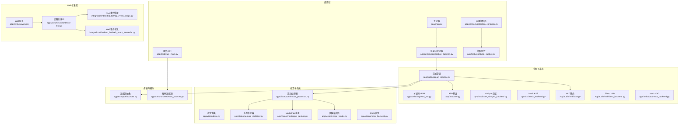
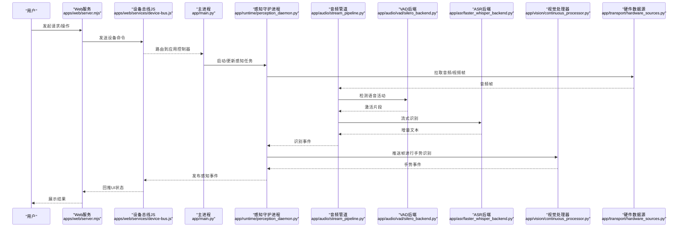
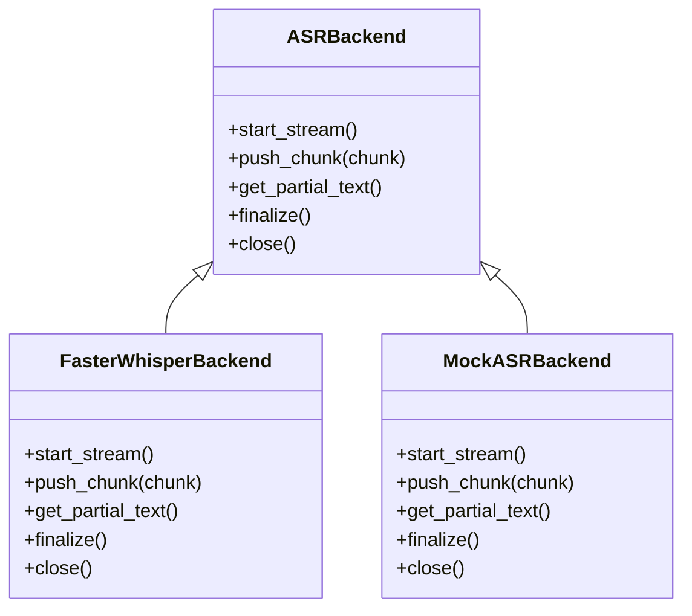
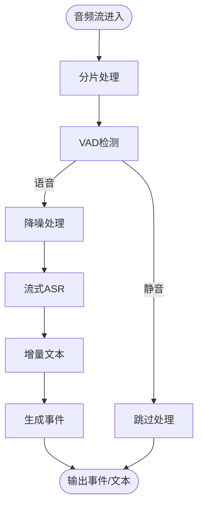
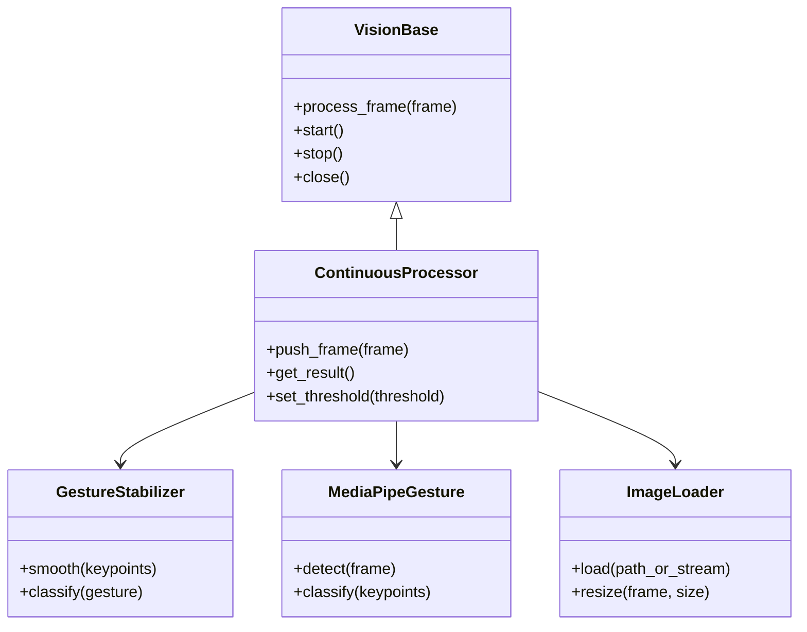
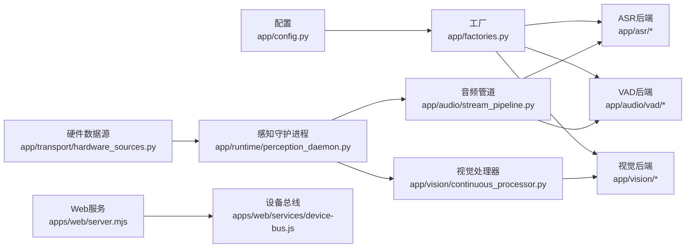

# 核心功能

<cite>
**本文引用的文件**   
- [app/main.py](file://app/main.py)
- [app/hardware_main.py](file://app/hardware_main.py)
- [app/config.py](file://app/config.py)
- [app/factories.py](file://app/factories.py)
- [app/perception_events.py](file://app/perception_events.py)
- [app/event_cache.py](file://app/event_cache.py)
- [app/asr/base.py](file://app/asr/base.py)
- [app/asr/faster_whisper_backend.py](file://app/asr/faster_whisper_backend.py)
- [app/asr/mock_backend.py](file://app/asr/mock_backend.py)
- [app/audio/stream_pipeline.py](file://app/audio/stream_pipeline.py)
- [app/audio/keyword_asr.py](file://app/audio/keyword_asr.py)
- [app/audio/vad/base.py](file://app/audio/vad/base.py)
- [app/audio/vad/silero_backend.py](file://app/audio/vad/silero_backend.py)
- [app/audio/vad/mock_backend.py](file://app/audio/vad/mock_backend.py)
- [app/detection/keywords.py](file://app/detection/keywords.py)
- [app/vision/base.py](file://app/vision/base.py)
- [app/vision/continuous_processor.py](file://app/vision/continuous_processor.py)
- [app/vision/gesture_stabilizer.py](file://app/vision/gesture_stabilizer.py)
- [app/vision/image_loader.py](file://app/vision/image_loader.py)
- [app/vision/mediapipe_gesture.py](file://app/vision/mediapipe_gesture.py)
- [app/vision/mock_backend.py](file://app/vision/mock_backend.py)
- [app/transport/sources.py](file://app/transport/sources.py)
- [app/transport/hardware_sources.py](file://app/transport/hardware_sources.py)
- [app/control/application_controller.py](file://app/control/application_controller.py)
- [app/runtime/perception_daemon.py](file://app/runtime/perception_daemon.py)
- [app/features/photo_capture.py](file://app/features/photo_capture.py)
- [apps/web/server.mjs](file://apps/web/server.mjs)
- [apps/web/services/device-bus.js](file://apps/web/services/device-bus.js)
- [integrations/desktop_bot/log_event_bridge.py](file://integrations/desktop_bot/log_event桥接.py)
- [integrations/desktop_bot/web_event_forwarder.py](file://integrations/desktop_bot/web_event_forwarder.py)
- [config.yaml](file://config.yaml)
- [requirements.txt](file://requirements.txt)
</cite>

## 目录
1. [简介](#简介)
2. [项目结构](#项目结构)
3. [核心组件](#核心组件)
4. [架构总览](#架构总览)
5. [详细组件分析](#详细组件分析)
6. [依赖关系分析](#依赖关系分析)
7. [性能考量](#性能考量)
8. [故障排查指南](#故障排查指南)
9. [结论](#结论)
10. [附录](#附录)

## 简介
本文件面向AI智能桌面设备项目的开发者与集成人员，系统性梳理语音识别（关键词检测、流式ASR）、音频处理管道（VAD、降噪）、视觉感知系统（手势识别、图像采集）以及硬件控制等核心能力。文档覆盖各模块的工作原理、输入输出格式、性能指标、模块间依赖与数据流转，并提供典型使用场景、配置示例与扩展指导，帮助快速上手与二次开发。

## 项目结构
- 应用入口与运行时
  - app/main.py：主进程启动、生命周期管理、事件总线装配
  - app/hardware_main.py：硬件侧运行入口，负责与ESP32/MVP设备通信
  - app/runtime/perception_daemon.py：感知守护进程，统一调度音视频采集与推理
- 配置与工厂
  - app/config.py：全局配置加载与校验
  - app/factories.py：组件工厂，按配置动态创建后端实例
- 事件与缓存
  - app/perception_events.py：感知事件模型定义
  - app/event_cache.py：事件缓存与回放
- 音频与ASR
  - app/audio/stream_pipeline.py：流式音频管道（采集→VAD→降噪→ASR）
  - app/audio/keyword_asr.py：关键词触发+流式ASR组合
  - app/asr/*：ASR后端抽象与实现（Whisper、Mock）
  - app/audio/vad/*：VAD后端抽象与实现（Silero、Mock）
- 视觉与手势
  - app/vision/*：视觉基类、连续帧处理、手势稳定器、MediaPipe手势识别、图像加载与Mock
- 传输与硬件
  - app/transport/*：通用数据源抽象与硬件数据源实现
- 控制与应用编排
  - app/control/application_controller.py：应用级控制逻辑
  - app/features/photo_capture.py：拍照功能特性
- Web前端与服务
  - apps/web/server.mjs：Web服务与设备交互
  - apps/web/services/device-bus.js：设备消息总线封装
- 集成与桥接
  - integrations/desktop_bot/*：日志事件桥接与Web事件转发

图表来源
- [app/main.py:1-200](file://app/main.py#L1-L200)
- [app/hardware_main.py:1-200](file://app/hardware_main.py#L1-L200)
- [app/runtime/perception_daemon.py:1-200](file://app/runtime/perception_daemon.py#L1-L200)
- [app/audio/stream_pipeline.py:1-200](file://app/audio/stream_pipeline.py#L1-L200)
- [app/vision/continuous_processor.py:1-200](file://app/vision/continuous_processor.py#L1-L200)
- [apps/web/server.mjs:1-200](file://apps/web/server.mjs#L1-L200)

章节来源
- [app/main.py:1-200](file://app/main.py#L1-L200)
- [app/hardware_main.py:1-200](file://app/hardware_main.py#L1-L200)
- [app/runtime/perception_daemon.py:1-200](file://app/runtime/perception_daemon.py#L1-L200)

## 核心组件
- 语音识别模块
  - 关键词检测：基于规则或轻量模型在音频流上实时匹配唤醒词，触发后续ASR流程
  - 流式ASR：将分片音频增量送入ASR后端，返回逐步文本结果
- 音频处理管道
  - VAD（语音活动检测）：过滤静音段，降低无效计算
  - 降噪：时频域滤波或深度学习降噪，提升信噪比
  - 流式处理：低延迟分片、缓冲与重采样策略
- 视觉感知系统
  - 手势识别：基于MediaPipe或自定义模型，输出关键点与手势类别
  - 图像采集：从摄像头或硬件数据源拉取帧，支持分辨率与帧率配置
- 硬件控制功能
  - 与ESP32/MVP设备通信，下发控制指令，接收传感器数据
  - 心跳、错误码与重试机制保障稳定性

章节来源
- [app/audio/keyword_asr.py:1-200](file://app/audio/keyword_asr.py#L1-L200)
- [app/audio/stream_pipeline.py:1-200](file://app/audio/stream_pipeline.py#L1-L200)
- [app/asr/base.py:1-200](file://app/asr/base.py#L1-L200)
- [app/asr/faster_whisper_backend.py:1-200](file://app/asr/faster_whisper_backend.py#L1-L200)
- [app/audio/vad/base.py:1-200](file://app/audio/vad/base.py#L1-L200)
- [app/audio/vad/silero_backend.py:1-200](file://app/audio/vad/silero_backend.py#L1-L200)
- [app/vision/mediapipe_gesture.py:1-200](file://app/vision/mediapipe_gesture.py#L1-L200)
- [app/vision/image_loader.py:1-200](file://app/vision/image_loader.py#L1-L200)
- [app/transport/hardware_sources.py:1-200](file://app/transport/hardware_sources.py#L1-L200)

## 架构总览
整体采用“守护进程+模块化后端”的架构：
- 感知守护进程统一调度音频与视觉流水线
- 通过工厂模式按需加载ASR/VAD/视觉后端
- 事件总线贯穿全链路，解耦数据采集、处理与消费
- Web服务与设备总线提供外部交互接口

图表来源
- [apps/web/server.mjs:1-200](file://apps/web/server.mjs#L1-L200)
- [apps/web/services/device-bus.js:1-200](file://apps/web/services/device-bus.js#L1-L200)
- [app/main.py:1-200](file://app/main.py#L1-L200)
- [app/runtime/perception_daemon.py:1-200](file://app/runtime/perception_daemon.py#L1-L200)
- [app/audio/stream_pipeline.py:1-200](file://app/audio/stream_pipeline.py#L1-L200)
- [app/audio/vad/silero_backend.py:1-200](file://app/audio/vad/silero_backend.py#L1-L200)
- [app/asr/faster_whisper_backend.py:1-200](file://app/asr/faster_whisper_backend.py#L1-L200)
- [app/vision/continuous_processor.py:1-200](file://app/vision/continuous_processor.py#L1-L200)
- [app/transport/hardware_sources.py:1-200](file://app/transport/hardware_sources.py#L1-L200)

## 详细组件分析

### 语音识别模块（关键词检测与流式ASR）
- 工作原理
  - 关键词检测：对音频流进行短时窗特征提取与匹配，命中后进入ASR阶段
  - 流式ASR：将音频分片增量送入后端，返回逐步文本；支持断句与置信度
- 输入输出
  - 输入：PCM/浮点音频流、采样率、通道数
  - 输出：关键词命中事件、增量文本、最终文本、置信度
- 性能指标
  - 关键词检测延迟：<100ms（取决于窗口大小与模型）
  - 流式ASR首字延迟：<300ms（受网络与模型影响）
  - 吞吐：单路音频实时处理（16kHz/单声道）
- 依赖与扩展
  - 后端抽象：app/asr/base.py
  - 默认后端：Whisper（更快推理）
  - 扩展方式：实现ASR后端接口并注册到工厂

图表来源
- [app/asr/base.py:1-200](file://app/asr/base.py#L1-L200)
- [app/asr/faster_whisper_backend.py:1-200](file://app/asr/faster_whisper_backend.py#L1-L200)
- [app/asr/mock_backend.py:1-200](file://app/asr/mock_backend.py#L1-L200)

章节来源
- [app/audio/keyword_asr.py:1-200](file://app/audio/keyword_asr.py#L1-L200)
- [app/asr/base.py:1-200](file://app/asr/base.py#L1-L200)
- [app/asr/faster_whisper_backend.py:1-200](file://app/asr/faster_whisper_backend.py#L1-L200)
- [app/asr/mock_backend.py:1-200](file://app/asr/mock_backend.py#L1-L200)

### 音频处理管道（VAD与降噪）
- 工作原理
  - VAD：判断语音活动，过滤静音段，减少ASR负载
  - 降噪：频域滤波或深度学习模型抑制背景噪声
  - 流式管道：分片缓冲、重采样、能量归一化
- 输入输出
  - 输入：原始音频流、VAD阈值、降噪参数
  - 输出：激活片段、降噪后音频、事件（开始/结束说话）
- 性能指标
  - VAD延迟：<50ms
  - 降噪CPU占用：中低（取决于算法）
  - 端到端延迟：受VAD与ASR共同影响
- 依赖与扩展
  - 后端抽象：app/audio/vad/base.py
  - 默认后端：Silero VAD
  - 扩展方式：实现VAD后端接口并注册

图表来源
- [app/audio/stream_pipeline.py:1-200](file://app/audio/stream_pipeline.py#L1-L200)
- [app/audio/vad/base.py:1-200](file://app/audio/vad/base.py#L1-L200)
- [app/audio/vad/silero_backend.py:1-200](file://app/audio/vad/silero_backend.py#L1-L200)

章节来源
- [app/audio/stream_pipeline.py:1-200](file://app/audio/stream_pipeline.py#L1-L200)
- [app/audio/vad/base.py:1-200](file://app/audio/vad/base.py#L1-L200)
- [app/audio/vad/silero_backend.py:1-200](file://app/audio/vad/silero_backend.py#L1-L200)

### 视觉感知系统（手势识别与图像采集）
- 工作原理
  - 图像采集：从摄像头或硬件数据源拉取帧，支持分辨率与帧率配置
  - 手势识别：基于MediaPipe关键点检测与分类，输出手势类型与置信度
  - 连续处理：帧去抖、稳定器平滑输出，避免抖动误判
- 输入输出
  - 输入：图像帧、相机参数、模型权重路径
  - 输出：手势事件、关键点坐标、置信度
- 性能指标
  - 帧率：≥30fps（取决于硬件与模型）
  - 延迟：<100ms（含推理与后处理）
  - 内存占用：随分辨率与模型规模变化
- 依赖与扩展
  - 基类：app/vision/base.py
  - 处理器：app/vision/continuous_processor.py
  - 手势：app/vision/mediapipe_gesture.py
  - 图像加载：app/vision/image_loader.py
  - 扩展方式：实现视觉后端接口并注册

图表来源
- [app/vision/base.py:1-200](file://app/vision/base.py#L1-L200)
- [app/vision/continuous_processor.py:1-200](file://app/vision/continuous_processor.py#L1-L200)
- [app/vision/gesture_stabilizer.py:1-200](file://app/vision/gesture_stabilizer.py#L1-L200)
- [app/vision/mediapipe_gesture.py:1-200](file://app/vision/mediapipe_gesture.py#L1-L200)
- [app/vision/image_loader.py:1-200](file://app/vision/image_loader.py#L1-L200)

章节来源
- [app/vision/continuous_processor.py:1-200](file://app/vision/continuous_processor.py#L1-L200)
- [app/vision/mediapipe_gesture.py:1-200](file://app/vision/mediapipe_gesture.py#L1-L200)
- [app/vision/image_loader.py:1-200](file://app/vision/image_loader.py#L1-L200)

### 硬件控制功能
- 工作原理
  - 与ESP32/MVP设备建立连接，周期性发送心跳与指令
  - 接收传感器数据（音频、图像、状态），解析并上报
  - 错误处理：重试、降级、告警
- 输入输出
  - 输入：控制指令、设备配置
  - 输出：设备状态、传感器数据、事件
- 性能指标
  - 通信延迟：<50ms（局域网）
  - 可靠性：心跳超时与自动重连
- 依赖与扩展
  - 数据源抽象：app/transport/sources.py
  - 硬件实现：app/transport/hardware_sources.py

章节来源
- [app/transport/sources.py:1-200](file://app/transport/sources.py#L1-L200)
- [app/transport/hardware_sources.py:1-200](file://app/transport/hardware_sources.py#L1-L200)

### 应用控制与特性
- 应用控制器：协调音频、视觉与硬件资源，管理任务生命周期
- 拍照特性：触发图像采集并保存或转发

章节来源
- [app/control/application_controller.py:1-200](file://app/control/application_controller.py#L1-L200)
- [app/features/photo_capture.py:1-200](file://app/features/photo_capture.py#L1-L200)

## 依赖关系分析
- 模块耦合
  - 感知守护进程依赖音频与视觉处理器，通过事件总线解耦
  - 音频管道依赖VAD与ASR后端，可热切换
  - 视觉处理器依赖图像加载与手势识别后端
- 外部依赖
  - Whisper、Silero、MediaPipe等第三方库
  - Web服务与设备总线用于前后端交互

图表来源
- [app/config.py:1-200](file://app/config.py#L1-L200)
- [app/factories.py:1-200](file://app/factories.py#L1-L200)
- [app/runtime/perception_daemon.py:1-200](file://app/runtime/perception_daemon.py#L1-L200)
- [app/audio/stream_pipeline.py:1-200](file://app/audio/stream_pipeline.py#L1-L200)
- [app/vision/continuous_processor.py:1-200](file://app/vision/continuous_processor.py#L1-L200)
- [app/transport/hardware_sources.py:1-200](file://app/transport/hardware_sources.py#L1-L200)
- [apps/web/server.mjs:1-200](file://apps/web/server.mjs#L1-L200)
- [apps/web/services/device-bus.js:1-200](file://apps/web/services/device-bus.js#L1-L200)

章节来源
- [app/factories.py:1-200](file://app/factories.py#L1-L200)
- [app/config.py:1-200](file://app/config.py#L1-L200)

## 性能考量
- 音频管道
  - 合理设置分片大小与采样率以平衡延迟与精度
  - VAD阈值调优可减少误触发
- 视觉处理
  - 降低分辨率与帧率以提升实时性
  - 使用轻量化模型或量化加速推理
- 硬件通信
  - 心跳间隔与超时时间需根据网络状况调整
  - 错误重试与降级策略保障稳定性

## 故障排查指南
- 常见问题
  - 音频无输入：检查硬件数据源与权限
  - VAD不触发：调整阈值与噪声环境
  - ASR识别失败：检查模型加载与网络（云端）
  - 手势识别不稳定：调整稳定器参数与光照条件
- 调试建议
  - 启用日志与事件缓存，定位问题链路
  - 使用Mock后端隔离问题范围

章节来源
- [app/event_cache.py:1-200](file://app/event_cache.py#L1-L200)
- [app/perception_events.py:1-200](file://app/perception_events.py#L1-L200)

## 结论
本项目通过模块化设计与事件驱动架构，实现了语音识别、音频处理、视觉感知与硬件控制的完整闭环。开发者可基于现有接口快速扩展新后端与特性，结合Web服务与设备总线构建丰富的桌面交互体验。

## 附录
- 典型使用场景
  - 语音助手：关键词唤醒→流式ASR→意图识别→执行动作
  - 手势控制：图像采集→手势识别→设备控制
  - 拍照记录：触发拍照→图像保存/转发
- 配置示例
  - 参考配置文件：[config.yaml](file://config.yaml)
  - 依赖清单：[requirements.txt](file://requirements.txt)
- 扩展指导
  - 新增ASR后端：实现接口并注册到工厂
  - 新增VAD后端：实现接口并替换默认后端
  - 新增视觉后端：实现接口并接入连续处理器