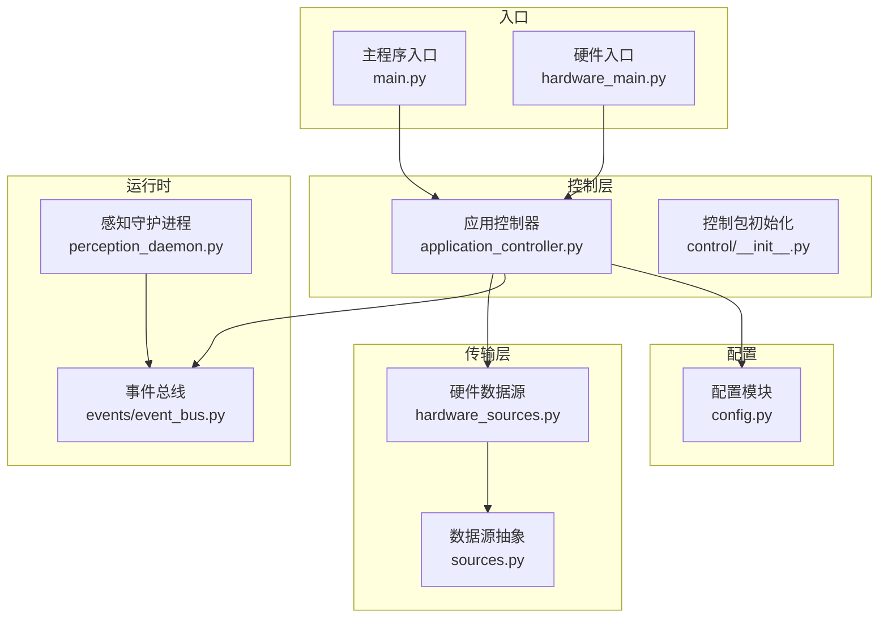
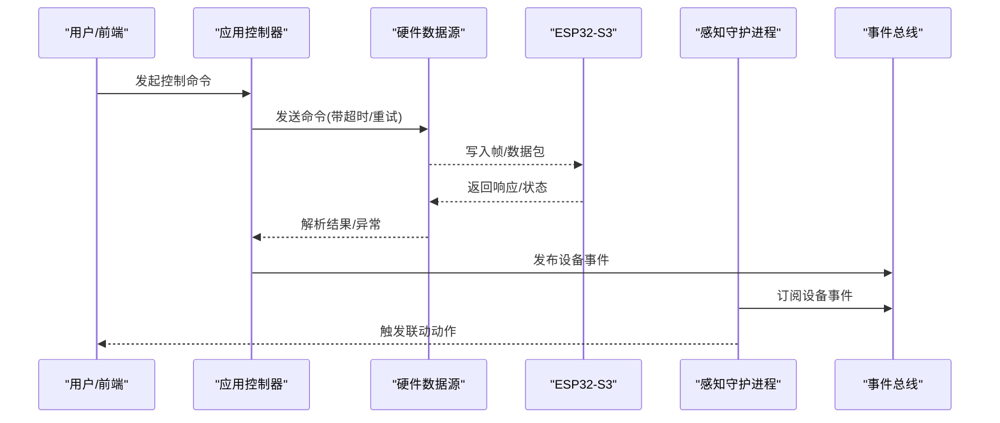
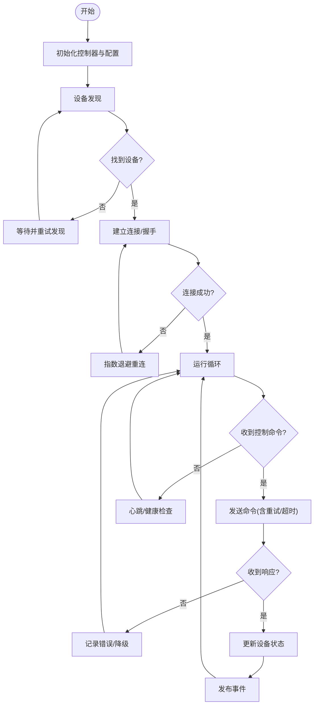
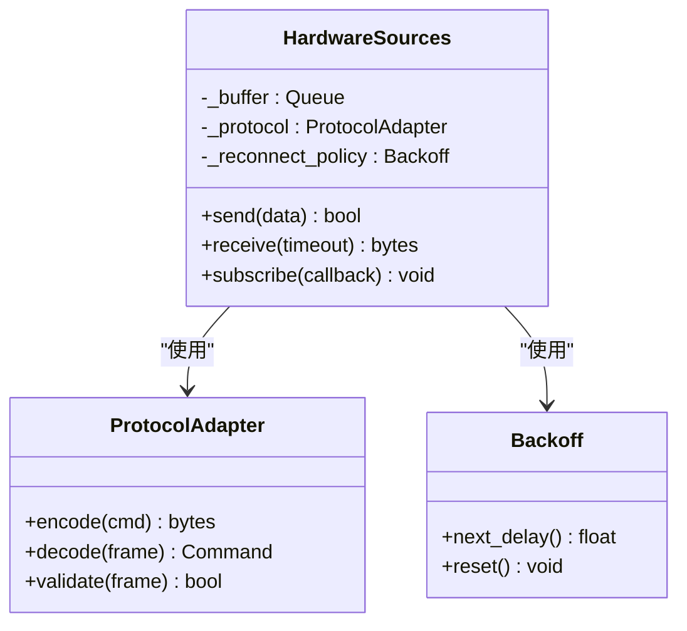
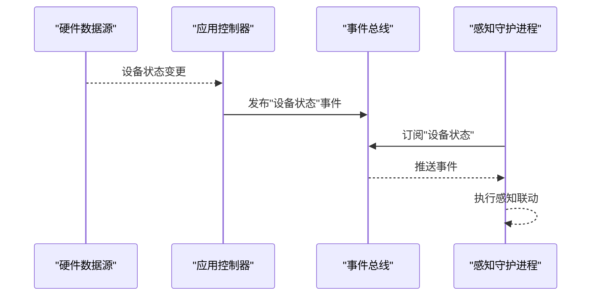
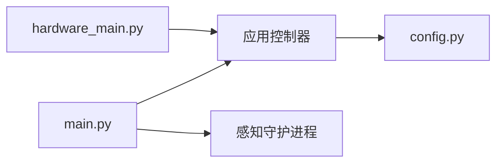
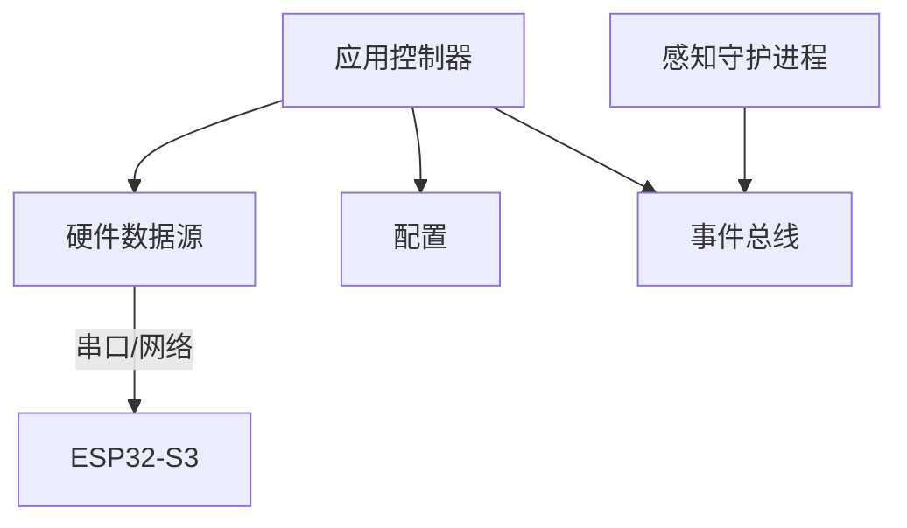

# 硬件控制功能

<cite>
**本文引用的文件**   
- [application_controller.py](file://app/control/application_controller.py)
- [hardware_sources.py](file://app/transport/hardware_sources.py)
- [sources.py](file://app/transport/sources.py)
- [perception_daemon.py](file://app/runtime/perception_daemon.py)
- [main.py](file://app/main.py)
- [hardware_main.py](file://app/hardware_main.py)
- [config.py](file://app/config.py)
- [__init__.py](file://app/control/__init__.py)
- [event_bus.py](file://app/events/event_bus.py)
- [ESP32-S3接入设计.md](file://AI_Hardware_Community_Project/07_Hardware/ESP32-S3接入设计.md)
- [MVP设备模拟协议.md](file://AI_Hardware_Community_Project/07_Hardware/MVP设备模拟协议.md)
- [Web与ESP32通信方案.md](file://AI_Hardware_Community_Project/07_Hardware/Web与ESP32通信方案.md)
</cite>

## 目录
1. [简介](#简介)
2. [项目结构](#项目结构)
3. [核心组件](#核心组件)
4. [架构总览](#架构总览)
5. [详细组件分析](#详细组件分析)
6. [依赖关系分析](#依赖关系分析)
7. [性能考量](#性能考量)
8. [故障排查指南](#故障排查指南)
9. [结论](#结论)
10. [附录](#附录)

## 简介
本文件面向AI智能桌面设备的硬件控制子系统，围绕应用控制器（application_controller.py）的设计模式、硬件抽象层实现与设备通信协议展开。文档重点说明：
- ESP32-S3设备接入流程、数据传输协议、命令响应机制与状态同步策略
- 设备发现、连接管理、错误重试与断线重连
- 硬件接口配置、自定义设备驱动开发与调试工具使用方法
- 与感知系统（语音/视觉）和前端应用的集成架构

## 项目结构
硬件控制相关代码主要分布在以下模块：
- 控制层：应用控制器与控制入口
- 传输层：硬件数据源与通用数据源抽象
- 运行时：感知守护进程与事件总线
- 配置：统一配置加载与校验
- 硬件文档：ESP32-S3接入、MVP协议、Web通信方案

**图示来源** 
- [application_controller.py](file://app/control/application_controller.py)
- [hardware_sources.py](file://app/transport/hardware_sources.py)
- [sources.py](file://app/transport/sources.py)
- [perception_daemon.py](file://app/runtime/perception_daemon.py)
- [event_bus.py](file://app/events/event_bus.py)
- [config.py](file://app/config.py)
- [main.py](file://app/main.py)
- [hardware_main.py](file://app/hardware_main.py)

**章节来源**
- [application_controller.py](file://app/control/application_controller.py)
- [hardware_sources.py](file://app/transport/hardware_sources.py)
- [sources.py](file://app/transport/sources.py)
- [perception_daemon.py](file://app/runtime/perception_daemon.py)
- [event_bus.py](file://app/events/event_bus.py)
- [config.py](file://app/config.py)
- [main.py](file://app/main.py)
- [hardware_main.py](file://app/hardware_main.py)

## 核心组件
- 应用控制器（ApplicationController）
  - 职责：编排硬件生命周期、调度命令下发、维护设备连接与状态、处理错误与重连、桥接事件总线与上层业务
  - 设计模式：单例/工厂组合、观察者（事件总线）、策略（不同硬件后端）、责任链（命令处理）
- 硬件数据源（HardwareSources）
  - 职责：封装底层设备通信（串口/网络），提供统一的读/写接口与数据流
  - 设计模式：适配器（适配不同物理接口）、生产者-消费者（数据流缓冲）
- 数据源抽象（Sources）
  - 职责：定义统一的数据源接口，屏蔽具体实现差异
- 感知守护进程（PerceptionDaemon）
  - 职责：启动并管理感知子系统的生命周期，与硬件控制通过事件总线交互
- 事件总线（EventBus）
  - 职责：解耦硬件事件与业务逻辑，支持订阅/发布、过滤与优先级
- 配置模块（Config）
  - 职责：集中管理硬件端口、超时、重试、日志级别等参数

**章节来源**
- [application_controller.py](file://app/control/application_controller.py)
- [hardware_sources.py](file://app/transport/hardware_sources.py)
- [sources.py](file://app/transport/sources.py)
- [perception_daemon.py](file://app/runtime/perception_daemon.py)
- [event_bus.py](file://app/events/event_bus.py)
- [config.py](file://app/config.py)

## 架构总览
整体架构采用分层与事件驱动相结合：
- 控制层负责设备生命周期管理与命令编排
- 传输层提供硬件抽象与数据流通道
- 运行时将感知能力与硬件控制通过事件总线解耦
- 配置中心统一管理参数，便于多设备部署

**图示来源** 
- [application_controller.py](file://app/control/application_controller.py)
- [hardware_sources.py](file://app/transport/hardware_sources.py)
- [perception_daemon.py](file://app/runtime/perception_daemon.py)
- [event_bus.py](file://app/events/event_bus.py)

## 详细组件分析

### 应用控制器（ApplicationController）
- 设计要点
  - 生命周期管理：初始化、启动、停止、健康检查
  - 连接管理：设备发现、握手、心跳、断线检测与自动重连
  - 命令编排：序列化命令、超时控制、重试策略、幂等性保障
  - 状态同步：本地状态机与设备状态对齐，增量更新与冲突解决
  - 错误处理：分类异常、降级策略、告警上报
- 关键流程
  - 设备发现与连接：扫描可用设备 -> 建立会话 -> 能力协商 -> 进入就绪
  - 命令下发：构建命令帧 -> 发送 -> 等待响应 -> 失败重试 -> 最终回退
  - 状态同步：周期性拉取或事件推送 -> 合并到本地状态 -> 广播事件

**图示来源** 
- [application_controller.py](file://app/control/application_controller.py)

**章节来源**
- [application_controller.py](file://app/control/application_controller.py)

### 硬件数据源（HardwareSources）
- 职责与接口
  - 统一读写接口：send(data)、receive(timeout)、subscribe(callback)
  - 数据流：环形缓冲、背压控制、丢帧策略
  - 协议适配：字节序、帧头尾、校验、分片重组
- 错误与恢复
  - I/O异常捕获、超时处理、CRC校验失败处理
  - 自动重连与状态重置
- 性能优化
  - 批量发送、零拷贝、异步I/O

**图示来源** 
- [hardware_sources.py](file://app/transport/hardware_sources.py)
- [sources.py](file://app/transport/sources.py)

**章节来源**
- [hardware_sources.py](file://app/transport/hardware_sources.py)
- [sources.py](file://app/transport/sources.py)

### 感知守护进程（PerceptionDaemon）与事件总线（EventBus）
- 感知守护进程
  - 启动ASR/VAD/视觉流水线，监听硬件事件，触发相应动作（如拍照、转向）
- 事件总线
  - 订阅/发布模型，支持主题过滤、QoS、持久化缓存
  - 与硬件控制解耦，便于扩展新感知能力

**图示来源** 
- [perception_daemon.py](file://app/runtime/perception_daemon.py)
- [event_bus.py](file://app/events/event_bus.py)

**章节来源**
- [perception_daemon.py](file://app/runtime/perception_daemon.py)
- [event_bus.py](file://app/events/event_bus.py)

### 入口与配置
- 入口
  - main.py：应用主入口，组装控制器、守护进程与HTTP服务
  - hardware_main.py：硬件专用入口，侧重设备通信与低延迟路径
- 配置
  - config.py：加载YAML/环境变量，提供类型安全的配置访问

**图示来源** 
- [main.py](file://app/main.py)
- [hardware_main.py](file://app/hardware_main.py)
- [config.py](file://app/config.py)

**章节来源**
- [main.py](file://app/main.py)
- [hardware_main.py](file://app/hardware_main.py)
- [config.py](file://app/config.py)

## 依赖关系分析
- 控制层依赖传输层提供的统一数据源接口
- 运行时通过事件总线与硬件控制解耦
- 配置模块被控制器与守护进程共同消费
- 外部设备（ESP32-S3）通过传输层接入

**图示来源** 
- [application_controller.py](file://app/control/application_controller.py)
- [hardware_sources.py](file://app/transport/hardware_sources.py)
- [perception_daemon.py](file://app/runtime/perception_daemon.py)
- [event_bus.py](file://app/events/event_bus.py)
- [config.py](file://app/config.py)

**章节来源**
- [application_controller.py](file://app/control/application_controller.py)
- [hardware_sources.py](file://app/transport/hardware_sources.py)
- [perception_daemon.py](file://app/runtime/perception_daemon.py)
- [event_bus.py](file://app/events/event_bus.py)
- [config.py](file://app/config.py)

## 性能考量
- 传输层
  - 使用异步I/O与零拷贝减少CPU占用
  - 合理设置缓冲区大小与背压阈值，避免内存抖动
- 控制器
  - 命令批量化与去重，降低总线压力
  - 指数退避重连，避免雪崩效应
- 事件总线
  - 分区订阅与限流，防止热点事件阻塞
- 感知联动
  - 按需启用流水线，空闲时休眠以降低功耗

[本节为通用指导，不直接分析具体文件]

## 故障排查指南
- 常见问题定位
  - 设备无法发现：检查端口/网络可达性、权限与防火墙
  - 连接频繁断开：查看心跳间隔、超时与重试配置
  - 命令无响应：核对帧格式、校验位与设备固件版本
  - 状态不同步：检查事件发布/订阅是否生效，是否存在消息丢失
- 调试建议
  - 开启详细日志，记录收发帧与异常堆栈
  - 使用模拟器验证协议正确性
  - 对关键路径添加埋点与指标采集

**章节来源**
- [application_controller.py](file://app/control/application_controller.py)
- [hardware_sources.py](file://app/transport/hardware_sources.py)
- [event_bus.py](file://app/events/event_bus.py)

## 结论
本硬件控制子系统以应用控制器为核心，结合传输层抽象与事件总线，实现了稳定可靠的ESP32-S3设备接入与状态同步。通过模块化设计与清晰的职责划分，系统具备良好的可扩展性与可维护性。配合完善的配置与调试手段，可在复杂场景下保持高可用与高性能。

[本节为总结性内容，不直接分析具体文件]

## 附录

### ESP32-S3设备接入与协议
- 接入方式：串口/网络双通道，支持热插拔与自动切换
- 协议要点：帧头/帧尾、长度字段、命令码、载荷、校验；支持分片与重传
- 命令响应：请求-应答模式，超时与重试策略可配置
- 状态同步：事件推送为主，周期轮询为辅，保证最终一致性

**章节来源**
- [ESP32-S3接入设计.md](file://AI_Hardware_Community_Project/07_Hardware/ESP32-S3接入设计.md)
- [MVP设备模拟协议.md](file://AI_Hardware_Community_Project/07_Hardware/MVP设备模拟协议.md)
- [Web与ESP32通信方案.md](file://AI_Hardware_Community_Project/07_Hardware/Web与ESP32通信方案.md)

### 硬件接口配置
- 关键参数
  - 端口/地址、波特率、超时时间、重试次数、心跳间隔
  - 日志级别、缓冲大小、队列容量
- 配置来源
  - YAML配置文件与环境变量覆盖
  - 运行时动态调整（安全参数）

**章节来源**
- [config.py](file://app/config.py)

### 自定义设备驱动开发
- 步骤
  - 继承数据源抽象，实现send/receive/subscribe
  - 实现协议编解码与校验
  - 注册到控制器，完成能力协商
- 注意事项
  - 线程安全与异常隔离
  - 资源释放与优雅关闭
  - 单元测试与协议回归测试

**章节来源**
- [sources.py](file://app/transport/sources.py)
- [hardware_sources.py](file://app/transport/hardware_sources.py)

### 调试工具使用方法
- 模拟器
  - 使用MVP协议模拟器验证命令与状态流转
- 抓包与日志
  - 启用传输层日志，导出原始帧进行离线分析
- 指标监控
  - 统计成功率、时延、重连次数与错误分布

**章节来源**
- [MVP设备模拟协议.md](file://AI_Hardware_Community_Project/07_Hardware/MVP设备模拟协议.md)
- [application_controller.py](file://app/control/application_controller.py)