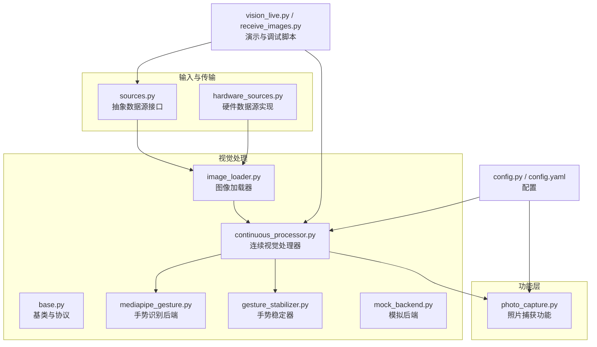
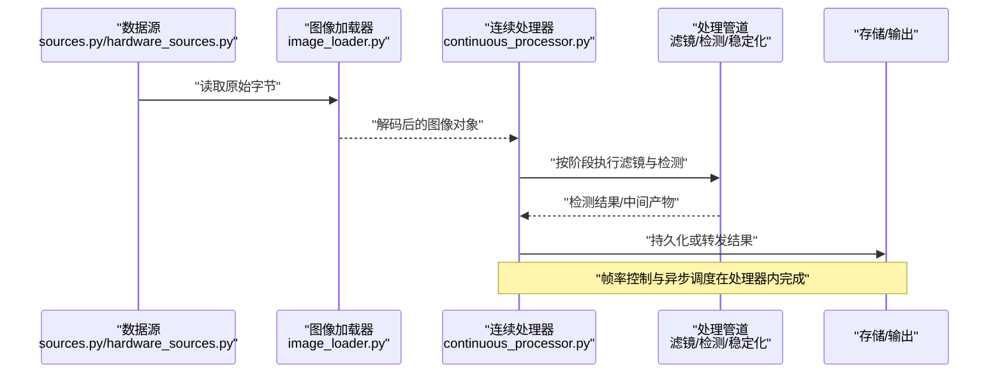
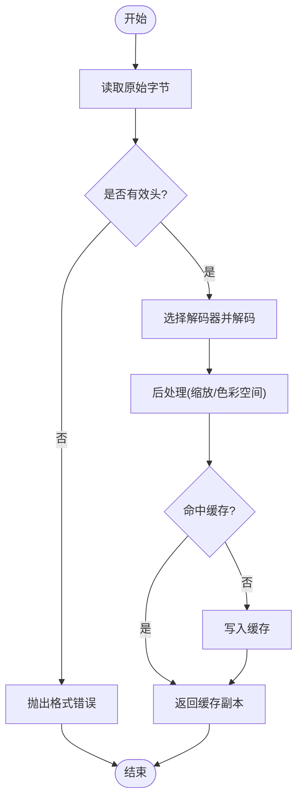
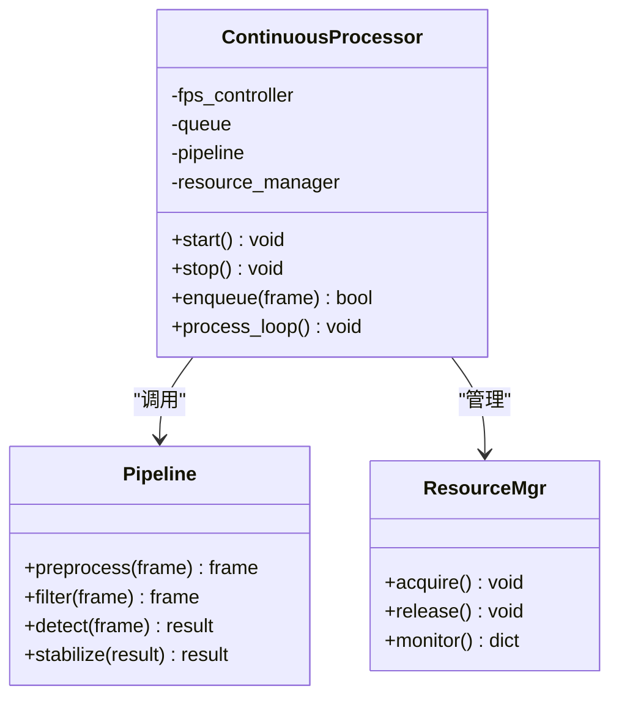
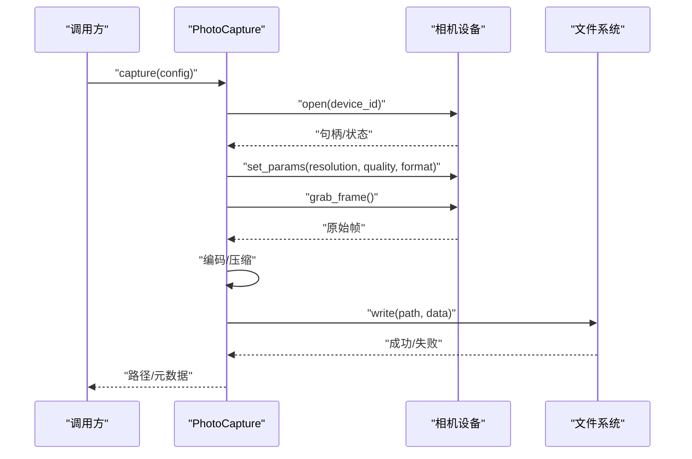
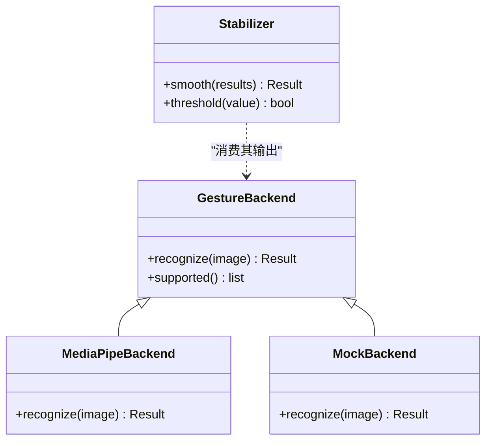
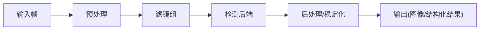
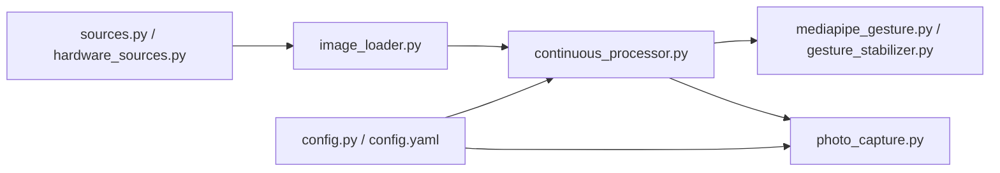

# 图像采集与处理

<cite>
**本文引用的文件**   
- [app/vision/image_loader.py](file://app/vision/image_loader.py)
- [app/vision/continuous_processor.py](file://app/vision/continuous_processor.py)
- [app/features/photo_capture.py](file://app/features/photo_capture.py)
- [app/vision/base.py](file://app/vision/base.py)
- [app/vision/mediapipe_gesture.py](file://app/vision/mediapipe_gesture.py)
- [app/vision/gesture_stabilizer.py](file://app/vision/gesture_stabilizer.py)
- [app/vision/mock_backend.py](file://app/vision/mock_backend.py)
- [app/transport/sources.py](file://app/transport/sources.py)
- [app/transport/hardware_sources.py](file://app/transport/hardware_sources.py)
- [app/config.py](file://app/config.py)
- [config.yaml](file://config.yaml)
- [scripts/vision_live.py](file://scripts/vision_live.py)
- [scripts/receive_images.py](file://scripts/receive_images.py)
- [app/perception_events.py](file://app/perception_events.py)
</cite>

## 目录
1. [简介](#简介)
2. [项目结构](#项目结构)
3. [核心组件](#核心组件)
4. [架构总览](#架构总览)
5. [详细组件分析](#详细组件分析)
6. [依赖关系分析](#依赖关系分析)
7. [性能考量](#性能考量)
8. [故障排查指南](#故障排查指南)
9. [结论](#结论)
10. [附录](#附录)

## 简介
本文件面向“图像采集与处理系统”，围绕以下目标展开：
- 图像加载器：实现原理、支持格式、内存管理与缓存策略
- 连续视觉处理器：工作流程、帧率控制、异步处理与资源管理
- 照片捕获：相机设备管理、图像质量设置与存储优化
- 图像处理管道：滤镜效果与格式转换机制
- 性能监控、错误恢复与调试工具使用方法

本说明以仓库中的 vision、features、transport 等模块为依据，结合配置与脚本，给出从数据源到处理管道的端到端说明。

## 项目结构
与图像采集与处理相关的核心代码位于 app/vision、app/features、app/transport 以及配置与脚本中。下图概览了关键文件与职责划分。

图表来源
- [app/transport/sources.py](file://app/transport/sources.py)
- [app/transport/hardware_sources.py](file://app/transport/hardware_sources.py)
- [app/vision/base.py](file://app/vision/base.py)
- [app/vision/image_loader.py](file://app/vision/image_loader.py)
- [app/vision/continuous_processor.py](file://app/vision/continuous_processor.py)
- [app/vision/mediapipe_gesture.py](file://app/vision/mediapipe_gesture.py)
- [app/vision/gesture_stabilizer.py](file://app/vision/gesture_stabilizer.py)
- [app/vision/mock_backend.py](file://app/vision/mock_backend.py)
- [app/features/photo_capture.py](file://app/features/photo_capture.py)
- [app/config.py](file://app/config.py)
- [config.yaml](file://config.yaml)
- [scripts/vision_live.py](file://scripts/vision_live.py)
- [scripts/receive_images.py](file://scripts/receive_images.py)

章节来源
- [app/vision/image_loader.py](file://app/vision/image_loader.py)
- [app/vision/continuous_processor.py](file://app/vision/continuous_processor.py)
- [app/features/photo_capture.py](file://app/features/photo_capture.py)
- [app/transport/sources.py](file://app/transport/sources.py)
- [app/transport/hardware_sources.py](file://app/transport/hardware_sources.py)
- [app/config.py](file://app/config.py)
- [config.yaml](file://config.yaml)
- [scripts/vision_live.py](file://scripts/vision_live.py)
- [scripts/receive_images.py](file://scripts/receive_images.py)

## 核心组件
- 图像加载器（ImageLoader）
  - 负责从不同数据源读取原始字节并解码为统一图像表示
  - 支持常见图像格式（如 JPEG、PNG、BMP 等），通过后端库进行解码
  - 提供内存复用与可选的轻量级缓存，减少重复解码开销
- 连续视觉处理器（ContinuousProcessor）
  - 驱动图像流持续进入处理管道
  - 内置帧率控制、丢帧策略与异步执行模型
  - 协调滤镜、检测与后处理阶段，管理生命周期与资源释放
- 照片捕获（PhotoCapture）
  - 封装相机设备选择、参数设置与单次捕获流程
  - 支持分辨率、质量、编码格式等配置项
  - 输出路径与命名策略可配置，便于后续归档与检索
- 视觉后端与稳定化
  - 手势识别后端（MediaPipe 或 Mock）
  - 手势稳定器用于时序平滑与抖动抑制

章节来源
- [app/vision/image_loader.py](file://app/vision/image_loader.py)
- [app/vision/continuous_processor.py](file://app/vision/continuous_processor.py)
- [app/features/photo_capture.py](file://app/features/photo_capture.py)
- [app/vision/mediapipe_gesture.py](file://app/vision/mediapipe_gesture.py)
- [app/vision/gesture_stabilizer.py](file://app/vision/gesture_stabilizer.py)
- [app/vision/mock_backend.py](file://app/vision/mock_backend.py)

## 架构总览
下图展示了从数据源到处理管道的整体数据流与控制流。

图表来源
- [app/transport/sources.py](file://app/transport/sources.py)
- [app/transport/hardware_sources.py](file://app/transport/hardware_sources.py)
- [app/vision/image_loader.py](file://app/vision/image_loader.py)
- [app/vision/continuous_processor.py](file://app/vision/continuous_processor.py)
- [app/vision/mediapipe_gesture.py](file://app/vision/mediapipe_gesture.py)
- [app/vision/gesture_stabilizer.py](file://app/vision/gesture_stabilizer.py)

## 详细组件分析

### 图像加载器（ImageLoader）
- 设计要点
  - 统一接口：对外暴露一致的“读取-解码”方法，屏蔽底层差异
  - 格式支持：基于通用解码库，支持 JPEG、PNG、BMP 等常见格式；扩展新格式只需注册新的解码器
  - 内存管理：优先使用零拷贝或共享缓冲；对大图像采用按需裁剪与分块处理
  - 缓存策略：LRU 或 TTL 缓存解码结果，避免重复解码；缓存大小与淘汰策略可配置
- 典型流程
  - 接收原始字节 → 校验头部 → 选择解码器 → 解码为统一矩阵 → 可选缩放/色彩空间转换 → 返回
- 异常与回退
  - 解码失败时记录原因并抛出明确异常
  - 支持降级策略（如降低分辨率重试）

图表来源
- [app/vision/image_loader.py](file://app/vision/image_loader.py)

章节来源
- [app/vision/image_loader.py](file://app/vision/image_loader.py)

### 连续视觉处理器（ContinuousProcessor）
- 设计要点
  - 帧率控制：目标 FPS 与最大延迟；支持自适应丢帧与节流
  - 异步处理：生产者-消费者队列，解耦采集与计算
  - 资源管理：线程/进程池、GPU/CPU 资源隔离、超时与取消
- 工作流
  - 启动：初始化队列、调度器、后端（滤镜/检测/稳定化）
  - 循环：拉取帧 → 预处理 → 并行执行各阶段 → 合并结果 → 输出
  - 停止：优雅关闭队列、释放资源、保存状态
- 监控指标
  - 入队/出队速率、处理耗时分布、丢帧率、内存占用、GPU 利用率

图表来源
- [app/vision/continuous_processor.py](file://app/vision/continuous_processor.py)

章节来源
- [app/vision/continuous_processor.py](file://app/vision/continuous_processor.py)

### 照片捕获（PhotoCapture）
- 设备管理
  - 枚举可用相机设备，选择索引或名称
  - 打开/关闭设备，处理权限与独占模式
- 图像质量与编码
  - 分辨率、帧率、质量因子、编码格式（JPEG/PNG/BMP）
  - 自动白平衡、曝光、对焦等高级参数（视设备能力）
- 存储优化
  - 文件名模板、时间戳、哈希去重
  - 压缩级别、批量落盘、异步 I/O
- 错误恢复
  - 设备不可用重试、临时性错误指数退避
  - 降级到较低分辨率或质量

图表来源
- [app/features/photo_capture.py](file://app/features/photo_capture.py)

章节来源
- [app/features/photo_capture.py](file://app/features/photo_capture.py)

### 视觉后端与稳定化
- 手势识别后端
  - MediaPipe 后端：利用 GPU/CPU 加速，提供关键点与分类结果
  - Mock 后端：用于离线测试与回归验证
- 手势稳定器
  - 时序滤波（滑动平均/卡尔曼）
  - 抖动抑制与阈值判定，减少误触发

图表来源
- [app/vision/mediapipe_gesture.py](file://app/vision/mediapipe_gesture.py)
- [app/vision/mock_backend.py](file://app/vision/mock_backend.py)
- [app/vision/gesture_stabilizer.py](file://app/vision/gesture_stabilizer.py)

章节来源
- [app/vision/mediapipe_gesture.py](file://app/vision/mediapipe_gesture.py)
- [app/vision/mock_backend.py](file://app/vision/mock_backend.py)
- [app/vision/gesture_stabilizer.py](file://app/vision/gesture_stabilizer.py)

### 数据处理管道与格式转换
- 管道阶段
  - 预处理：尺寸归一化、色彩空间转换、噪声抑制
  - 滤镜：锐化、模糊、对比度增强、边缘检测等
  - 检测：手势、人脸、物体等（由后端决定）
  - 后处理：稳定化、阈值化、结果聚合
- 格式转换
  - 统一内部矩阵表示，输出时可转 JPEG/PNG/BMP
  - 根据下游需求选择无损或有损压缩

图表来源
- [app/vision/base.py](file://app/vision/base.py)
- [app/vision/continuous_processor.py](file://app/vision/continuous_processor.py)
- [app/vision/mediapipe_gesture.py](file://app/vision/mediapipe_gesture.py)
- [app/vision/gesture_stabilizer.py](file://app/vision/gesture_stabilizer.py)

章节来源
- [app/vision/base.py](file://app/vision/base.py)
- [app/vision/continuous_processor.py](file://app/vision/continuous_processor.py)
- [app/vision/mediapipe_gesture.py](file://app/vision/mediapipe_gesture.py)
- [app/vision/gesture_stabilizer.py](file://app/vision/gesture_stabilizer.py)

## 依赖关系分析
- 模块耦合
  - 连续处理器依赖图像加载器与处理管道，并通过资源管理器协调并发
  - 照片捕获依赖设备抽象与文件系统，独立于实时处理链路
  - 视觉后端与稳定化作为插件式组件，易于替换与扩展
- 外部依赖
  - 解码库（如 PIL/OpenCV）、手势识别库（MediaPipe）、I/O 与序列化库
- 潜在环依赖
  - 通过 base 抽象与工厂模式解耦，避免直接循环导入

图表来源
- [app/vision/image_loader.py](file://app/vision/image_loader.py)
- [app/vision/continuous_processor.py](file://app/vision/continuous_processor.py)
- [app/vision/mediapipe_gesture.py](file://app/vision/mediapipe_gesture.py)
- [app/vision/gesture_stabilizer.py](file://app/vision/gesture_stabilizer.py)
- [app/features/photo_capture.py](file://app/features/photo_capture.py)
- [app/transport/sources.py](file://app/transport/sources.py)
- [app/transport/hardware_sources.py](file://app/transport/hardware_sources.py)
- [app/config.py](file://app/config.py)
- [config.yaml](file://config.yaml)

章节来源
- [app/vision/image_loader.py](file://app/vision/image_loader.py)
- [app/vision/continuous_processor.py](file://app/vision/continuous_processor.py)
- [app/features/photo_capture.py](file://app/features/photo_capture.py)
- [app/transport/sources.py](file://app/transport/sources.py)
- [app/transport/hardware_sources.py](file://app/transport/hardware_sources.py)
- [app/config.py](file://app/config.py)
- [config.yaml](file://config.yaml)

## 性能考量
- 帧率控制
  - 目标 FPS 与最大延迟上限；当处理耗时超过阈值时主动丢帧
  - 自适应调节：根据 CPU/GPU 负载动态调整分辨率或滤镜强度
- 内存与缓存
  - 图像池与缓冲区复用，减少分配/释放开销
  - LRU/TTL 缓存解码结果，限制最大条目数与单条大小
- 异步与并行
  - 生产者-消费者队列解耦采集与计算
  - 多阶段并行执行（如滤镜与检测分离），注意锁与同步成本
- I/O 优化
  - 批量写入、异步落盘、压缩级别调优
  - 网络传输场景下使用流式传输与增量更新

[本节为通用指导，不直接分析具体文件]

## 故障排查指南
- 常见问题
  - 解码失败：检查输入字节序列与格式头；确认解码器支持
  - 设备不可用：权限、独占模式、设备被其他进程占用
  - 帧率过低：检查瓶颈阶段（解码/滤镜/检测/I/O），适当降级
  - 内存泄漏：确认缓冲区回收、缓存上限与对象生命周期
- 诊断工具
  - 启用日志与指标上报（FPS、延迟、丢帧、内存、GPU 利用率）
  - 使用 mock 后端与离线数据进行回归测试
  - 可视化中间结果（预览帧、关键点、热力图）
- 恢复策略
  - 指数退避重试、自动切换备用设备、降级到更低分辨率/质量
  - 健康检查与自愈：周期性自检与重启子任务

章节来源
- [app/perception_events.py](file://app/perception_events.py)
- [scripts/vision_live.py](file://scripts/vision_live.py)
- [scripts/receive_images.py](file://scripts/receive_images.py)

## 结论
本系统以模块化与可扩展为核心设计原则，将图像加载、连续处理、照片捕获与视觉后端解耦，配合灵活的配置与监控手段，能够在多种硬件与部署环境下稳定运行。通过合理的帧率控制、内存与缓存策略，以及完善的错误恢复与调试工具，能够满足高吞吐、低延迟的图像采集与处理需求。

[本节为总结性内容，不直接分析具体文件]

## 附录
- 快速上手
  - 使用 scripts/vision_live.py 启动实时预览与处理
  - 使用 scripts/receive_images.py 接收并保存图像流
- 配置建议
  - 在 config.yaml 中设置目标 FPS、缓存大小、输出路径与质量
  - 在 app/config.py 中覆盖运行时参数（如设备 ID、后端选择）

章节来源
- [scripts/vision_live.py](file://scripts/vision_live.py)
- [scripts/receive_images.py](file://scripts/receive_images.py)
- [config.yaml](file://config.yaml)
- [app/config.py](file://app/config.py)