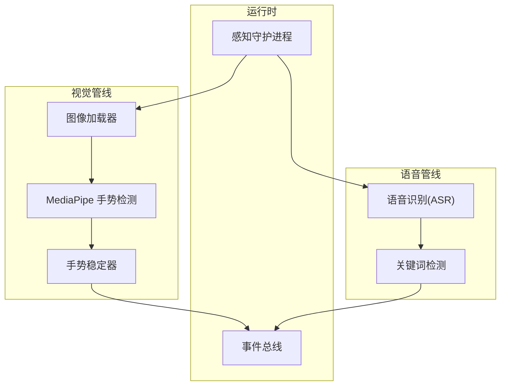
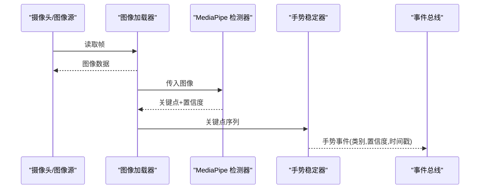
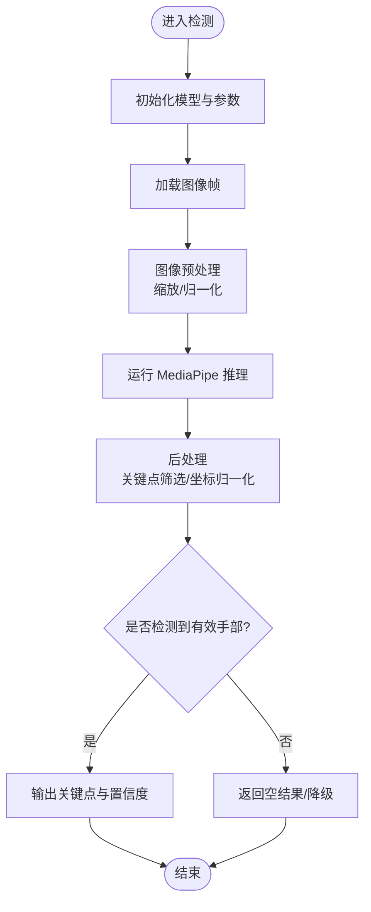
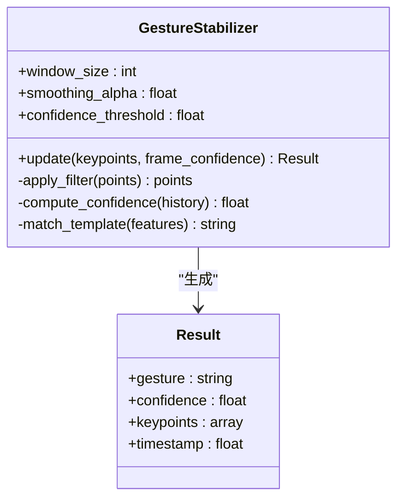
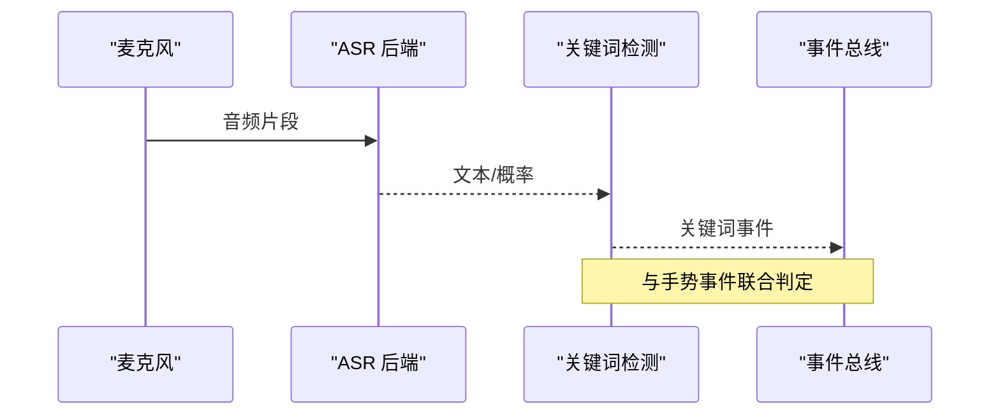
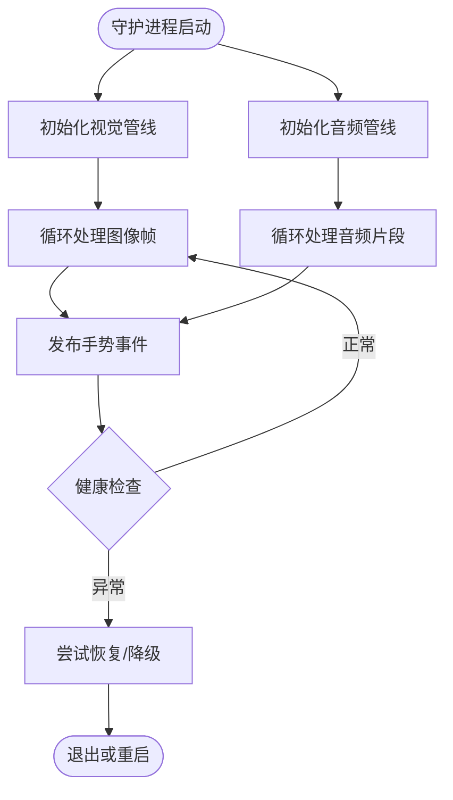
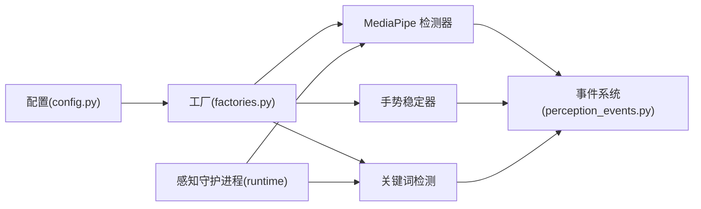

# 手势识别模块

<cite>
**本文引用的文件**   
- [app/vision/mediapipe_gesture.py](file://app/vision/mediapipe_gesture.py)
- [app/vision/gesture_stabilizer.py](file://app/vision/gesture_stabilizer.py)
- [app/detection/keywords.py](file://app/detection/keywords.py)
- [app/config.py](file://app/config.py)
- [app/perception_events.py](file://app/perception_events.py)
- [app/runtime/perception_daemon.py](file://app/runtime/perception_daemon.py)
- [app/factories.py](file://app/factories.py)
- [requirements.txt](file://requirements.txt)
</cite>

## 目录
1. [简介](#简介)
2. [项目结构](#项目结构)
3. [核心组件](#核心组件)
4. [架构总览](#架构总览)
5. [详细组件分析](#详细组件分析)
6. [依赖关系分析](#依赖关系分析)
7. [性能考虑](#性能考虑)
8. [故障排查指南](#故障排查指南)
9. [结论](#结论)
10. [附录](#附录)

## 简介
本文件为“手势识别模块”的完整技术文档，聚焦于基于 MediaPipe 的手势检测与分类实现、关键点提取与稳定化策略、关键词检测联动机制，以及模型配置、阈值调优与性能优化。文档面向不同技术背景的读者，提供从高层架构到代码级细节的分层说明，并包含数据格式、错误处理与排障建议。

## 项目结构
手势识别相关代码主要位于 vision、detection、runtime、config 等模块中：
- vision：MediaPipe 集成、手势稳定器、图像加载与连续处理
- detection：关键词检测（语音）与事件桥接
- runtime：感知守护进程，协调视觉与音频流
- config：全局配置项（含手势相关参数）
- perception_events：统一的事件定义与数据结构

图表来源
- [app/vision/mediapipe_gesture.py:1-200](file://app/vision/mediapipe_gesture.py#L1-L200)
- [app/vision/gesture_stabilizer.py:1-200](file://app/vision/gesture_stabilizer.py#L1-L200)
- [app/detection/keywords.py:1-200](file://app/detection/keywords.py#L1-L200)
- [app/runtime/perception_daemon.py:1-200](file://app/runtime/perception_daemon.py#L1-L200)

章节来源
- [app/vision/mediapipe_gesture.py:1-200](file://app/vision/mediapipe_gesture.py#L1-L200)
- [app/vision/gesture_stabilizer.py:1-200](file://app/vision/gesture_stabilizer.py#L1-L200)
- [app/detection/keywords.py:1-200](file://app/detection/keywords.py#L1-L200)
- [app/runtime/perception_daemon.py:1-200](file://app/runtime/perception_daemon.py#L1-L200)

## 核心组件
- MediaPipe 手势检测器：封装 MediaPipe Hands 或类似模型，完成手部区域检测与关键点提取，输出标准化关键点坐标与置信度。
- 手势稳定器：对连续帧的关键点序列进行抖动过滤、平滑处理与置信度计算，输出稳定的手势类别与置信度。
- 关键词检测：在语音流上执行关键词唤醒，与手势识别结果进行融合，触发更可靠的复合动作。
- 感知守护进程：统一调度视觉与音频子任务，管理生命周期与资源释放。
- 事件系统：将识别结果以统一事件结构发布，供上层业务消费。

章节来源
- [app/vision/mediapipe_gesture.py:1-200](file://app/vision/mediapipe_gesture.py#L1-L200)
- [app/vision/gesture_stabilizer.py:1-200](file://app/vision/gesture_stabilizer.py#L1-L200)
- [app/detection/keywords.py:1-200](file://app/detection/keywords.py#L1-L200)
- [app/perception_events.py:1-200](file://app/perception_events.py#L1-L200)
- [app/runtime/perception_daemon.py:1-200](file://app/runtime/perception_daemon.py#L1-L200)

## 架构总览
整体采用“多模态输入 + 稳定化推理 + 事件驱动”的架构：
- 视觉分支：图像加载 → MediaPipe 关键点 → 稳定器 → 手势事件
- 语音分支：音频采集 → ASR → 关键词检测 → 关键词事件
- 运行时：守护进程协调两路输入，合并事件并分发

图表来源
- [app/vision/mediapipe_gesture.py:1-200](file://app/vision/mediapipe_gesture.py#L1-L200)
- [app/vision/gesture_stabilizer.py:1-200](file://app/vision/gesture_stabilizer.py#L1-L200)
- [app/perception_events.py:1-200](file://app/perception_events.py#L1-L200)

## 详细组件分析

### MediaPipe 手势检测器
职责
- 初始化 MediaPipe Hands 或等效模型，设置输入尺寸、最大手数量、置信度阈值等
- 对每帧图像进行手部检测与关键点提取，返回标准化的关键点数组与置信度
- 异常捕获与降级策略（如模型加载失败、输入尺寸不合法）

关键流程
- 初始化：加载模型、校验设备能力、预热
- 推理：预处理图像 → 模型推理 → 后处理（坐标归一化、关键点筛选）
- 输出：关键点列表、手部边界框、置信度

图表来源
- [app/vision/mediapipe_gesture.py:1-200](file://app/vision/mediapipe_gesture.py#L1-L200)

章节来源
- [app/vision/mediapipe_gesture.py:1-200](file://app/vision/mediapipe_gesture.py#L1-L200)

### 手势稳定器
职责
- 对连续帧的关键点序列进行抖动过滤与平滑处理
- 基于时序一致性计算置信度，抑制瞬时误检
- 支持自定义手势模板匹配与相似度打分

算法要点
- 抖动过滤：滑动窗口均值/中值滤波，剔除离群点
- 平滑处理：指数移动平均（EMA）或卡尔曼滤波，提升轨迹稳定性
- 置信度计算：结合关键点方差、帧间位移、检测置信度加权

图表来源
- [app/vision/gesture_stabilizer.py:1-200](file://app/vision/gesture_stabilizer.py#L1-L200)

章节来源
- [app/vision/gesture_stabilizer.py:1-200](file://app/vision/gesture_stabilizer.py#L1-L200)

### 关键词检测与手势识别关联
职责
- 在语音流上实时检测关键词（唤醒词或指令词）
- 与手势事件融合，形成复合触发条件（例如“关键词 + 手势”）
- 降低单一模态误报率，提高鲁棒性

联动逻辑
- 关键词命中时，放宽手势置信度阈值，缩短稳定窗口
- 无关键词时，保持保守阈值，避免误触
- 事件融合：按时间窗口对齐，若同时满足则触发最终动作

图表来源
- [app/detection/keywords.py:1-200](file://app/detection/keywords.py#L1-L200)

章节来源
- [app/detection/keywords.py:1-200](file://app/detection/keywords.py#L1-L200)

### 感知守护进程
职责
- 启动/停止视觉与音频子任务
- 管理资源（模型、线程、队列）
- 统一异常上报与日志记录

图表来源
- [app/runtime/perception_daemon.py:1-200](file://app/runtime/perception_daemon.py#L1-L200)

章节来源
- [app/runtime/perception_daemon.py:1-200](file://app/runtime/perception_daemon.py#L1-L200)

### 事件系统与数据结构
职责
- 统一定义手势事件、关键词事件的结构与字段
- 提供事件发布/订阅接口，解耦各模块

数据结构要点
- 手势事件：包含手势类别、置信度、关键点、时间戳、来源
- 关键词事件：包含关键词文本、置信度、时间戳、来源
- 事件路由：按类型分发至对应消费者

章节来源
- [app/perception_events.py:1-200](file://app/perception_events.py#L1-L200)

## 依赖关系分析
- 外部依赖
  - MediaPipe：用于手部检测与关键点提取
  - 音频库：用于语音采集与 ASR 后端通信
- 内部依赖
  - vision 模块依赖 mediapipe_gesture 与 gesture_stabilizer
  - detection 模块依赖 keywords
  - runtime 模块依赖 vision、detection、event bus

图表来源
- [app/config.py:1-200](file://app/config.py#L1-L200)
- [app/factories.py:1-200](file://app/factories.py#L1-L200)
- [app/perception_events.py:1-200](file://app/perception_events.py#L1-L200)
- [app/runtime/perception_daemon.py:1-200](file://app/runtime/perception_daemon.py#L1-L200)

章节来源
- [requirements.txt:1-200](file://requirements.txt#L1-L200)
- [app/config.py:1-200](file://app/config.py#L1-L200)
- [app/factories.py:1-200](file://app/factories.py#L1-L200)

## 性能考虑
- 模型与推理
  - 使用轻量级 MediaPipe 模型，限制最大手数量与输入分辨率
  - 批量推理与缓存中间结果，减少重复计算
- 稳定器优化
  - 合理设置滑动窗口大小与平滑系数，平衡响应速度与稳定性
  - 对低置信度帧直接跳过，降低无效计算
- 资源管理
  - 守护进程内线程池与队列长度控制，防止内存泄漏
  - 动态调整采样率与处理频率，根据负载自适应
- 监控与诊断
  - 记录关键指标（FPS、置信度分布、误报率）
  - 提供开关以启用/禁用调试日志

[本节为通用指导，不直接分析具体文件]

## 故障排查指南
常见问题与定位方法
- 模型加载失败
  - 检查依赖安装与环境变量
  - 查看守护进程日志中的初始化错误
- 关键点不稳定
  - 调整稳定器的窗口大小与平滑系数
  - 检查输入图像质量与光照条件
- 误报率高
  - 提高置信度阈值，延长稳定窗口
  - 引入关键词联动，降低单模态误判
- 性能瓶颈
  - 降低输入分辨率与帧率
  - 关闭不必要的调试输出

章节来源
- [app/runtime/perception_daemon.py:1-200](file://app/runtime/perception_daemon.py#L1-L200)
- [app/vision/gesture_stabilizer.py:1-200](file://app/vision/gesture_stabilizer.py#L1-L200)
- [app/vision/mediapipe_gesture.py:1-200](file://app/vision/mediapipe_gesture.py#L1-L200)

## 结论
本模块通过 MediaPipe 实现高效的手部关键点提取，结合手势稳定器提升鲁棒性，并与关键词检测协同工作，形成可靠的多模态手势识别方案。通过合理的配置与调优，可在多种设备上达到良好的实时性与准确性。

[本节为总结性内容，不直接分析具体文件]

## 附录
- 手势模型配置
  - 输入尺寸、最大手数量、置信度阈值、关键点筛选规则
- 自定义手势定义
  - 模板关键点集合、相似度阈值、匹配策略
- 识别阈值调整
  - 置信度阈值、稳定窗口大小、平滑系数
- 手势数据格式
  - 关键点数组、置信度、时间戳、来源标识
- 识别结果结构
  - 手势类别、置信度、附加元数据
- 错误处理机制
  - 异常捕获、降级策略、重试与恢复

[本节为补充信息，不直接分析具体文件]