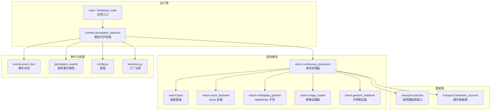
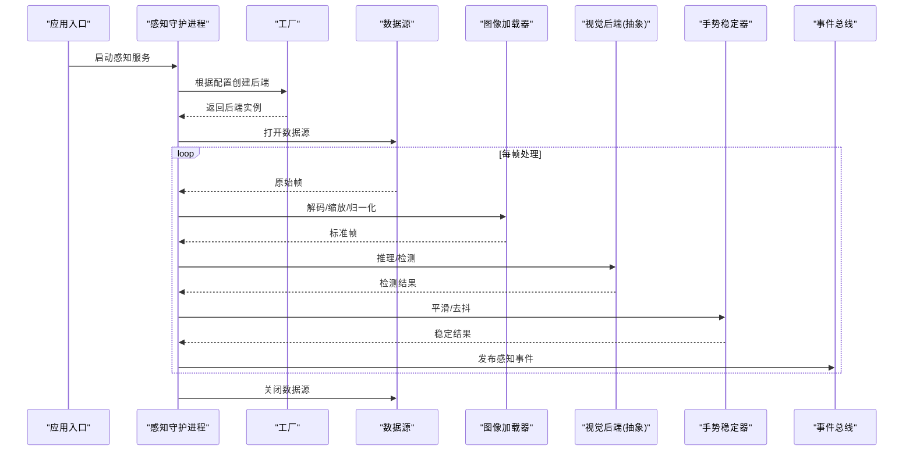
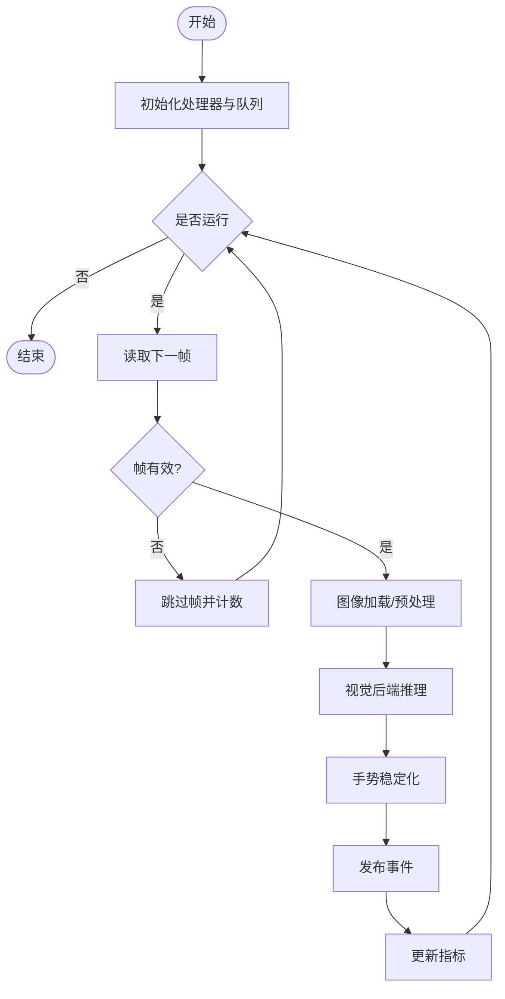
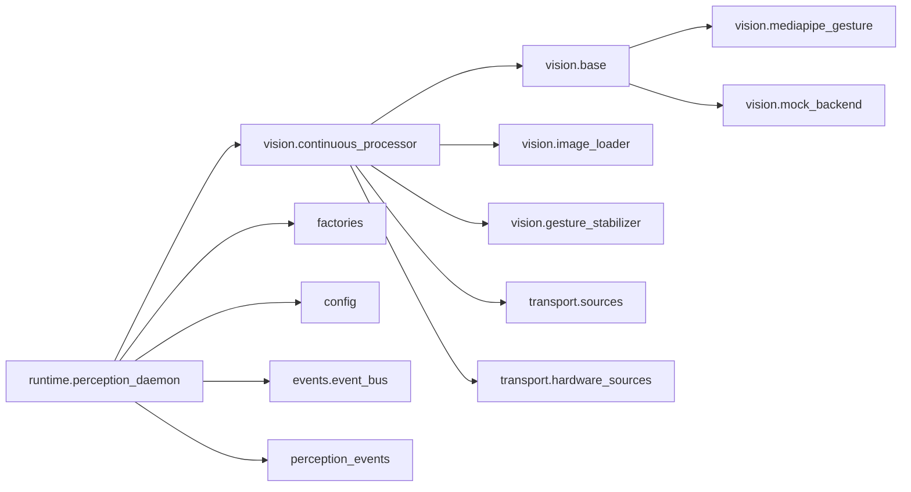

# 视觉后端架构

<cite>
**本文引用的文件**   
- [app/vision/base.py](file://app/vision/base.py)
- [app/vision/mock_backend.py](file://app/vision/mock_backend.py)
- [app/vision/continuous_processor.py](file://app/vision/continuous_processor.py)
- [app/vision/image_loader.py](file://app/vision/image_loader.py)
- [app/vision/mediapipe_gesture.py](file://app/vision/mediapipe_gesture.py)
- [app/vision/gesture_stabilizer.py](file://app/vision/gesture_stabilizer.py)
- [app/factories.py](file://app/factories.py)
- [app/config.py](file://app/config.py)
- [app/runtime/perception_daemon.py](file://app/runtime/perception_daemon.py)
- [app/main.py](file://app/main.py)
- [app/hardware_main.py](file://app/hardware_main.py)
- [app/transport/sources.py](file://app/transport/sources.py)
- [app/transport/hardware_sources.py](file://app/transport/hardware_sources.py)
- [app/events/event_bus.py](file://app/events/event_bus.py)
- [app/perception_events.py](file://app/perception_events.py)
</cite>

## 目录
1. [简介](#简介)
2. [项目结构](#项目结构)
3. [核心组件](#核心组件)
4. [架构总览](#架构总览)
5. [详细组件分析](#详细组件分析)
6. [依赖关系分析](#依赖关系分析)
7. [性能考量](#性能考量)
8. [故障排查指南](#故障排查指南)
9. [结论](#结论)
10. [附录：自定义视觉后端开发指南与最佳实践](#附录自定义视觉后端开发指南与最佳实践)

## 简介
本文件面向视觉后端的架构设计与实现，聚焦以下目标：
- 抽象基类与接口规范：定义统一的视觉处理接口、生命周期与错误模型。
- 插件机制与扩展点：通过工厂注册与配置驱动动态加载不同视觉后端（如 MediaPipe、Mock）。
- Mock 后端原理：为测试与开发环境提供稳定可复现的图像与手势数据流。
- 视觉处理管道：数据流控制、错误传播与状态管理的设计模式。
- 后端注册、动态加载与生命周期管理：从配置到运行时实例化的完整链路。
- 自定义视觉后端开发指南：如何快速接入新的视觉算法或设备源。

## 项目结构
视觉相关代码集中在 app/vision 模块，配合 transport（数据源）、events（事件总线）、runtime（守护进程）与 factories（工厂注册）共同构成完整的视觉后端体系。

图表来源
- [app/vision/base.py](file://app/vision/base.py)
- [app/vision/mock_backend.py](file://app/vision/mock_backend.py)
- [app/vision/continuous_processor.py](file://app/vision/continuous_processor.py)
- [app/vision/image_loader.py](file://app/vision/image_loader.py)
- [app/vision/mediapipe_gesture.py](file://app/vision/mediapipe_gesture.py)
- [app/vision/gesture_stabilizer.py](file://app/vision/gesture_stabilizer.py)
- [app/transport/sources.py](file://app/transport/sources.py)
- [app/transport/hardware_sources.py](file://app/transport/hardware_sources.py)
- [app/runtime/perception_daemon.py](file://app/runtime/perception_daemon.py)
- [app/events/event_bus.py](file://app/events/event_bus.py)
- [app/perception_events.py](file://app/perception_events.py)
- [app/config.py](file://app/config.py)
- [app/factories.py](file://app/factories.py)
- [app/main.py](file://app/main.py)
- [app/hardware_main.py](file://app/hardware_main.py)

章节来源
- [app/vision/base.py](file://app/vision/base.py)
- [app/vision/continuous_processor.py](file://app/vision/continuous_processor.py)
- [app/vision/image_loader.py](file://app/vision/image_loader.py)
- [app/vision/mediapipe_gesture.py](file://app/vision/mediapipe_gesture.py)
- [app/vision/gesture_stabilizer.py](file://app/vision/gesture_stabilizer.py)
- [app/vision/mock_backend.py](file://app/vision/mock_backend.py)
- [app/transport/sources.py](file://app/transport/sources.py)
- [app/transport/hardware_sources.py](file://app/transport/hardware_sources.py)
- [app/runtime/perception_daemon.py](file://app/runtime/perception_daemon.py)
- [app/events/event_bus.py](file://app/events/event_bus.py)
- [app/perception_events.py](file://app/perception_events.py)
- [app/config.py](file://app/config.py)
- [app/factories.py](file://app/factories.py)
- [app/main.py](file://app/main.py)
- [app/hardware_main.py](file://app/hardware_main.py)

## 核心组件
- 抽象基类（VisionBackendBase）
  - 职责：统一视觉后端接口，定义初始化、帧处理、资源释放等生命周期方法；规定输入输出数据结构与错误类型。
  - 关键点：抽象方法强制子类实现；默认钩子用于扩展点（如预处理、后处理、指标上报）。
- 连续处理器（ContinuousProcessor）
  - 职责：驱动数据源读取帧，按流水线调用各处理阶段（加载、检测、稳定化、结果聚合），并管理线程/协程生命周期。
  - 关键点：背压与缓冲策略、异常隔离、状态机（启动/运行/停止/重启）。
- 图像加载器（ImageLoader）
  - 职责：从内存/磁盘/网络/设备获取原始图像，统一格式与尺寸，支持缓存与降级。
- 手势稳定器（GestureStabilizer）
  - 职责：对检测结果进行时间平滑、去抖与置信度过滤，降低抖动与误报。
- 具体后端
  - MediaPipe 手势后端：基于 MediaPipe 的实时手势识别，封装推理与结果解析。
  - Mock 后端：生成模拟帧与手势序列，便于单元测试与集成测试。
- 工厂与配置
  - 工厂（Factories）：根据配置选择并实例化具体后端；维护注册表与别名映射。
  - 配置（Config）：集中管理后端参数、数据源路径、阈值与开关。
- 运行期与事件
  - 感知守护进程（PerceptionDaemon）：协调数据源、处理器与事件总线，负责启停与监控。
  - 事件总线（EventBus）：解耦生产者与消费者，支持异步分发与订阅。
  - 感知事件模型（PerceptionEvents）：标准化事件结构，便于跨模块消费。

章节来源
- [app/vision/base.py](file://app/vision/base.py)
- [app/vision/continuous_processor.py](file://app/vision/continuous_processor.py)
- [app/vision/image_loader.py](file://app/vision/image_loader.py)
- [app/vision/gesture_stabilizer.py](file://app/vision/gesture_stabilizer.py)
- [app/vision/mediapipe_gesture.py](file://app/vision/mediapipe_gesture.py)
- [app/vision/mock_backend.py](file://app/vision/mock_backend.py)
- [app/factories.py](file://app/factories.py)
- [app/config.py](file://app/config.py)
- [app/runtime/perception_daemon.py](file://app/runtime/perception_daemon.py)
- [app/events/event_bus.py](file://app/events/event_bus.py)
- [app/perception_events.py](file://app/perception_events.py)

## 架构总览
视觉后端采用“抽象基类 + 插件后端 + 流水线处理器”的分层架构。数据由传输层数据源进入，经图像加载、视觉推理、结果稳定化后，通过事件总线对外发布。工厂与配置完成后端的选择与注入，守护进程负责生命周期与资源管理。

图表来源
- [app/runtime/perception_daemon.py](file://app/runtime/perception_daemon.py)
- [app/factories.py](file://app/factories.py)
- [app/transport/sources.py](file://app/transport/sources.py)
- [app/vision/image_loader.py](file://app/vision/image_loader.py)
- [app/vision/base.py](file://app/vision/base.py)
- [app/vision/gesture_stabilizer.py](file://app/vision/gesture_stabilizer.py)
- [app/events/event_bus.py](file://app/events/event_bus.py)

## 详细组件分析

### 抽象基类与接口规范（VisionBackendBase）
- 设计要点
  - 定义统一的生命周期：初始化、开始、处理帧、结束、释放。
  - 输入输出契约：明确帧格式、检测结果的字段与约束。
  - 错误模型：区分可恢复错误（重试）与致命错误（终止）。
  - 扩展钩子：预处理、后处理、指标收集、健康检查。
- 复杂度与性能
  - 抽象层开销极低，主要成本在子类实现。
  - 建议子类内部使用零拷贝与批处理以降低延迟。
- 错误处理
  - 捕获底层异常并转换为统一错误类型，避免污染上层。
  - 提供降级策略（如回退到低分辨率或简化模型）。

章节来源
- [app/vision/base.py](file://app/vision/base.py)

### 连续处理器（ContinuousProcessor）
- 职责
  - 驱动数据源循环读取帧，串联加载、推理、稳定化阶段。
  - 管理线程/协程池、队列缓冲与背压。
  - 维护状态机：空闲、运行、暂停、停止、错误恢复。
- 数据流控制
  - 使用有界队列限制内存占用；满队时丢弃最旧帧或阻塞上游。
  - 超时与心跳机制，确保长时间无帧时及时告警。
- 错误传播
  - 单阶段失败不中断整体流程，记录日志并跳过该帧。
  - 累计错误阈值触发自动重启或切换后端。
- 状态管理
  - 暴露状态查询接口，供守护进程与监控采集。

图表来源
- [app/vision/continuous_processor.py](file://app/vision/continuous_processor.py)

章节来源
- [app/vision/continuous_processor.py](file://app/vision/continuous_processor.py)

### 图像加载器（ImageLoader）
- 功能
  - 多源输入（内存数组、文件路径、设备缓冲区）。
  - 统一格式转换（色彩空间、尺寸、数据类型）。
  - 可选缓存与压缩，减少重复解码开销。
- 性能
  - 预分配缓冲区，避免频繁分配。
  - 并行解码与流水线合并，提升吞吐。
- 错误处理
  - 损坏数据回退策略（裁剪、插值、替换默认帧）。

章节来源
- [app/vision/image_loader.py](file://app/vision/image_loader.py)

### 手势稳定器（GestureStabilizer）
- 功能
  - 时间窗口平滑（移动平均/指数平滑）。
  - 去抖与置信度阈值过滤。
  - 状态机判定（静止、移动、切换）。
- 参数
  - 窗口大小、衰减系数、阈值、迟滞区间。
- 性能
  - O(1) 增量更新，低内存占用。

章节来源
- [app/vision/gesture_stabilizer.py](file://app/vision/gesture_stabilizer.py)

### MediaPipe 手势后端（MediaPipeGestureBackend）
- 功能
  - 调用 MediaPipe 模型进行手部关键点与手势分类。
  - 结果解析为标准检测对象，包含关键点坐标、类别与置信度。
- 性能
  - GPU/CPU 加速选择；批量推理优化。
- 错误处理
  - 模型加载失败回退到 CPU；关键帧缺失时保持上一帧结果。

章节来源
- [app/vision/mediapipe_gesture.py](file://app/vision/mediapipe_gesture.py)

### Mock 后端（MockVisionBackend）
- 目的
  - 为测试与开发提供确定性数据流，无需真实摄像头或模型。
- 行为
  - 按固定频率生成模拟帧与手势序列。
  - 支持外部注入轨迹与噪声，验证鲁棒性。
- 使用场景
  - 单元测试：断言事件顺序与数值范围。
  - 集成测试：端到端验证管道稳定性与性能。
  - 演示环境：无需硬件即可运行。

章节来源
- [app/vision/mock_backend.py](file://app/vision/mock_backend.py)

### 工厂与配置（Factories & Config）
- 工厂
  - 维护后端注册表，支持按名称或别名实例化。
  - 支持热重载与动态切换（需满足接口兼容）。
- 配置
  - 集中管理后端参数、数据源路径、阈值、开关。
  - 支持环境变量覆盖与配置文件优先级。

章节来源
- [app/factories.py](file://app/factories.py)
- [app/config.py](file://app/config.py)

### 运行期与事件（PerceptionDaemon, EventBus, PerceptionEvents）
- 感知守护进程
  - 协调数据源、处理器与后端，负责启停、监控与自愈。
  - 暴露健康检查与指标导出接口。
- 事件总线
  - 订阅/发布模型，支持异步回调与限流。
  - 保证事件顺序与幂等性。
- 感知事件模型
  - 标准化事件结构，包含时间戳、来源、类型与载荷。

章节来源
- [app/runtime/perception_daemon.py](file://app/runtime/perception_daemon.py)
- [app/events/event_bus.py](file://app/events/event_bus.py)
- [app/perception_events.py](file://app/perception_events.py)

## 依赖关系分析
- 内聚与耦合
  - vision.base 作为核心抽象，被所有后端与处理器依赖，内聚性强。
  - continuous_processor 组合 image_loader、backend、gesture_stabilizer，耦合度适中。
  - factories 与 config 松耦合，通过接口与配置项交互。
- 外部依赖
  - 传输层 sources/hardware_sources 对接设备或文件系统。
  - events 模块解耦生产与消费，降低模块间直接依赖。
- 潜在循环依赖
  - 通过抽象与事件总线避免循环引用；确保仅单向依赖。

图表来源
- [app/vision/base.py](file://app/vision/base.py)
- [app/vision/mediapipe_gesture.py](file://app/vision/mediapipe_gesture.py)
- [app/vision/mock_backend.py](file://app/vision/mock_backend.py)
- [app/vision/continuous_processor.py](file://app/vision/continuous_processor.py)
- [app/vision/image_loader.py](file://app/vision/image_loader.py)
- [app/vision/gesture_stabilizer.py](file://app/vision/gesture_stabilizer.py)
- [app/transport/sources.py](file://app/transport/sources.py)
- [app/transport/hardware_sources.py](file://app/transport/hardware_sources.py)
- [app/runtime/perception_daemon.py](file://app/runtime/perception_daemon.py)
- [app/factories.py](file://app/factories.py)
- [app/config.py](file://app/config.py)
- [app/events/event_bus.py](file://app/events/event_bus.py)
- [app/perception_events.py](file://app/perception_events.py)

章节来源
- [app/vision/base.py](file://app/vision/base.py)
- [app/vision/continuous_processor.py](file://app/vision/continuous_processor.py)
- [app/vision/image_loader.py](file://app/vision/image_loader.py)
- [app/vision/gesture_stabilizer.py](file://app/vision/gesture_stabilizer.py)
- [app/vision/mediapipe_gesture.py](file://app/vision/mediapipe_gesture.py)
- [app/vision/mock_backend.py](file://app/vision/mock_backend.py)
- [app/transport/sources.py](file://app/transport/sources.py)
- [app/transport/hardware_sources.py](file://app/transport/hardware_sources.py)
- [app/runtime/perception_daemon.py](file://app/runtime/perception_daemon.py)
- [app/factories.py](file://app/factories.py)
- [app/config.py](file://app/config.py)
- [app/events/event_bus.py](file://app/events/event_bus.py)
- [app/perception_events.py](file://app/perception_events.py)

## 性能考量
- 数据路径优化
  - 零拷贝传递帧数组，避免不必要的复制。
  - 批量推理与流水线并行，提高吞吐。
- 内存与缓冲
  - 有界队列与背压控制，防止内存泄漏。
  - 预分配缓冲区与对象池，减少 GC 压力。
- 计算资源
  - 根据设备能力选择 CPU/GPU 后端。
  - 动态调整分辨率与帧率以平衡延迟与精度。
- 错误与恢复
  - 快速失败与优雅降级，避免级联故障。
  - 健康检查与自动重启，提升可用性。

[本节为通用指导，不直接分析具体文件]

## 故障排查指南
- 常见问题
  - 数据源无法打开：检查路径、权限与设备连接。
  - 模型加载失败：确认依赖库版本与硬件加速可用。
  - 帧丢失或卡顿：调整队列大小与处理耗时，启用降级策略。
  - 事件未消费：检查订阅者注册与事件路由配置。
- 诊断步骤
  - 启用详细日志与指标采集。
  - 使用 Mock 后端隔离问题域。
  - 逐步禁用组件定位瓶颈。
- 恢复策略
  - 自动重试与回退到备用后端。
  - 重启守护进程与清理临时资源。

章节来源
- [app/runtime/perception_daemon.py](file://app/runtime/perception_daemon.py)
- [app/events/event_bus.py](file://app/events/event_bus.py)
- [app/vision/mock_backend.py](file://app/vision/mock_backend.py)

## 结论
视觉后端通过清晰的抽象基类、插件化后端与流水线处理器，实现了高内聚、低耦合与可扩展的架构。Mock 后端为开发与测试提供了稳定支撑，工厂与配置驱动了动态加载与生命周期管理。遵循本文档的最佳实践，可快速接入新的视觉算法与数据源，同时保障系统的性能与可靠性。

[本节为总结，不直接分析具体文件]

## 附录：自定义视觉后端开发指南与最佳实践
- 实现步骤
  - 继承抽象基类，实现必需的生命周期方法与帧处理逻辑。
  - 定义输入输出数据结构，遵循统一契约。
  - 在工厂中注册新后端，并在配置中添加对应条目。
- 最佳实践
  - 错误隔离：将底层异常转换为统一错误类型。
  - 性能优先：避免频繁分配与拷贝，使用批处理与缓存。
  - 可观测性：暴露健康检查与指标，便于监控与排障。
  - 可测试性：提供 Mock 或 Stub 实现，覆盖边界条件。
- 示例流程
  - 新增后端类 -> 工厂注册 -> 配置添加 -> 单元测试 -> 集成测试 -> 上线部署。

章节来源
- [app/vision/base.py](file://app/vision/base.py)
- [app/factories.py](file://app/factories.py)
- [app/config.py](file://app/config.py)
- [app/vision/mock_backend.py](file://app/vision/mock_backend.py)