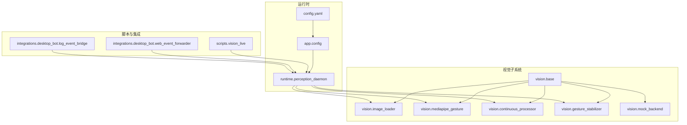
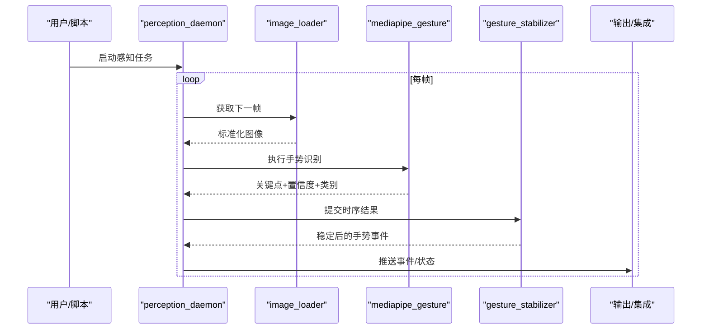
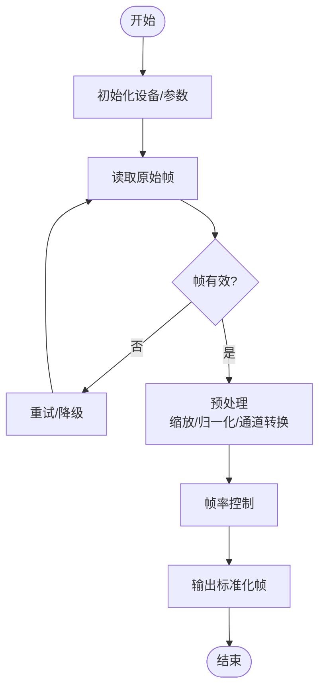
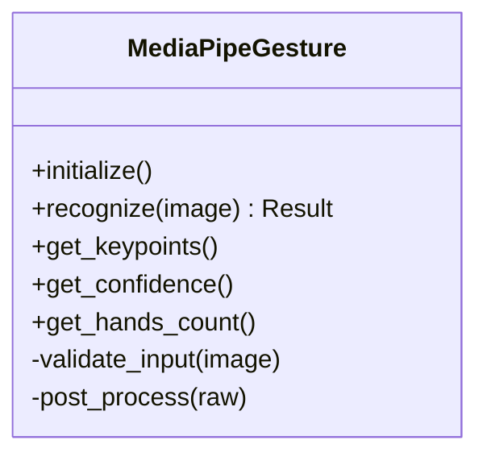
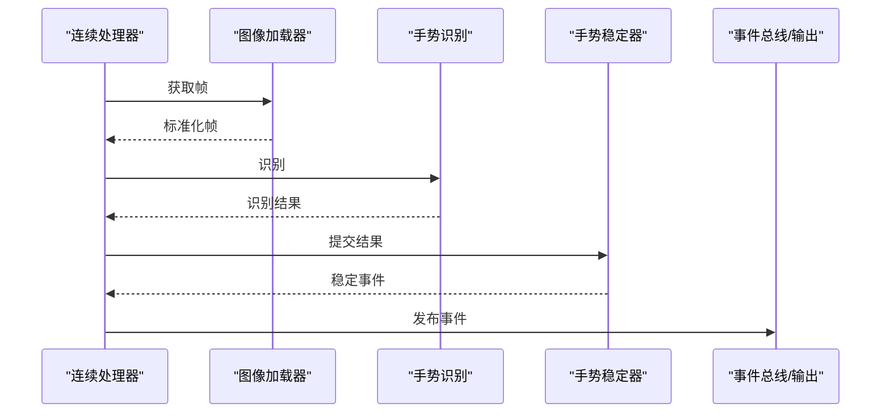
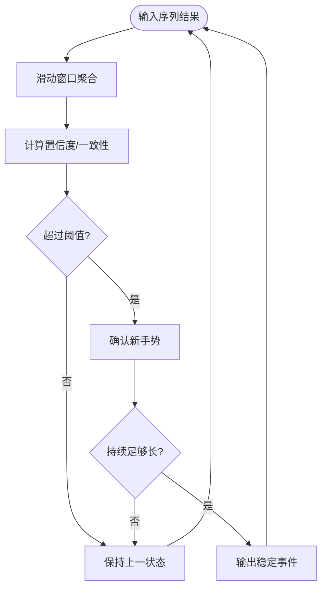
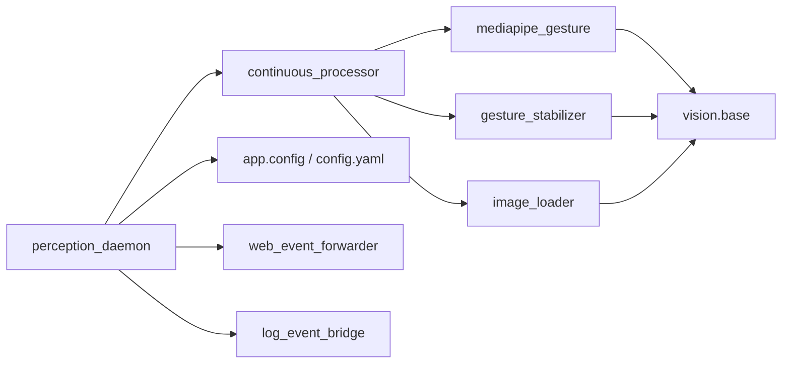

# 视觉感知系统

<cite>
**本文引用的文件**   
- [app/vision/mediapipe_gesture.py](file://app/vision/mediapipe_gesture.py)
- [app/vision/image_loader.py](file://app/vision/image_loader.py)
- [app/vision/continuous_processor.py](file://app/vision/continuous_processor.py)
- [app/vision/gesture_stabilizer.py](file://app/vision/gesture_stabilizer.py)
- [app/vision/base.py](file://app/vision/base.py)
- [app/vision/mock_backend.py](file://app/vision/mock_backend.py)
- [app/runtime/perception_daemon.py](file://app/runtime/perception_daemon.py)
- [app/config.py](file://app/config.py)
- [config.yaml](file://config.yaml)
- [scripts/vision_live.py](file://scripts/vision_live.py)
- [integrations/desktop_bot/web_event_forwarder.py](file://integrations/desktop_bot/web_event_forwarder.py)
- [integrations/desktop_bot/log_event_bridge.py](file://integrations/desktop_bot/log_event_bridge.py)
</cite>

## 目录
1. [简介](#简介)
2. [项目结构](#项目结构)
3. [核心组件](#核心组件)
4. [架构总览](#架构总览)
5. [详细组件分析](#详细组件分析)
6. [依赖关系分析](#依赖关系分析)
7. [性能考量](#性能考量)
8. [故障排查指南](#故障排查指南)
9. [结论](#结论)
10. [附录](#附录)

## 简介
本文件面向AI智能桌面设备的视觉感知系统，重点阐述手势识别模块（MediaPipe集成）、图像采集与处理管道、连续视觉处理器与手势稳定器的工作原理。文档覆盖图像输入格式、预处理步骤、特征提取算法与识别结果输出；并给出相机设备管理、帧率控制、内存优化与错误处理机制说明。同时提供视觉模型配置、自定义手势定义与性能调优指南，解释与前端展示和硬件控制的集成方式。

## 项目结构
视觉感知相关代码集中在 app/vision 目录下，配合运行时守护进程与配置模块，形成“采集—处理—识别—稳定—输出”的完整流水线。脚本与集成层负责演示与事件转发。

图表来源
- [app/vision/base.py](file://app/vision/base.py)
- [app/vision/image_loader.py](file://app/vision/image_loader.py)
- [app/vision/mediapipe_gesture.py](file://app/vision/mediapipe_gesture.py)
- [app/vision/continuous_processor.py](file://app/vision/continuous_processor.py)
- [app/vision/gesture_stabilizer.py](file://app/vision/gesture_stabilizer.py)
- [app/vision/mock_backend.py](file://app/vision/mock_backend.py)
- [app/runtime/perception_daemon.py](file://app/runtime/perception_daemon.py)
- [app/config.py](file://app/config.py)
- [config.yaml](file://config.yaml)
- [scripts/vision_live.py](file://scripts/vision_live.py)
- [integrations/desktop_bot/web_event_forwarder.py](file://integrations/desktop_bot/web_event_forwarder.py)
- [integrations/desktop_bot/log_event_bridge.py](file://integrations/desktop_bot/log_event_bridge.py)

章节来源
- [app/vision/base.py](file://app/vision/base.py)
- [app/vision/image_loader.py](file://app/vision/image_loader.py)
- [app/vision/mediapipe_gesture.py](file://app/vision/mediapipe_gesture.py)
- [app/vision/continuous_processor.py](file://app/vision/continuous_processor.py)
- [app/vision/gesture_stabilizer.py](file://app/vision/gesture_stabilizer.py)
- [app/vision/mock_backend.py](file://app/vision/mock_backend.py)
- [app/runtime/perception_daemon.py](file://app/runtime/perception_daemon.py)
- [app/config.py](file://app/config.py)
- [config.yaml](file://config.yaml)
- [scripts/vision_live.py](file://scripts/vision_live.py)
- [integrations/desktop_bot/web_event_forwarder.py](file://integrations/desktop_bot/web_event_forwarder.py)
- [integrations/desktop_bot/log_event_bridge.py](file://integrations/desktop_bot/log_event_bridge.py)

## 核心组件
- 图像加载器：负责从摄像头或模拟源读取帧，统一为内部格式，完成尺寸归一化与通道转换，支持帧率限制与异常恢复。
- MediaPipe手势识别：封装MediaPipe Hands能力，进行关键点检测与手势分类，输出结构化结果（关键点坐标、置信度、手势类别）。
- 连续视觉处理器：驱动采集与识别循环，协调帧率、丢帧策略、资源清理与错误重试。
- 手势稳定器：对时序上的手势结果进行平滑与去抖，降低抖动与误触发，支持阈值与时间窗口配置。
- 基类与Mock后端：抽象统一的接口契约，便于替换实现与单元测试。

章节来源
- [app/vision/image_loader.py](file://app/vision/image_loader.py)
- [app/vision/mediapipe_gesture.py](file://app/vision/mediapipe_gesture.py)
- [app/vision/continuous_processor.py](file://app/vision/continuous_processor.py)
- [app/vision/gesture_stabilizer.py](file://app/vision/gesture_stabilizer.py)
- [app/vision/base.py](file://app/vision/base.py)
- [app/vision/mock_backend.py](file://app/vision/mock_backend.py)

## 架构总览
视觉感知系统以守护进程为中心，按固定周期拉取帧，经预处理后送入手势识别，再由稳定器过滤输出。配置来自应用配置与配置文件，日志与事件通过集成层转发到Web前端或外部系统。

图表来源
- [app/runtime/perception_daemon.py](file://app/runtime/perception_daemon.py)
- [app/vision/image_loader.py](file://app/vision/image_loader.py)
- [app/vision/mediapipe_gesture.py](file://app/vision/mediapipe_gesture.py)
- [app/vision/gesture_stabilizer.py](file://app/vision/gesture_stabilizer.py)

## 详细组件分析

### 图像加载器（Image Loader）
- 功能要点
  - 多源接入：优先使用真实摄像头，回退至模拟源。
  - 输入格式：统一为RGB、指定分辨率、数据类型（如uint8），必要时进行镜像翻转。
  - 预处理：缩放、归一化、通道顺序调整，确保与下游模型一致。
  - 帧率控制：基于目标FPS计算等待时间，避免CPU过载。
  - 错误处理：捕获设备不可用、权限不足、解码失败等异常，自动重试或降级。
  - 内存优化：复用缓冲区，及时释放大对象，避免频繁分配。
- 关键流程
  - 初始化时探测可用设备，建立连接。
  - 读取帧后进行校验与标准化。
  - 若超时或失败，记录日志并尝试重连。

图表来源
- [app/vision/image_loader.py](file://app/vision/image_loader.py)

章节来源
- [app/vision/image_loader.py](file://app/vision/image_loader.py)

### MediaPipe手势识别（MediaPipe Gesture）
- 功能要点
  - 使用MediaPipe Hands进行手部关键点检测与手势分类。
  - 输入：标准化后的RGB图像。
  - 输出：关键点坐标（相对或绝对）、置信度、手势类别、手数量。
  - 性能：批处理可选、线程安全、GPU加速（若可用）。
  - 错误处理：模型初始化失败、推理超时、输入尺寸不匹配等。
- 典型调用链
  - 接收图像 → 构建输入张量/数据结构 → 运行推理 → 解析结果 → 返回结构化数据。

图表来源
- [app/vision/mediapipe_gesture.py](file://app/vision/mediapipe_gesture.py)

章节来源
- [app/vision/mediapipe_gesture.py](file://app/vision/mediapipe_gesture.py)

### 连续视觉处理器（Continuous Processor）
- 功能要点
  - 驱动采集与识别循环，维护生命周期与退出信号。
  - 帧率调度：根据目标FPS动态休眠，避免忙等。
  - 丢帧策略：当处理耗时超过帧间隔时丢弃旧帧，保证实时性。
  - 资源管理：在异常路径中释放锁、关闭设备、清理缓存。
  - 可观测性：统计吞吐、延迟、丢帧率、错误计数。
- 控制流
  - 启动时初始化各子组件，注册回调。
  - 主循环拉取帧、识别、稳定、输出。
  - 优雅停止：等待当前帧处理完成再退出。

图表来源
- [app/vision/continuous_processor.py](file://app/vision/continuous_processor.py)

章节来源
- [app/vision/continuous_processor.py](file://app/vision/continuous_processor.py)

### 手势稳定器（Gesture Stabilizer）
- 功能要点
  - 时序平滑：对连续帧的手势类别与置信度进行滑动平均或投票。
  - 去抖逻辑：设置最小持续时间与置信度阈值，防止瞬时抖动触发。
  - 状态机：IDLE→CONFIRMED→RELEASED等状态迁移，减少误报。
  - 配置项：时间窗口、阈值、滞后系数、最大确认时长。
- 决策流程
  - 接收序列结果 → 计算统计量 → 判断是否满足条件 → 输出稳定事件。

图表来源
- [app/vision/gesture_stabilizer.py](file://app/vision/gesture_stabilizer.py)

章节来源
- [app/vision/gesture_stabilizer.py](file://app/vision/gesture_stabilizer.py)

### 基类与Mock后端（Base & Mock Backend）
- 基类：定义统一的接口契约（初始化、推理、结果访问、资源释放），便于扩展新的识别后端。
- Mock后端：用于离线测试与CI，生成可控的关键点与手势序列，验证稳定器与处理器逻辑。

章节来源
- [app/vision/base.py](file://app/vision/base.py)
- [app/vision/mock_backend.py](file://app/vision/mock_backend.py)

### 运行时守护进程（Perception Daemon）
- 职责
  - 加载配置，初始化图像加载器、识别器、稳定器。
  - 启动后台线程/协程执行连续处理循环。
  - 暴露启停接口，监听外部事件（如切换摄像头、调整FPS）。
  - 将识别结果转发到集成层（Web事件、日志桥接）。
- 错误恢复
  - 设备断开自动重连，识别失败回退到Mock或跳过帧。
  - 资源泄漏防护，异常路径清理。

章节来源
- [app/runtime/perception_daemon.py](file://app/runtime/perception_daemon.py)

### 配置与模型参数（Config & YAML）
- 配置来源
  - 应用级配置：集中管理默认值与运行时覆盖。
  - 配置文件：YAML中的摄像头索引、分辨率、FPS、模型开关、稳定器阈值等。
- 关键参数
  - 图像：分辨率、宽高比、通道顺序、归一化范围。
  - 识别：模型路径、GPU启用、推理线程数。
  - 稳定器：时间窗口、置信度阈值、最小持续时间。
  - 性能：最大队列长度、丢帧策略、日志级别。

章节来源
- [app/config.py](file://app/config.py)
- [config.yaml](file://config.yaml)

### 脚本与集成（Vision Live & Event Forwarding）
- 演示脚本：快速启动视觉感知，打印或可视化结果，便于调试。
- 事件转发：将识别到的手势事件推送到Web前端或日志系统，供上层业务消费。

章节来源
- [scripts/vision_live.py](file://scripts/vision_live.py)
- [integrations/desktop_bot/web_event_forwarder.py](file://integrations/desktop_bot/web_event_forwarder.py)
- [integrations/desktop_bot/log_event_bridge.py](file://integrations/desktop_bot/log_event_bridge.py)

## 依赖关系分析
- 组件耦合
  - 连续处理器依赖图像加载器、识别器、稳定器，三者通过基类解耦。
  - 守护进程作为编排者，仅依赖抽象接口，便于替换实现。
- 外部依赖
  - MediaPipe库用于关键点检测与手势分类。
  - 摄像头驱动（如OpenCV/系统API）用于帧采集。
- 潜在循环依赖
  - 通过分层与接口隔离避免循环导入。
- 集成点
  - 事件总线/HTTP/WebSocket用于向前端推送。
  - 日志桥接用于审计与排障。

图表来源
- [app/runtime/perception_daemon.py](file://app/runtime/perception_daemon.py)
- [app/vision/continuous_processor.py](file://app/vision/continuous_processor.py)
- [app/vision/image_loader.py](file://app/vision/image_loader.py)
- [app/vision/mediapipe_gesture.py](file://app/vision/mediapipe_gesture.py)
- [app/vision/gesture_stabilizer.py](file://app/vision/gesture_stabilizer.py)
- [app/vision/base.py](file://app/vision/base.py)
- [app/config.py](file://app/config.py)
- [config.yaml](file://config.yaml)
- [integrations/desktop_bot/web_event_forwarder.py](file://integrations/desktop_bot/web_event_forwarder.py)
- [integrations/desktop_bot/log_event_bridge.py](file://integrations/desktop_bot/log_event_bridge.py)

章节来源
- [app/runtime/perception_daemon.py](file://app/runtime/perception_daemon.py)
- [app/vision/continuous_processor.py](file://app/vision/continuous_processor.py)
- [app/vision/image_loader.py](file://app/vision/image_loader.py)
- [app/vision/mediapipe_gesture.py](file://app/vision/mediapipe_gesture.py)
- [app/vision/gesture_stabilizer.py](file://app/vision/gesture_stabilizer.py)
- [app/vision/base.py](file://app/vision/base.py)
- [app/config.py](file://app/config.py)
- [config.yaml](file://config.yaml)
- [integrations/desktop_bot/web_event_forwarder.py](file://integrations/desktop_bot/web_event_forwarder.py)
- [integrations/desktop_bot/log_event_bridge.py](file://integrations/desktop_bot/log_event_bridge.py)

## 性能考量
- 帧率控制
  - 目标FPS与设备能力匹配，过高会导致CPU/GPU占用飙升。
  - 采用睡眠与忙等结合的策略，平衡延迟与功耗。
- 内存优化
  - 复用帧缓冲，避免频繁分配。
  - 及时释放中间结果与大对象，减少GC压力。
- 推理加速
  - 启用GPU/加速后端（若可用）。
  - 批量推理与异步处理，提高吞吐。
- 丢帧与降级
  - 处理超时时丢弃旧帧，保证最新性。
  - 识别失败时回退到Mock或跳过帧，维持系统可用性。
- 监控指标
  - 记录端到端延迟、吞吐、丢帧率、错误次数，辅助调优。

[本节为通用指导，无需具体文件引用]

## 故障排查指南
- 常见问题
  - 摄像头无法打开：检查权限、设备索引、驱动安装。
  - 识别结果为空：确认输入尺寸、通道顺序、模型初始化成功。
  - 手势抖动严重：调整稳定器阈值与时间窗口。
  - 高CPU占用：降低分辨率/FPS，启用加速后端，优化预处理。
- 定位方法
  - 开启详细日志，观察初始化与推理阶段报错。
  - 使用Mock后端隔离问题，逐步回归真实设备。
  - 监控指标曲线，定位瓶颈环节。

章节来源
- [app/vision/image_loader.py](file://app/vision/image_loader.py)
- [app/vision/mediapipe_gesture.py](file://app/vision/mediapipe_gesture.py)
- [app/vision/gesture_stabilizer.py](file://app/vision/gesture_stabilizer.py)
- [app/runtime/perception_daemon.py](file://app/runtime/perception_daemon.py)

## 结论
视觉感知系统通过清晰的模块化设计与稳定的运行时编排，实现了从图像采集、预处理、手势识别到结果稳定的完整链路。借助配置化管理与Mock后端，系统具备良好的可测试性与可扩展性。在生产部署中，应重点关注帧率、内存与推理加速，结合监控指标持续优化。

[本节为总结性内容，无需具体文件引用]

## 附录
- 图像输入格式建议
  - RGB、uint8、指定分辨率（如640x480），必要时镜像翻转。
- 预处理步骤建议
  - 缩放至模型输入尺寸，归一化到[0,1]或[-1,1]，通道顺序一致。
- 特征提取与输出
  - 关键点坐标（相对/绝对）、置信度、手势类别、手数量。
- 自定义手势定义
  - 在稳定器中扩展类别映射与阈值策略，结合业务需求定义触发条件。
- 与前端与硬件集成
  - 通过事件转发器将手势事件推送至Web前端，或通过日志桥接上报给控制系统。

[本节为概念性补充，无需具体文件引用]