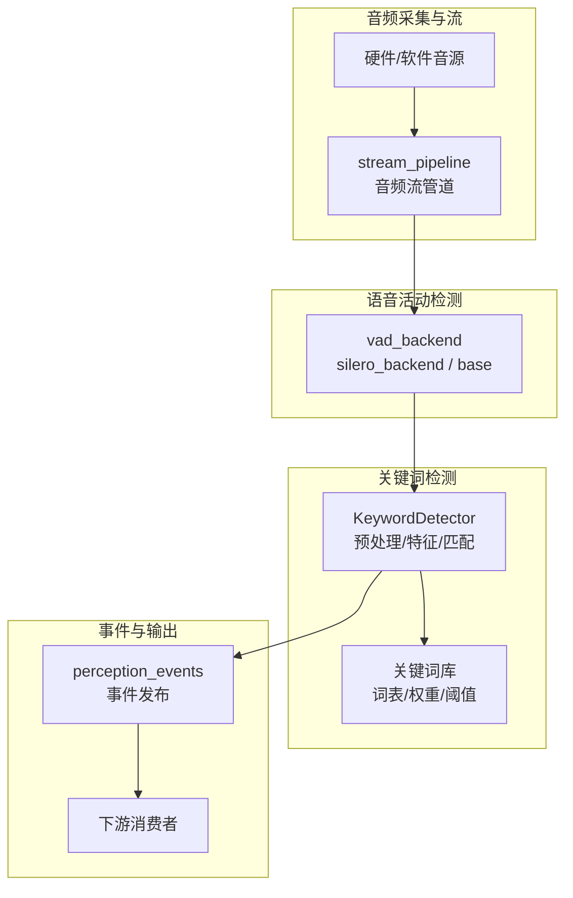
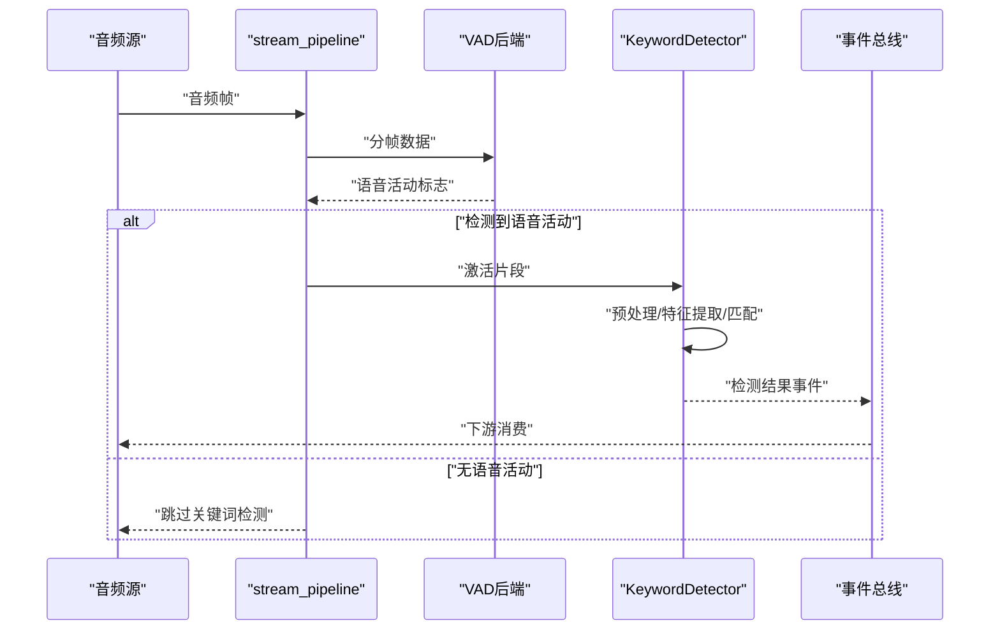
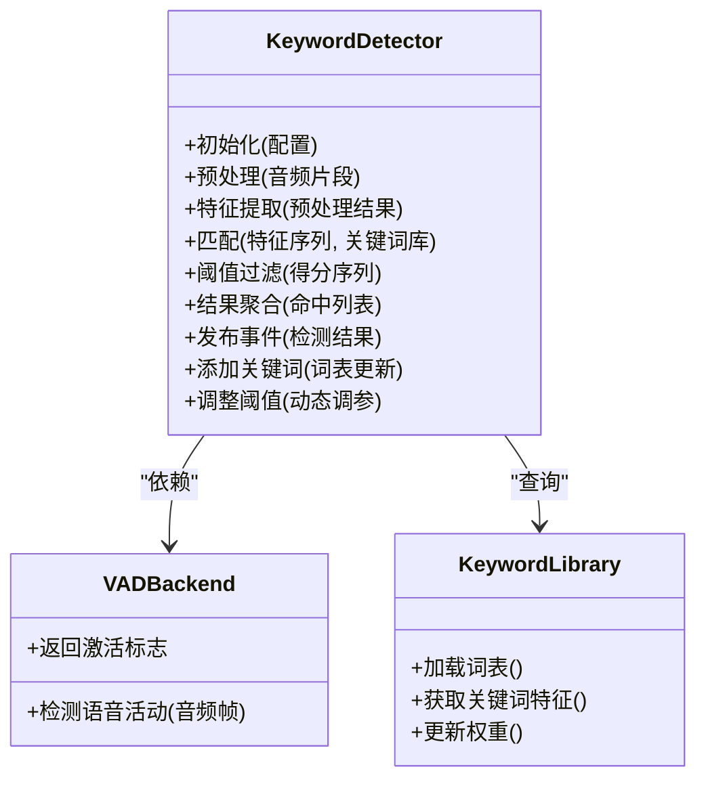
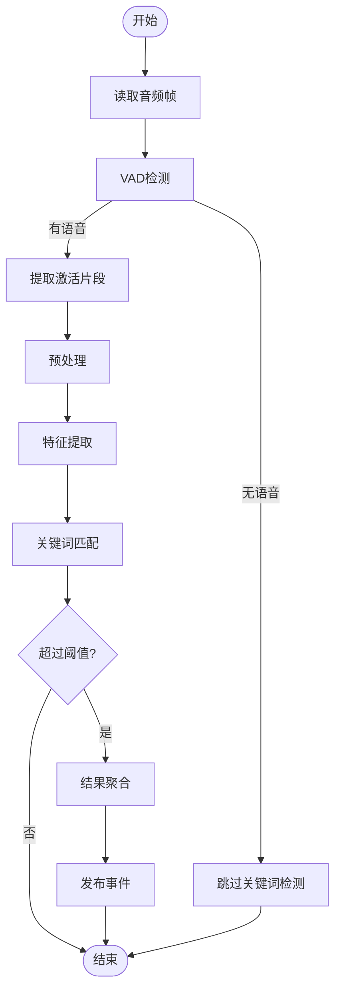
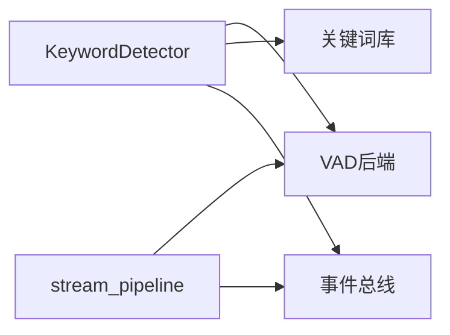

# 关键词检测模块

<cite>
**本文引用的文件**   
- [app/detection/keywords.py](file://app/detection/keywords.py)
- [app/audio/stream_pipeline.py](file://app/audio/stream_pipeline.py)
- [app/audio/vad/silero_backend.py](file://app/audio/vad/silero_backend.py)
- [app/audio/vad/base.py](file://app/audio/vad/base.py)
- [app/config.py](file://app/config.py)
- [config.yaml](file://config.yaml)
- [app/perception_events.py](file://app/perception_events.py)
- [tests/test_vad_stream.py](file://tests/test_vad_stream.py)
</cite>

## 目录
1. [简介](#简介)
2. [项目结构](#项目结构)
3. [核心组件](#核心组件)
4. [架构总览](#架构总览)
5. [详细组件分析](#详细组件分析)
6. [依赖关系分析](#依赖关系分析)
7. [性能考虑](#性能考虑)
8. [故障排查指南](#故障排查指南)
9. [结论](#结论)
10. [附录](#附录)

## 简介
本模块聚焦于“关键词检测”（Keyword Spotting）能力，提供从音频流接入、语音活动检测（VAD）、特征提取与匹配到结果输出的完整链路。文档将深入解释算法实现原理（预处理、特征提取、匹配策略），详细说明 KeywordDetector 类的核心方法、配置参数与使用模式，并覆盖关键词库管理、实时检测流程、性能优化技巧以及与 VAD 系统的集成方式和错误处理机制。

## 项目结构
关键词检测相关代码主要位于 app/detection 与 app/audio 子系统中：
- app/detection/keywords.py：关键词检测器核心实现（KeywordDetector）
- app/audio/stream_pipeline.py：音频流管道，负责数据源接入、分帧、VAD 触发与事件分发
- app/audio/vad/*：VAD 后端实现（如 Silero）与抽象基类
- app/config.py 与 config.yaml：运行时配置项（采样率、窗口长度、阈值等）
- app/perception_events.py：感知事件模型（用于检测结果的事件化输出）
- tests/test_vad_stream.py：VAD 与流管道的测试用例参考

图表来源
- [app/audio/stream_pipeline.py](file://app/audio/stream_pipeline.py)
- [app/audio/vad/silero_backend.py](file://app/audio/vad/silero_backend.py)
- [app/audio/vad/base.py](file://app/audio/vad/base.py)
- [app/detection/keywords.py](file://app/detection/keywords.py)
- [app/perception_events.py](file://app/perception_events.py)

章节来源
- [app/detection/keywords.py](file://app/detection/keywords.py)
- [app/audio/stream_pipeline.py](file://app/audio/stream_pipeline.py)
- [app/audio/vad/silero_backend.py](file://app/audio/vad/silero_backend.py)
- [app/audio/vad/base.py](file://app/audio/vad/base.py)
- [app/config.py](file://app/config.py)
- [config.yaml](file://config.yaml)
- [app/perception_events.py](file://app/perception_events.py)

## 核心组件
- KeywordDetector：关键词检测的核心类，封装了音频预处理、特征提取、匹配策略、阈值控制与结果聚合。
- VAD 后端：基于 silero 或自定义实现的语音活动检测，用于在低功耗模式下仅对含声片段进行关键词检测。
- 音频流管道：统一接入音频源，按帧推送数据至 VAD 与关键词检测器，并转发检测结果事件。
- 配置系统：集中管理采样率、窗口大小、步长、VAD 阈值、关键词阈值、缓存与线程池等参数。
- 事件模型：标准化检测结果的结构，便于下游消费与扩展。

章节来源
- [app/detection/keywords.py](file://app/detection/keywords.py)
- [app/audio/stream_pipeline.py](file://app/audio/stream_pipeline.py)
- [app/audio/vad/silero_backend.py](file://app/audio/vad/silero_backend.py)
- [app/audio/vad/base.py](file://app/audio/vad/base.py)
- [app/config.py](file://app/config.py)
- [config.yaml](file://config.yaml)
- [app/perception_events.py](file://app/perception_events.py)

## 架构总览
关键词检测的整体流程如下：
- 音频源通过 stream_pipeline 持续产出音频帧
- VAD 后端判断是否包含语音活动，仅在激活时触发关键词检测
- KeywordDetector 对激活片段执行预处理、特征提取与匹配，结合阈值与滑动窗口策略输出最终结果
- 检测结果以事件形式发布，供其他模块消费

图表来源
- [app/audio/stream_pipeline.py](file://app/audio/stream_pipeline.py)
- [app/audio/vad/silero_backend.py](file://app/audio/vad/silero_backend.py)
- [app/detection/keywords.py](file://app/detection/keywords.py)
- [app/perception_events.py](file://app/perception_events.py)

## 详细组件分析

### KeywordDetector 类分析
- 职责
  - 接收 VAD 激活的音频片段
  - 执行音频预处理（降噪、归一化、重采样等）
  - 提取声学特征（如 MFCC、频谱能量等）
  - 与关键词库进行匹配（模板匹配、相似度打分、时间一致性校验）
  - 根据阈值与滑动窗口策略输出稳定检测结果
- 关键方法与概念
  - 初始化与配置加载：读取采样率、窗口长度、步长、阈值、关键词库路径等
  - 预处理管线：静音切除、增益控制、滤波、分帧
  - 特征提取：计算每帧特征向量，构建时序特征序列
  - 匹配策略：计算候选关键词与输入特征的相似度，应用阈值与时间一致性过滤
  - 结果聚合：去抖、合并相邻命中、生成最终事件
- 配置参数
  - 音频参数：采样率、窗口长度、步长、帧重叠
  - VAD 参数：激活阈值、最小语音时长
  - 关键词参数：词表、权重、阈值、时间一致性窗口
  - 性能参数：线程池大小、批处理大小、缓存大小
- 使用模式
  - 单例或工厂创建实例
  - 注册关键词库与回调处理器
  - 启动后订阅 VAD 事件，处理激活片段
  - 停止时释放资源与清理状态

图表来源
- [app/detection/keywords.py](file://app/detection/keywords.py)
- [app/audio/vad/base.py](file://app/audio/vad/base.py)
- [app/audio/vad/silero_backend.py](file://app/audio/vad/silero_backend.py)

章节来源
- [app/detection/keywords.py](file://app/detection/keywords.py)
- [app/audio/vad/base.py](file://app/audio/vad/base.py)
- [app/audio/vad/silero_backend.py](file://app/audio/vad/silero_backend.py)

### 音频流管道与 VAD 集成
- 音频流管道
  - 统一接入硬件或模拟音源
  - 按固定帧长切分音频数据
  - 将帧推送给 VAD 后端
  - 当 VAD 返回激活时，将对应片段传递给 KeywordDetector
- VAD 后端
  - 基于 silero 或其他模型实现
  - 维护内部状态（如滑动平均、静音恢复）
  - 输出布尔标志表示是否检测到语音活动
- 集成要点
  - 帧对齐与缓冲管理
  - 激活片段的边界确定（开始/结束时间戳）
  - 错误回退（VAD 失败时降级为全量检测或暂停）

图表来源
- [app/audio/stream_pipeline.py](file://app/audio/stream_pipeline.py)
- [app/audio/vad/silero_backend.py](file://app/audio/vad/silero_backend.py)
- [app/detection/keywords.py](file://app/detection/keywords.py)

章节来源
- [app/audio/stream_pipeline.py](file://app/audio/stream_pipeline.py)
- [app/audio/vad/silero_backend.py](file://app/audio/vad/silero_backend.py)

### 关键词库管理与动态更新
- 词表结构
  - 每个关键词包含名称、权重、阈值、预计算特征等
  - 支持批量导入与增量更新
- 更新策略
  - 热更新：不中断检测流程的情况下替换词表
  - 版本控制：保留历史版本以便回滚
- 性能优化
  - 预计算特征以减少在线计算开销
  - 索引加速（如哈希或树形结构）提升匹配速度

章节来源
- [app/detection/keywords.py](file://app/detection/keywords.py)

### 实时检测流程与结果处理
- 实时性要求
  - 低延迟：端到端延迟控制在毫秒级
  - 高吞吐：支持多路音频并行处理
- 结果处理
  - 去抖：避免短时间内重复触发
  - 合并：相邻命中合并为一次事件
  - 置信度：综合相似度、时长、稳定性给出最终置信度

章节来源
- [app/detection/keywords.py](file://app/detection/keywords.py)
- [app/perception_events.py](file://app/perception_events.py)

### 与 VAD 系统的集成方式
- 接口约定
  - VAD 后端需实现统一的检测接口
  - 返回布尔标志与可选的时间戳信息
- 容错机制
  - VAD 异常时自动降级或重试
  - 超时保护防止阻塞主循环

章节来源
- [app/audio/vad/base.py](file://app/audio/vad/base.py)
- [app/audio/vad/silero_backend.py](file://app/audio/vad/silero_backend.py)

### 错误处理机制
- 常见错误
  - 音频源不可用
  - VAD 模型加载失败
  - 关键词库格式错误
  - 内存不足或线程池耗尽
- 处理策略
  - 捕获异常并记录日志
  - 自动重试与降级
  - 健康检查与告警

章节来源
- [app/detection/keywords.py](file://app/detection/keywords.py)
- [app/audio/stream_pipeline.py](file://app/audio/stream_pipeline.py)

## 依赖关系分析
- 模块内依赖
  - KeywordDetector 依赖 VAD 后端与关键词库
  - stream_pipeline 依赖 VAD 后端与事件总线
- 外部依赖
  - VAD 模型（如 silero）
  - 音频处理库（如 numpy、scipy）
  - 事件总线（如 asyncio 或消息队列）

图表来源
- [app/detection/keywords.py](file://app/detection/keywords.py)
- [app/audio/stream_pipeline.py](file://app/audio/stream_pipeline.py)
- [app/audio/vad/base.py](file://app/audio/vad/base.py)
- [app/perception_events.py](file://app/perception_events.py)

章节来源
- [app/detection/keywords.py](file://app/detection/keywords.py)
- [app/audio/stream_pipeline.py](file://app/audio/stream_pipeline.py)
- [app/audio/vad/base.py](file://app/audio/vad/base.py)
- [app/perception_events.py](file://app/perception_events.py)

## 性能考虑
- 预处理优化
  - 使用向量化操作减少 Python 循环开销
  - 合理设置窗口长度与步长平衡精度与延迟
- 特征提取优化
  - 预计算静态特征（如 MFCC 系数）
  - 使用缓存避免重复计算
- 匹配策略优化
  - 早期退出：相似度低于阈值直接丢弃
  - 并行匹配：多线程或多进程处理多个关键词
- 内存管理
  - 限制缓冲区大小，及时释放中间结果
  - 使用生成器或流式处理降低内存占用
- 线程与异步
  - 合理配置线程池大小，避免上下文切换开销
  - 使用异步 I/O 提高并发处理能力

[本节为通用指导，无需特定文件引用]

## 故障排查指南
- 常见问题
  - 无检测结果：检查 VAD 阈值与关键词阈值是否过高
  - 误报率高：降低阈值或增加时间一致性窗口
  - 延迟过高：减小窗口长度或启用批处理
  - 内存溢出：减少缓存大小或启用流式处理
- 调试步骤
  - 启用详细日志，观察 VAD 激活频率
  - 可视化特征序列与匹配得分
  - 逐步禁用功能定位问题模块
- 测试参考
  - 使用单元测试验证 VAD 与流管道行为
  - 使用模拟音频数据验证关键词检测准确性

章节来源
- [tests/test_vad_stream.py](file://tests/test_vad_stream.py)

## 结论
关键词检测模块通过 VAD 与 KeywordDetector 的协同工作，实现了高效、准确的实时关键词识别。合理的配置与优化策略可显著提升性能与稳定性。建议在生产环境中持续监控指标并根据实际场景调整参数。

[本节为总结性内容，无需特定文件引用]

## 附录
- 配置示例
  - 采样率：16000 Hz
  - 窗口长度：25 ms
  - 步长：10 ms
  - VAD 阈值：0.5
  - 关键词阈值：0.7
  - 时间一致性窗口：3 帧
- 使用示例
  - 添加新关键词：更新关键词库并重新加载
  - 调整检测阈值：修改配置文件或调用动态调参接口
  - 处理检测结果：订阅事件总线并消费关键词检测事件

[本节为补充说明，无需特定文件引用]