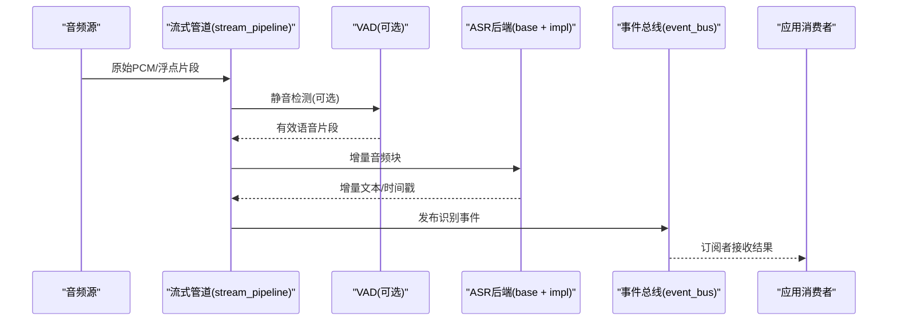
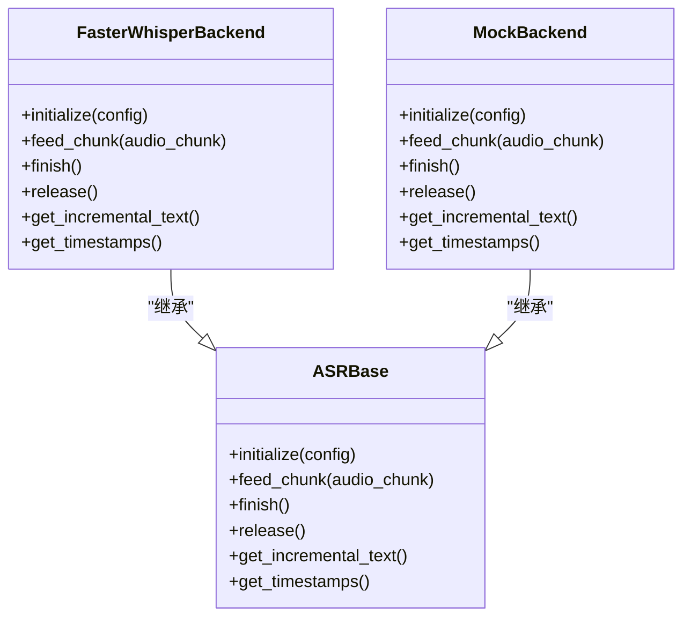
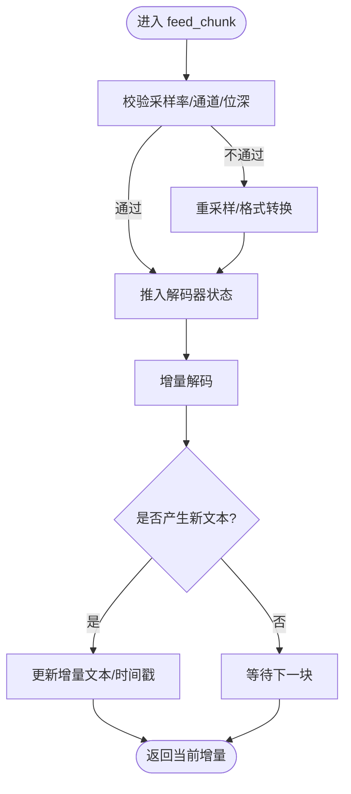
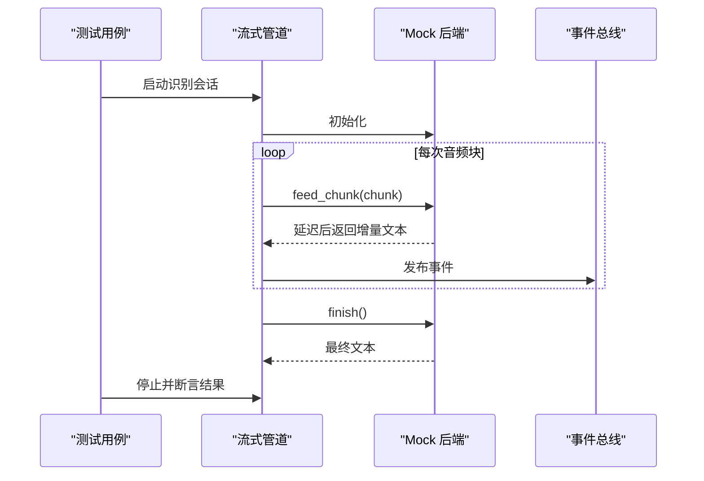
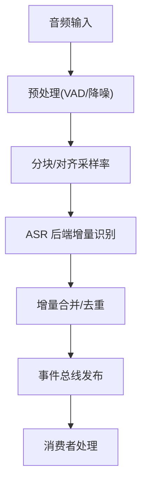
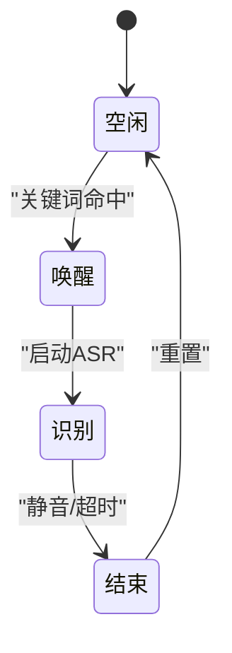
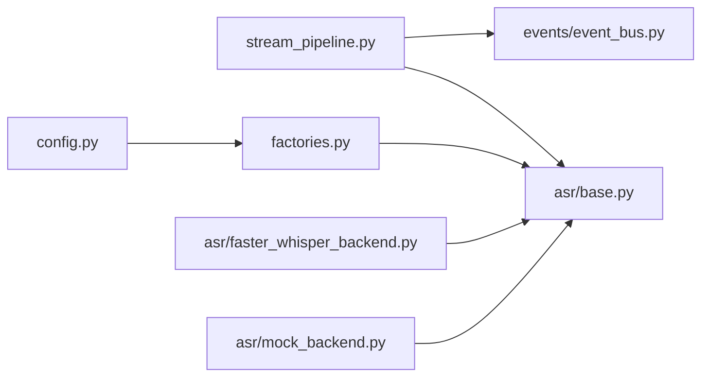

# 流式语音识别

<cite>
**本文引用的文件**   
- [app/asr/base.py](file://app/asr/base.py)
- [app/asr/faster_whisper_backend.py](file://app/asr/faster_whisper_backend.py)
- [app/asr/mock_backend.py](file://app/asr/mock_backend.py)
- [app/audio/stream_pipeline.py](file://app/audio/stream_pipeline.py)
- [app/audio/keyword_asr.py](file://app/audio/keyword_asr.py)
- [app/events/event_bus.py](file://app/events/event_bus.py)
- [app/config.py](file://app/config.py)
- [app/factories.py](file://app/factories.py)
- [tests/test_vad_stream.py](file://tests/test_vad_stream.py)
</cite>

## 目录
1. [简介](#简介)
2. [项目结构](#项目结构)
3. [核心组件](#核心组件)
4. [架构总览](#架构总览)
5. [详细组件分析](#详细组件分析)
6. [依赖关系分析](#依赖关系分析)
7. [性能考量](#性能考量)
8. [故障排查指南](#故障排查指南)
9. [结论](#结论)
10. [附录](#附录)

## 简介
本文件面向流式语音识别（ASR）子系统，系统性阐述基类设计模式与后端抽象接口、Faster-Whisper 后端的实现要点、Mock 后端的测试用途；深入解释流式音频处理管道、实时转录流程与增量识别机制；并覆盖音频格式支持、采样率配置、缓冲区管理与内存优化策略。同时提供后端切换配置、性能调优参数、故障恢复方案，以及与事件总线的集成方式和扩展自定义后端的开发指南。

## 项目结构
ASR 相关代码主要位于 app/asr 与 app/audio 两个目录：
- app/asr：定义 ASR 基类与具体后端（Faster-Whisper、Mock）。
- app/audio：包含流式处理管道、关键词唤醒与 ASR 的协作逻辑。
- app/events：事件总线，用于在系统内广播识别结果与状态。
- app/config、app/factories：配置与工厂，负责后端选择与实例化。

```mermaid
graph TB
subgraph "ASR 模块"
A_base["base.py<br/>ASR 基类"]
A_fw["faster_whisper_backend.py<br/>Faster-Whisper 后端"]
A_mock["mock_backend.py<br/>Mock 后端"]
end
subgraph "音频处理"
S_pipe["stream_pipeline.py<br/>流式管道"]
K_asr["keyword_asr.py<br/>关键词+ASR 协作"]
end
subgraph "系统与配置"
E_bus["event_bus.py<br/>事件总线"]
Cfg["config.py<br/>配置"]
Fac["factories.py<br/>工厂"]
end
S_pipe --> A_base
A_fw --> A_base
A_mock --> A_base
K_asr --> S_pipe
K_asr --> A_base
E_bus < --> K_asr
Fac --> A_base
Cfg --> Fac
```

图表来源
- [app/asr/base.py](file://app/asr/base.py)
- [app/asr/faster_whisper_backend.py](file://app/asr/faster_whisper_backend.py)
- [app/asr/mock_backend.py](file://app/asr/mock_backend.py)
- [app/audio/stream_pipeline.py](file://app/audio/stream_pipeline.py)
- [app/audio/keyword_asr.py](file://app/audio/keyword_asr.py)
- [app/events/event_bus.py](file://app/events/event_bus.py)
- [app/config.py](file://app/config.py)
- [app/factories.py](file://app/factories.py)

章节来源
- [app/asr/base.py](file://app/asr/base.py)
- [app/asr/faster_whisper_backend.py](file://app/asr/faster_whisper_backend.py)
- [app/asr/mock_backend.py](file://app/asr/mock_backend.py)
- [app/audio/stream_pipeline.py](file://app/audio/stream_pipeline.py)
- [app/audio/keyword_asr.py](file://app/audio/keyword_asr.py)
- [app/events/event_bus.py](file://app/events/event_bus.py)
- [app/config.py](file://app/config.py)
- [app/factories.py](file://app/factories.py)

## 核心组件
- ASR 基类与后端抽象：统一输入输出契约，屏蔽不同后端差异，便于替换与测试。
- Faster-Whisper 后端：基于 Faster-Whisper 的流式推理实现，支持增量文本输出与时间戳对齐。
- Mock 后端：用于单元测试与端到端验证，模拟流式分片与延迟，保证管道稳定性。
- 流式音频管道：将采集到的音频切片、VAD 切分、送入 ASR 后端，聚合增量结果并推送事件。
- 事件总线：解耦识别结果发布与消费方，支持多订阅者。

章节来源
- [app/asr/base.py](file://app/asr/base.py)
- [app/asr/faster_whisper_backend.py](file://app/asr/faster_whisper_backend.py)
- [app/asr/mock_backend.py](file://app/asr/mock_backend.py)
- [app/audio/stream_pipeline.py](file://app/audio/stream_pipeline.py)
- [app/events/event_bus.py](file://app/events/event_bus.py)

## 架构总览
下图展示从音频采集到识别结果发布的完整数据流，以及后端可插拔的设计。



图表来源
- [app/audio/stream_pipeline.py](file://app/audio/stream_pipeline.py)
- [app/asr/base.py](file://app/asr/base.py)
- [app/asr/faster_whisper_backend.py](file://app/asr/faster_whisper_backend.py)
- [app/asr/mock_backend.py](file://app/asr/mock_backend.py)
- [app/events/event_bus.py](file://app/events/event_bus.py)

## 详细组件分析

### ASR 基类与后端抽象
- 设计目标：定义统一的流式识别接口，包括初始化、增量输入、结束与资源释放等生命周期方法；返回增量文本与可选时间戳。
- 关键职责：
  - 标准化输入格式（采样率、通道数、位深）。
  - 管理内部缓冲与上下文状态。
  - 暴露一致的异常模型与错误码。
- 扩展性：新增后端只需继承基类并实现必要方法，即可无缝接入管道。



图表来源
- [app/asr/base.py](file://app/asr/base.py)
- [app/asr/faster_whisper_backend.py](file://app/asr/faster_whisper_backend.py)
- [app/asr/mock_backend.py](file://app/asr/mock_backend.py)

章节来源
- [app/asr/base.py](file://app/asr/base.py)
- [app/asr/faster_whisper_backend.py](file://app/asr/faster_whisper_backend.py)
- [app/asr/mock_backend.py](file://app/asr/mock_backend.py)

### Faster-Whisper 后端实现要点
- 流式推理：按块喂入音频，维护解码器状态，逐步产出增量文本与时间戳。
- 采样率与格式：确保输入为后端期望的采样率与通道布局，必要时进行重采样与归一化。
- 资源管理：显式释放模型句柄与缓存，避免长时运行内存泄漏。
- 错误处理：网络或模型加载失败时的重试与降级策略。



图表来源
- [app/asr/faster_whisper_backend.py](file://app/asr/faster_whisper_backend.py)

章节来源
- [app/asr/faster_whisper_backend.py](file://app/asr/faster_whisper_backend.py)

### Mock 后端与测试用途
- 作用：模拟真实后端的流式行为（延迟、分片、边界情况），用于单元测试与集成测试。
- 特性：
  - 可控延迟与抖动，验证管道的鲁棒性。
  - 固定输出序列，便于断言。
  - 支持异常注入，检验错误恢复路径。



图表来源
- [app/asr/mock_backend.py](file://app/asr/mock_backend.py)
- [app/audio/stream_pipeline.py](file://app/audio/stream_pipeline.py)
- [app/events/event_bus.py](file://app/events/event_bus.py)
- [tests/test_vad_stream.py](file://tests/test_vad_stream.py)

章节来源
- [app/asr/mock_backend.py](file://app/asr/mock_backend.py)
- [tests/test_vad_stream.py](file://tests/test_vad_stream.py)

### 流式音频处理管道与实时转录
- 输入：来自硬件或模拟源的 PCM/浮点音频流。
- 预处理：可选 VAD 切分、降噪、增益控制。
- 流式识别：将有效片段按块送入 ASR 后端，累积增量文本。
- 输出：通过事件总线发布识别结果，供 UI、日志、下游服务消费。



图表来源
- [app/audio/stream_pipeline.py](file://app/audio/stream_pipeline.py)
- [app/events/event_bus.py](file://app/events/event_bus.py)

章节来源
- [app/audio/stream_pipeline.py](file://app/audio/stream_pipeline.py)

### 关键词唤醒与 ASR 协作
- 工作流：先进行关键词检测，命中后再启动 ASR 流式识别，降低功耗与误触发。
- 状态机：空闲→唤醒→识别→结束，状态变化通过事件总线广播。



章节来源
- [app/audio/keyword_asr.py](file://app/audio/keyword_asr.py)

## 依赖关系分析
- 组件耦合：
  - 流式管道依赖 ASR 基类，不感知具体后端实现。
  - 工厂根据配置创建具体后端实例。
  - 事件总线解耦发布者与订阅者。
- 外部依赖：
  - Faster-Whisper 运行时库。
  - 音频处理库（如重采样、VAD）。
- 潜在循环依赖：通过工厂与接口隔离，避免直接循环导入。



图表来源
- [app/audio/stream_pipeline.py](file://app/audio/stream_pipeline.py)
- [app/asr/base.py](file://app/asr/base.py)
- [app/asr/faster_whisper_backend.py](file://app/asr/faster_whisper_backend.py)
- [app/asr/mock_backend.py](file://app/asr/mock_backend.py)
- [app/events/event_bus.py](file://app/events/event_bus.py)
- [app/config.py](file://app/config.py)
- [app/factories.py](file://app/factories.py)

章节来源
- [app/audio/stream_pipeline.py](file://app/audio/stream_pipeline.py)
- [app/asr/base.py](file://app/asr/base.py)
- [app/asr/faster_whisper_backend.py](file://app/asr/faster_whisper_backend.py)
- [app/asr/mock_backend.py](file://app/asr/mock_backend.py)
- [app/events/event_bus.py](file://app/events/event_bus.py)
- [app/config.py](file://app/config.py)
- [app/factories.py](file://app/factories.py)

## 性能考量
- 采样率与块大小：
  - 合理设置采样率（如 16kHz）与块大小（如 10–30ms）以平衡延迟与准确率。
  - 避免频繁重采样，尽量在源头保持目标采样率。
- 缓冲区管理：
  - 使用环形缓冲与零拷贝传递，减少内存分配与复制。
  - 及时释放中间对象，防止 GC 压力。
- 增量识别：
  - 仅对新增片段进行解码，复用上下文状态。
  - 合并增量文本时做去重与平滑，避免重复词。
- 资源释放：
  - 会话结束时显式释放模型句柄与缓存。
  - 监控内存占用，设置上限告警。
- 并发与线程安全：
  - 区分 I/O 线程与计算线程，避免阻塞。
  - 事件发布采用异步队列，背压保护。

[本节为通用指导，无需特定文件引用]

## 故障排查指南
- 常见问题定位：
  - 音频格式不匹配：检查采样率、通道数、位深，确认预处理链路。
  - 延迟过高：调整块大小、禁用不必要的预处理、检查后端负载。
  - 内存泄漏：监控进程内存，确认 release/finish 调用路径。
  - 识别中断：检查事件总线订阅者是否阻塞，增加超时与重试。
- 调试手段：
  - 启用 Mock 后端复现问题，隔离后端因素。
  - 记录关键指标（块时长、增量间隔、错误码）。
  - 使用最小化测试用例快速回归。

章节来源
- [app/asr/mock_backend.py](file://app/asr/mock_backend.py)
- [app/events/event_bus.py](file://app/events/event_bus.py)
- [tests/test_vad_stream.py](file://tests/test_vad_stream.py)

## 结论
本系统通过 ASR 基类与后端抽象实现了高内聚、低耦合的流式语音识别能力。Faster-Whisper 后端提供生产级增量识别，Mock 后端保障测试稳定性。流式管道与事件总线协同，形成可扩展、易维护的实时转录体系。结合合理的采样率、缓冲区与内存策略，可在延迟与准确率之间取得良好平衡。

[本节为总结性内容，无需特定文件引用]

## 附录

### 音频格式支持与采样率配置
- 支持的输入格式：PCM 整数/浮点、单声道/立体声（建议转单声道）。
- 推荐采样率：16kHz（兼顾清晰度与带宽）。
- 重采样策略：仅在源头不可控时执行，优先在采集端固定采样率。

章节来源
- [app/audio/stream_pipeline.py](file://app/audio/stream_pipeline.py)
- [app/config.py](file://app/config.py)

### 缓冲区管理与内存优化
- 环形缓冲：固定容量，写入即覆盖旧数据，避免增长。
- 零拷贝：跨模块传递内存视图，减少复制。
- 对象池：复用解码器上下文与临时数组。
- 监控：定期采样内存与 GC 统计，设置阈值告警。

章节来源
- [app/audio/stream_pipeline.py](file://app/audio/stream_pipeline.py)

### 后端切换配置与工厂
- 配置项：后端类型、模型路径、采样率、块大小、超时等。
- 工厂：根据配置动态创建后端实例，支持热切换。
- 默认策略：无可用后端时回退至 Mock，保证系统可用性。

章节来源
- [app/config.py](file://app/config.py)
- [app/factories.py](file://app/factories.py)

### 事件总线集成与扩展指南
- 事件类型：识别开始、增量文本、结束、错误、状态变更。
- 订阅模式：多订阅者、异步处理、超时与重试。
- 扩展自定义后端：
  - 继承 ASR 基类，实现初始化、增量输入、结束与释放。
  - 遵循输入输出契约，抛出标准异常。
  - 在工厂中注册新后端，并在配置中选择。

章节来源
- [app/events/event_bus.py](file://app/events/event_bus.py)
- [app/asr/base.py](file://app/asr/base.py)
- [app/factories.py](file://app/factories.py)