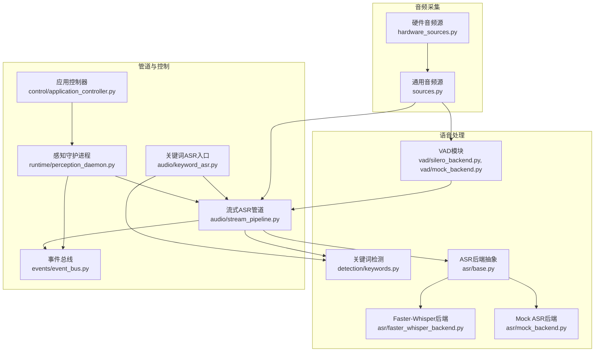
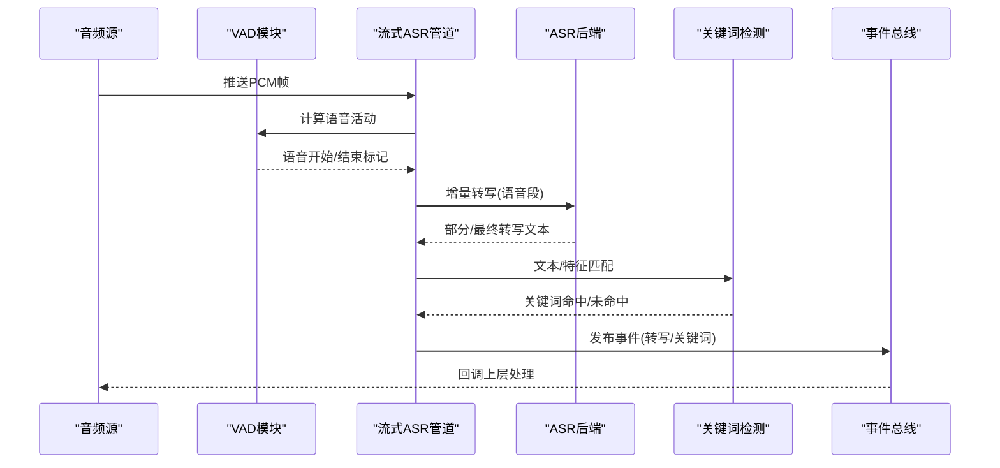
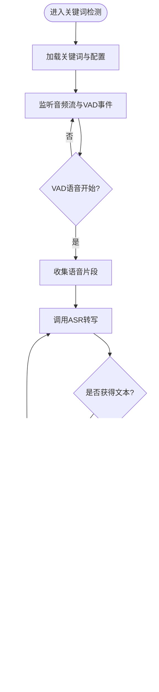
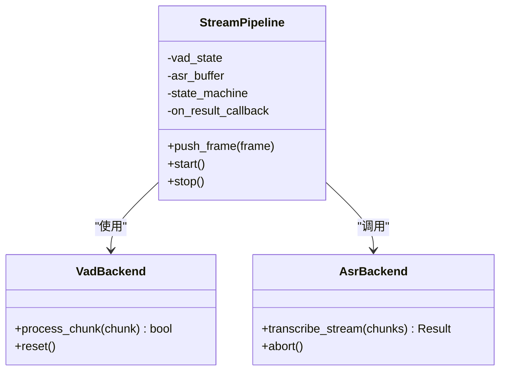
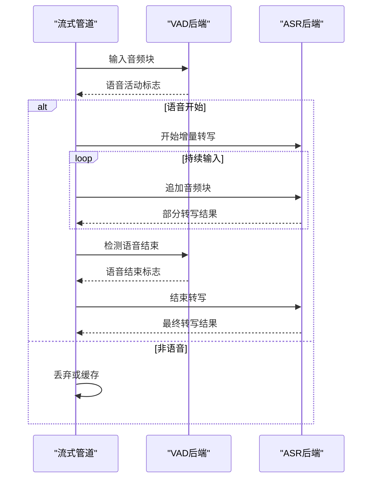
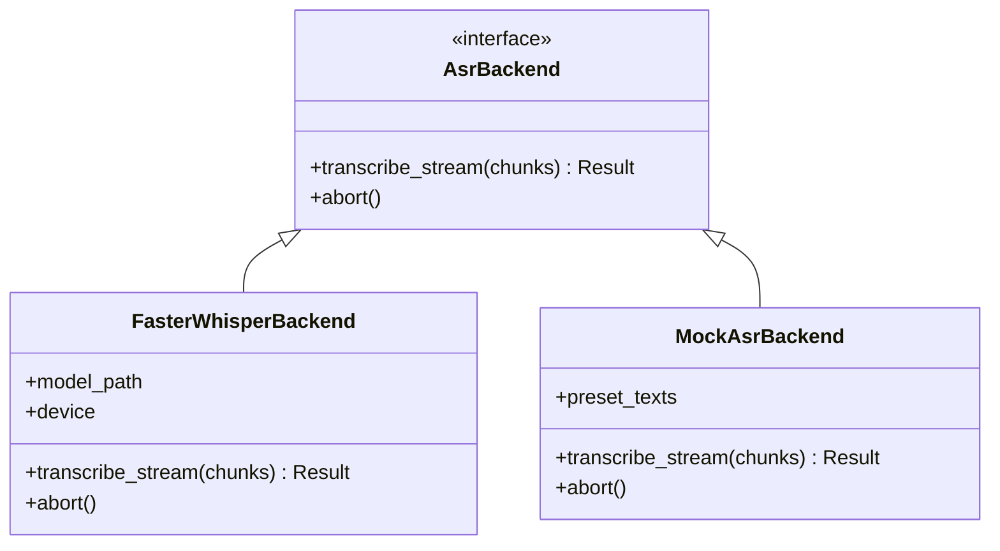
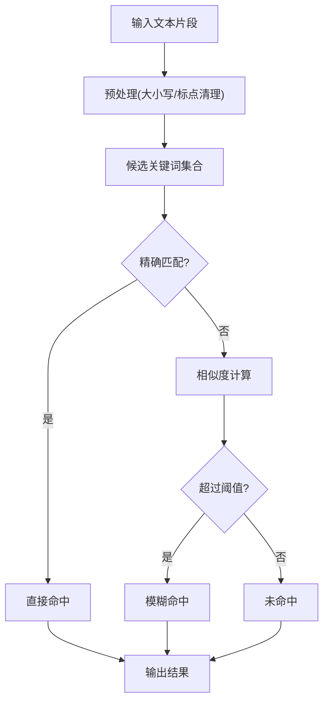
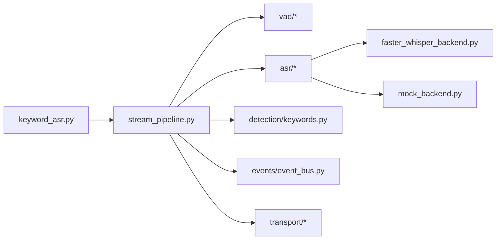

# 语音识别系统

<cite>
**本文引用的文件**   
- [keyword_asr.py](file://app/audio/keyword_asr.py)
- [stream_pipeline.py](file://app/audio/stream_pipeline.py)
- [faster_whisper_backend.py](file://app/asr/faster_whisper_backend.py)
- [mock_backend.py](file://app/asr/mock_backend.py)
- [base.py](file://app/asr/base.py)
- [silero_backend.py](file://app/audio/vad/silero_backend.py)
- [mock_backend.py](file://app/audio/vad/mock_backend.py)
- [base.py](file://app/audio/vad/base.py)
- [keywords.py](file://app/detection/keywords.py)
- [config.py](file://app/config.py)
- [hardware_sources.py](file://app/transport/hardware_sources.py)
- [sources.py](file://app/transport/sources.py)
- [perception_daemon.py](file://app/runtime/perception_daemon.py)
- [application_controller.py](file://app/control/application_controller.py)
- [event_bus.py](file://app/events/event_bus.py)
- [models.py](file://app/models.py)
- [perception_events.py](file://app/perception_events.py)
- [__main__.py](file://app/__main__.py)
- [main.py](file://app/main.py)
- [requirements.txt](file://requirements.txt)
</cite>

## 目录
1. [简介](#简介)
2. [项目结构](#项目结构)
3. [核心组件](#核心组件)
4. [架构总览](#架构总览)
5. [详细组件分析](#详细组件分析)
6. [依赖关系分析](#依赖关系分析)
7. [性能考量](#性能考量)
8. [故障排查指南](#故障排查指南)
9. [结论](#结论)
10. [附录](#附录)

## 简介
本文件面向AI智能桌面设备的语音识别子系统，重点说明关键词检测模块与流式ASR处理管道的工作原理。内容涵盖：
- 关键词检测（Keyword Detection）与VAD（语音活动检测）的协同流程
- 流式ASR管道的实时处理、错误恢复与性能优化策略
- Faster-Whisper后端与Mock后端的实现差异及适用场景
- 音频输入格式、关键词匹配算法、实时处理时序
- VAD集成、降噪处理、错误恢复机制
- 配置参数说明、API接口参考与实际使用示例
- 与其他组件的集成方式与扩展开发指导

## 项目结构
语音识别相关代码主要分布在以下目录：
- app/audio：关键词检测与流式ASR管道、VAD子模块
- app/asr：ASR后端抽象与具体实现（Faster-Whisper、Mock）
- app/detection：关键词检测逻辑
- app/transport：音频来源（硬件/模拟）
- app/runtime：感知守护进程，负责调度与生命周期管理
- app/control：应用控制器，协调各子系统
- app/events：事件总线，用于跨模块通信
- app/config：运行时配置加载与校验
- models.py / perception_events.py：数据模型与感知事件定义

**图表来源** 
- [hardware_sources.py](file://app/transport/hardware_sources.py)
- [sources.py](file://app/transport/sources.py)
- [silero_backend.py](file://app/audio/vad/silero_backend.py)
- [mock_backend.py](file://app/audio/vad/mock_backend.py)
- [keywords.py](file://app/detection/keywords.py)
- [base.py](file://app/asr/base.py)
- [faster_whisper_backend.py](file://app/asr/faster_whisper_backend.py)
- [mock_backend.py](file://app/asr/mock_backend.py)
- [stream_pipeline.py](file://app/audio/stream_pipeline.py)
- [keyword_asr.py](file://app/audio/keyword_asr.py)
- [application_controller.py](file://app/control/application_controller.py)
- [perception_daemon.py](file://app/runtime/perception_daemon.py)
- [event_bus.py](file://app/events/event_bus.py)

**章节来源**
- [__main__.py](file://app/__main__.py)
- [main.py](file://app/main.py)
- [config.py](file://app/config.py)

## 核心组件
- 关键词检测模块（keyword_asr.py）：作为语音交互的入口，负责从音频流中检测唤醒词并触发后续ASR或动作。
- 流式ASR管道（stream_pipeline.py）：将音频分块送入VAD与ASR后端，维护状态机，输出转写结果与事件。
- VAD模块（vad/*）：基于Silero或Mock实现，用于检测语音起止点，降低无效计算。
- ASR后端（asr/*）：抽象接口与具体实现（Faster-Whisper、Mock），提供统一的流式转写能力。
- 关键词检测（detection/keywords.py）：实现关键词匹配算法，支持阈值、滑动窗口等策略。
- 音频来源（transport/*）：封装硬件麦克风或模拟音频源，统一为PCM帧流。
- 控制与运行时（control/*, runtime/*, events/*）：应用控制器与守护进程负责启动、调度、事件分发与生命周期管理。

**章节来源**
- [keyword_asr.py](file://app/audio/keyword_asr.py)
- [stream_pipeline.py](file://app/audio/stream_pipeline.py)
- [base.py](file://app/asr/base.py)
- [faster_whisper_backend.py](file://app/asr/faster_whisper_backend.py)
- [mock_backend.py](file://app/asr/mock_backend.py)
- [base.py](file://app/audio/vad/base.py)
- [silero_backend.py](file://app/audio/vad/silero_backend.py)
- [mock_backend.py](file://app/audio/vad/mock_backend.py)
- [keywords.py](file://app/detection/keywords.py)
- [hardware_sources.py](file://app/transport/hardware_sources.py)
- [sources.py](file://app/transport/sources.py)
- [application_controller.py](file://app/control/application_controller.py)
- [perception_daemon.py](file://app/runtime/perception_daemon.py)
- [event_bus.py](file://app/events/event_bus.py)

## 架构总览
整体架构采用“采集→VAD→ASR→关键词检测”的分层流水线设计，结合事件总线进行松耦合通信。关键路径如下：
- 音频源提供连续PCM帧
- VAD根据能量或模型判断语音段
- 流式ASR对语音段进行增量转写
- 关键词检测在转写文本或声学特征上匹配唤醒词
- 事件总线广播检测结果，驱动上层业务

**图表来源** 
- [stream_pipeline.py](file://app/audio/stream_pipeline.py)
- [silero_backend.py](file://app/audio/vad/silero_backend.py)
- [mock_backend.py](file://app/audio/vad/mock_backend.py)
- [base.py](file://app/asr/base.py)
- [faster_whisper_backend.py](file://app/asr/faster_whisper_backend.py)
- [mock_backend.py](file://app/asr/mock_backend.py)
- [keywords.py](file://app/detection/keywords.py)
- [event_bus.py](file://app/events/event_bus.py)

## 详细组件分析

### 关键词检测模块（keyword_asr.py）
职责与流程：
- 初始化关键词列表与匹配策略（阈值、时间窗）
- 订阅音频流与VAD事件，维护上下文缓存
- 当检测到语音段时，调用ASR获取文本片段
- 对文本片段执行关键词匹配，命中则触发后续动作或事件

关键点：
- 支持多关键词并发匹配与优先级排序
- 可配置置信度阈值与重复抑制
- 与事件总线集成，向上层广播关键词命中事件

**图表来源** 
- [keyword_asr.py](file://app/audio/keyword_asr.py)
- [keywords.py](file://app/detection/keywords.py)
- [event_bus.py](file://app/events/event_bus.py)

**章节来源**
- [keyword_asr.py](file://app/audio/keyword_asr.py)
- [keywords.py](file://app/detection/keywords.py)
- [event_bus.py](file://app/events/event_bus.py)

### 流式ASR处理管道（stream_pipeline.py）
职责与流程：
- 接收音频帧，按固定时长切块
- 调用VAD判断语音段边界
- 将语音段送入ASR后端进行增量转写
- 维护状态机（空闲、录音中、转写中、完成）
- 输出中间结果与最终结果，并处理错误与超时

关键点：
- 缓冲与去抖策略，避免频繁切换状态
- 支持异步回调与事件通知
- 错误恢复：网络异常、模型加载失败、音频丢包等

**图表来源** 
- [stream_pipeline.py](file://app/audio/stream_pipeline.py)
- [base.py](file://app/audio/vad/base.py)
- [base.py](file://app/asr/base.py)

**章节来源**
- [stream_pipeline.py](file://app/audio/stream_pipeline.py)
- [base.py](file://app/audio/vad/base.py)
- [base.py](file://app/asr/base.py)

### VAD（语音活动检测）集成
- Silero后端：基于深度学习模型，提供高鲁棒性的语音起止检测
- Mock后端：用于测试与仿真，返回预设的语音段序列
- 与流式管道协作，减少无效ASR计算，提升吞吐与延迟表现

**图表来源** 
- [stream_pipeline.py](file://app/audio/stream_pipeline.py)
- [silero_backend.py](file://app/audio/vad/silero_backend.py)
- [mock_backend.py](file://app/audio/vad/mock_backend.py)
- [base.py](file://app/asr/base.py)

**章节来源**
- [silero_backend.py](file://app/audio/vad/silero_backend.py)
- [mock_backend.py](file://app/audio/vad/mock_backend.py)
- [stream_pipeline.py](file://app/audio/stream_pipeline.py)

### ASR后端：Faster-Whisper与Mock的差异
- Faster-Whisper后端：
  - 基于Whisper模型的加速推理引擎，支持流式增量转写
  - 需要模型权重与GPU/CPU资源，适合生产环境
  - 提供高精度转写与多语言支持
- Mock后端：
  - 返回预设文本或随机结果，用于开发与测试
  - 无外部依赖，便于快速验证管道逻辑
- 抽象接口（base.py）统一了两种后端的调用方式，便于替换与扩展

**图表来源** 
- [base.py](file://app/asr/base.py)
- [faster_whisper_backend.py](file://app/asr/faster_whisper_backend.py)
- [mock_backend.py](file://app/asr/mock_backend.py)

**章节来源**
- [base.py](file://app/asr/base.py)
- [faster_whisper_backend.py](file://app/asr/faster_whisper_backend.py)
- [mock_backend.py](file://app/asr/mock_backend.py)

### 关键词匹配算法（detection/keywords.py）
- 支持精确匹配与模糊匹配（编辑距离、相似度阈值）
- 滑动窗口与时间衰减，避免误触发
- 多关键词优先级与冲突消解策略
- 可与声学特征结合，提高鲁棒性

**图表来源** 
- [keywords.py](file://app/detection/keywords.py)

**章节来源**
- [keywords.py](file://app/detection/keywords.py)

### 音频输入格式与来源
- 输入格式：通常为PCM单声道、16kHz采样率、16bit量化
- 来源：
  - 硬件麦克风（通过hardware_sources.py）
  - 模拟音频源（通过sources.py）
- 分块策略：按固定时长（如20ms~50ms）切块，保证低延迟

**章节来源**
- [hardware_sources.py](file://app/transport/hardware_sources.py)
- [sources.py](file://app/transport/sources.py)

### 错误恢复机制
- VAD异常：回退到能量阈值检测或跳过当前块
- ASR后端失败：重试、降级到Mock后端或上报错误事件
- 音频丢包：缓冲合并与插值，保持连续性
- 超时处理：设置最大处理时长，强制结束当前会话

**章节来源**
- [stream_pipeline.py](file://app/audio/stream_pipeline.py)
- [event_bus.py](file://app/events/event_bus.py)

## 依赖关系分析
- 模块内聚性：
  - audio模块内聚关键词检测与流式管道
  - asr模块内聚ASR后端抽象与实现
  - vad模块内聚VAD实现
- 外部依赖：
  - Whisper模型与推理引擎（Faster-Whisper）
  - Silero VAD模型
  - 硬件音频设备驱动
- 事件驱动：
  - 通过event_bus进行跨模块通信，降低耦合

**图表来源** 
- [keyword_asr.py](file://app/audio/keyword_asr.py)
- [stream_pipeline.py](file://app/audio/stream_pipeline.py)
- [base.py](file://app/asr/base.py)
- [faster_whisper_backend.py](file://app/asr/faster_whisper_backend.py)
- [mock_backend.py](file://app/asr/mock_backend.py)
- [base.py](file://app/audio/vad/base.py)
- [silero_backend.py](file://app/audio/vad/silero_backend.py)
- [mock_backend.py](file://app/audio/vad/mock_backend.py)
- [keywords.py](file://app/detection/keywords.py)
- [event_bus.py](file://app/events/event_bus.py)
- [hardware_sources.py](file://app/transport/hardware_sources.py)
- [sources.py](file://app/transport/sources.py)

**章节来源**
- [requirements.txt](file://requirements.txt)

## 性能考量
- 分块大小与延迟权衡：更小块降低延迟但增加开销
- VAD前置过滤：显著减少ASR计算量
- 模型量化与批处理：Faster-Whisper支持量化与批处理以提升吞吐
- 内存管理：避免大对象累积，及时释放缓冲区
- 多线程与异步：I/O与计算分离，提升并发能力
- 监控与指标：记录延迟、吞吐、错误率，辅助调优

[本节为通用指导，不直接分析具体文件]

## 故障排查指南
常见问题与定位方法：
- 无语音检测：检查VAD阈值与音频质量，确认采样率与通道数
- 转写不准确：调整ASR模型参数，检查噪声环境与关键词匹配阈值
- 卡顿或延迟：检查分块大小、模型加载与GPU/CPU资源占用
- 崩溃或异常：查看事件总线日志与错误回调，定位异常堆栈

建议步骤：
- 启用调试日志，观察各模块输入输出
- 使用Mock后端隔离问题，逐步引入真实后端
- 使用离线音频回放验证管道稳定性

**章节来源**
- [event_bus.py](file://app/events/event_bus.py)
- [stream_pipeline.py](file://app/audio/stream_pipeline.py)

## 结论
本语音识别系统通过模块化设计与事件驱动架构，实现了高效的关键词检测与流式ASR处理。Faster-Whisper与Mock后端的抽象接口便于替换与扩展，VAD集成有效提升了性能与鲁棒性。在实际部署中，需根据硬件条件与业务需求调优参数，并结合监控与日志进行持续优化。

[本节为总结，不直接分析具体文件]

## 附录

### 配置参数说明
- 音频参数：采样率、通道数、位深度、分块时长
- VAD参数：阈值、最小语音长度、最大静音长度
- ASR参数：模型路径、设备类型、量化级别、语言
- 关键词参数：关键词列表、匹配阈值、时间窗、重复抑制
- 事件参数：回调函数、队列大小、超时时间

**章节来源**
- [config.py](file://app/config.py)
- [models.py](file://app/models.py)

### API接口参考
- 流式ASR接口：
  - push_frame(frame): 推送音频帧
  - start(): 启动管道
  - stop(): 停止管道
  - on_result(callback): 注册结果回调
- VAD接口：
  - process_chunk(chunk): 处理音频块
  - reset(): 重置状态
- ASR后端接口：
  - transcribe_stream(chunks): 流式转写
  - abort(): 中止转写

**章节来源**
- [stream_pipeline.py](file://app/audio/stream_pipeline.py)
- [base.py](file://app/asr/base.py)
- [base.py](file://app/audio/vad/base.py)

### 实际使用示例
- 初始化关键词检测器与流式管道
- 配置音频源与VAD后端
- 启动管道并注册事件回调
- 处理关键词命中与转写结果

**章节来源**
- [keyword_asr.py](file://app/audio/keyword_asr.py)
- [stream_pipeline.py](file://app/audio/stream_pipeline.py)
- [application_controller.py](file://app/control/application_controller.py)
- [perception_daemon.py](file://app/runtime/perception_daemon.py)

### 与其他组件的集成方式
- 与硬件设备：通过transport模块统一音频输入
- 与上层应用：通过event_bus广播事件
- 与模型服务：通过asr后端抽象加载与管理模型
- 与控制系统：由application_controller协调生命周期

**章节来源**
- [hardware_sources.py](file://app/transport/hardware_sources.py)
- [sources.py](file://app/transport/sources.py)
- [event_bus.py](file://app/events/event_bus.py)
- [application_controller.py](file://app/control/application_controller.py)
- [perception_daemon.py](file://app/runtime/perception_daemon.py)

### 扩展开发指导
- 新增ASR后端：实现base.py中的接口，注册到工厂或配置
- 新增VAD后端：实现vad/base.py接口，替换默认实现
- 自定义关键词算法：扩展detection/keywords.py，支持新匹配策略
- 增强错误恢复：在stream_pipeline.py中添加重试与降级逻辑
- 性能优化：引入批处理、量化、异步I/O等技术

**章节来源**
- [base.py](file://app/asr/base.py)
- [base.py](file://app/audio/vad/base.py)
- [keywords.py](file://app/detection/keywords.py)
- [stream_pipeline.py](file://app/audio/stream_pipeline.py)