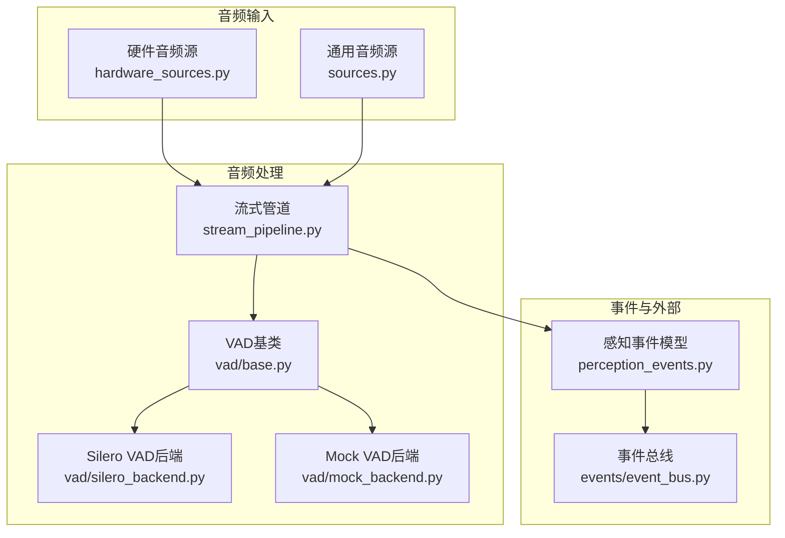
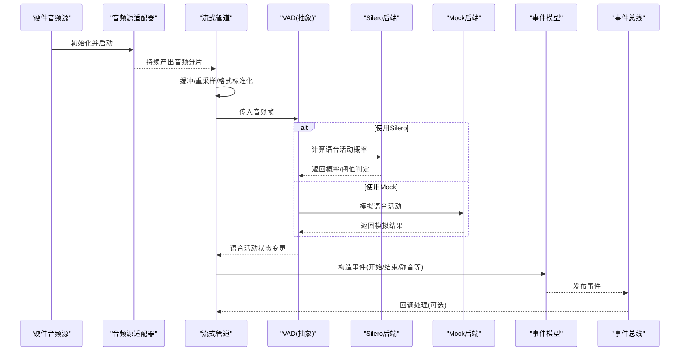
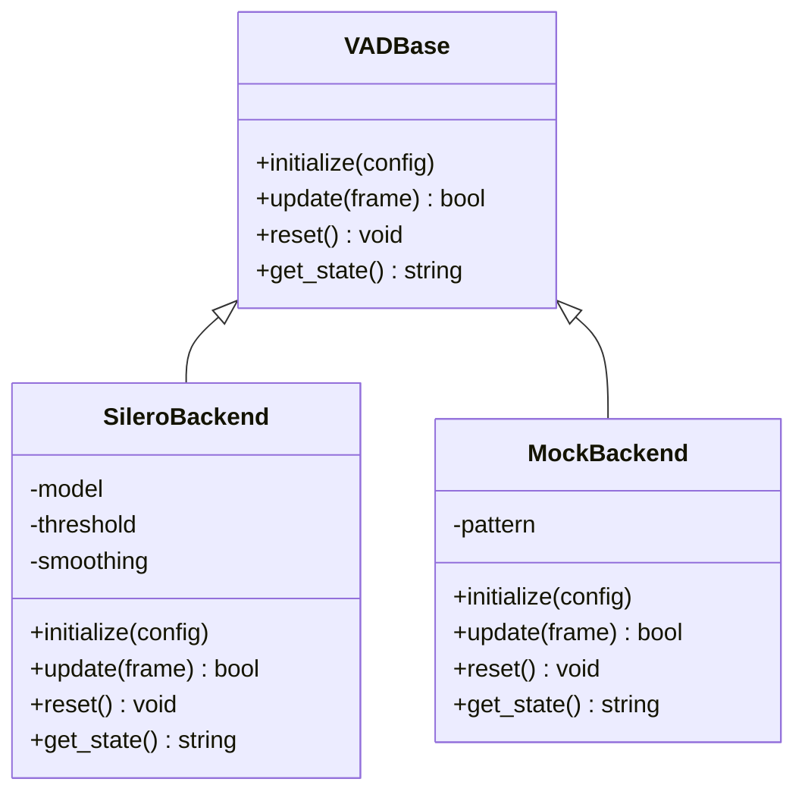
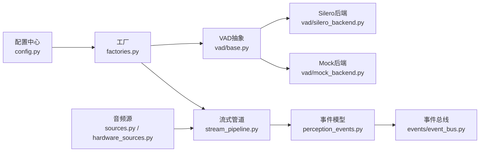

# 音频处理管道

<cite>
**本文引用的文件**   
- [app/audio/stream_pipeline.py](file://app/audio/stream_pipeline.py)
- [app/audio/vad/base.py](file://app/audio/vad/base.py)
- [app/audio/vad/silero_backend.py](file://app/audio/vad/silero_backend.py)
- [app/audio/vad/mock_backend.py](file://app/audio/vad/mock_backend.py)
- [app/transport/sources.py](file://app/transport/sources.py)
- [app/transport/hardware_sources.py](file://app/transport/hardware_sources.py)
- [app/config.py](file://app/config.py)
- [app/factories.py](file://app/factories.py)
- [app/perception_events.py](file://app/perception_events.py)
- [app/events/event_bus.py](file://app/events/event_bus.py)
- [tests/test_vad_stream.py](file://tests/test_vad_stream.py)
</cite>

## 目录
1. [简介](#简介)
2. [项目结构](#项目结构)
3. [核心组件](#核心组件)
4. [架构总览](#架构总览)
5. [详细组件分析](#详细组件分析)
6. [依赖关系分析](#依赖关系分析)
7. [性能考量](#性能考量)
8. [故障排查指南](#故障排查指南)
9. [结论](#结论)
10. [附录](#附录)

## 简介
本文件面向AI智能桌面设备的“音频处理管道”，系统性阐述流式音频处理架构、VAD（语音活动检测）模块的实现原理与配置，以及从硬件采集到事件输出的完整数据流。文档覆盖缓冲区管理、采样率转换与格式标准化、质量优化、延迟控制、内存策略、配置选项、事件机制与故障恢复，并说明与硬件音频设备及其他软件组件的集成方式。

## 项目结构
音频相关代码主要分布在以下模块：
- 流式管道与入口：stream_pipeline.py
- VAD抽象与后端：vad/base.py、vad/silero_backend.py、vad/mock_backend.py
- 音频源与硬件接入：transport/sources.py、transport/hardware_sources.py
- 配置与工厂：config.py、factories.py
- 事件模型与总线：perception_events.py、events/event_bus.py
- 测试用例：tests/test_vad_stream.py

图表来源
- [app/transport/hardware_sources.py](file://app/transport/hardware_sources.py)
- [app/transport/sources.py](file://app/transport/sources.py)
- [app/audio/stream_pipeline.py](file://app/audio/stream_pipeline.py)
- [app/audio/vad/base.py](file://app/audio/vad/base.py)
- [app/audio/vad/silero_backend.py](file://app/audio/vad/silero_backend.py)
- [app/audio/vad/mock_backend.py](file://app/audio/vad/mock_backend.py)
- [app/perception_events.py](file://app/perception_events.py)
- [app/events/event_bus.py](file://app/events/event_bus.py)

章节来源
- [app/audio/stream_pipeline.py](file://app/audio/stream_pipeline.py)
- [app/transport/sources.py](file://app/transport/sources.py)
- [app/transport/hardware_sources.py](file://app/transport/hardware_sources.py)
- [app/audio/vad/base.py](file://app/audio/vad/base.py)
- [app/audio/vad/silero_backend.py](file://app/audio/vad/silero_backend.py)
- [app/audio/vad/mock_backend.py](file://app/audio/vad/mock_backend.py)
- [app/perception_events.py](file://app/perception_events.py)
- [app/events/event_bus.py](file://app/events/event_bus.py)

## 核心组件
- 流式音频管道：负责从音频源拉取分片、缓冲、重采样与格式标准化，驱动VAD进行语音活动检测，并将检测结果转化为事件输出。
- VAD抽象与后端：定义统一的VAD接口；提供Silero实现用于真实推理，以及Mock实现用于开发与调试。
- 音频源：封装硬件或模拟音频输入，提供稳定的分片读取与错误恢复能力。
- 事件模型与总线：将VAD状态变化与音频片段边界等语义转换为事件，通过事件总线分发至其他子系统。

章节来源
- [app/audio/stream_pipeline.py](file://app/audio/stream_pipeline.py)
- [app/audio/vad/base.py](file://app/audio/vad/base.py)
- [app/audio/vad/silero_backend.py](file://app/audio/vad/silero_backend.py)
- [app/audio/vad/mock_backend.py](file://app/audio/vad/mock_backend.py)
- [app/transport/sources.py](file://app/transport/sources.py)
- [app/transport/hardware_sources.py](file://app/transport/hardware_sources.py)
- [app/perception_events.py](file://app/perception_events.py)
- [app/events/event_bus.py](file://app/events/event_bus.py)

## 架构总览
下图展示从硬件采集到事件输出的端到端流程，包括VAD切换、缓冲与重采样、事件生成与分发。

图表来源
- [app/transport/hardware_sources.py](file://app/transport/hardware_sources.py)
- [app/transport/sources.py](file://app/transport/sources.py)
- [app/audio/stream_pipeline.py](file://app/audio/stream_pipeline.py)
- [app/audio/vad/base.py](file://app/audio/vad/base.py)
- [app/audio/vad/silero_backend.py](file://app/audio/vad/silero_backend.py)
- [app/audio/vad/mock_backend.py](file://app/audio/vad/mock_backend.py)
- [app/perception_events.py](file://app/perception_events.py)
- [app/events/event_bus.py](file://app/events/event_bus.py)

## 详细组件分析

### 流式音频管道
- 职责
  - 从音频源循环读取分片，维护环形缓冲与滑动窗口。
  - 执行采样率转换与位深/通道数标准化，确保下游一致性。
  - 按固定步长切分帧，调用VAD进行实时检测。
  - 根据VAD状态变化生成事件，并通过事件总线广播。
- 关键设计点
  - 缓冲管理：采用固定容量缓冲，避免内存增长；在低延迟模式下减小帧长与缓冲深度。
  - 重采样：在入站路径统一重采样至目标采样率，减少VAD与后续模块复杂度。
  - 格式标准化：统一为单声道、16-bit PCM，便于跨平台与跨设备兼容。
  - 事件触发：基于VAD状态机（说话中/静音/过渡）产生最小抖动的事件。
- 性能与延迟
  - 帧长与批大小影响延迟与吞吐；建议以10-30ms为粒度平衡实时性与稳定性。
  - 重采样与VAD推理尽量使用零拷贝或内存池，降低GC压力。
- 错误恢复
  - 音频源断连时自动重试与降级；VAD异常时回退到保守策略（如延长静音段）。

章节来源
- [app/audio/stream_pipeline.py](file://app/audio/stream_pipeline.py)

### VAD抽象与后端
- 抽象接口
  - 定义统一的初始化、增量更新、重置与配置方法。
  - 支持多后端切换（Silero/Mock），对外暴露一致的API。
- Silero后端
  - 加载预训练模型，对音频帧计算语音活动概率。
  - 内部包含平滑滤波与阈值判定，抑制抖动。
  - 可配置参数：阈值、平滑系数、最小说话时长、最小静音时长等。
- Mock后端
  - 用于开发/测试，按规则或随机序列返回语音活动状态。
  - 支持注入特定场景（连续说话、频繁切换、长时间静音等）。
- 线程安全
  - 增量更新需保证并发安全，避免竞态条件导致状态不一致。

图表来源
- [app/audio/vad/base.py](file://app/audio/vad/base.py)
- [app/audio/vad/silero_backend.py](file://app/audio/vad/silero_backend.py)
- [app/audio/vad/mock_backend.py](file://app/audio/vad/mock_backend.py)

章节来源
- [app/audio/vad/base.py](file://app/audio/vad/base.py)
- [app/audio/vad/silero_backend.py](file://app/audio/vad/silero_backend.py)
- [app/audio/vad/mock_backend.py](file://app/audio/vad/mock_backend.py)

### 音频源与硬件集成
- 通用音频源
  - 提供统一的读取接口，屏蔽底层差异。
  - 支持回放、录制与网络流等多种模式。
- 硬件音频源
  - 对接系统音频设备（麦克风/声卡），处理设备枚举、权限与采样率协商。
  - 实现断线重连、背压与丢包补偿策略。
- 错误与降级
  - 设备不可用时切换到Mock或内置录音文件。
  - 高负载时自动降低采样率或帧长。

章节来源
- [app/transport/sources.py](file://app/transport/sources.py)
- [app/transport/hardware_sources.py](file://app/transport/hardware_sources.py)

### 事件模型与总线
- 事件模型
  - 定义语音开始、语音结束、静音、噪声门限等事件类型。
  - 携带时间戳、置信度、音频片段元数据等字段。
- 事件总线
  - 解耦生产者与消费者，支持订阅/发布与优先级队列。
  - 提供异步派发与背压控制，避免阻塞主处理流。

章节来源
- [app/perception_events.py](file://app/perception_events.py)
- [app/events/event_bus.py](file://app/events/event_bus.py)

### 配置与工厂
- 配置项
  - 音频源：设备ID、采样率、位深、通道数、缓冲大小。
  - 管道：帧长、批大小、重采样算法、目标格式。
  - VAD：后端选择、阈值、平滑参数、最小时长约束。
  - 事件：是否启用、过滤规则、转发目标。
- 工厂
  - 根据配置动态创建VAD后端、音频源与事件处理器。
  - 支持热切换后端（如从Mock切换到Silero）。

章节来源
- [app/config.py](file://app/config.py)
- [app/factories.py](file://app/factories.py)

## 依赖关系分析
- 松耦合设计：VAD抽象隔离具体实现；音频源与管道通过统一接口交互；事件总线解耦上下游。
- 潜在风险：重采样与VAD推理可能成为CPU热点；事件总线在高吞吐下需关注序列化与队列积压。
- 外部依赖：Silero模型权重加载、系统音频库、事件总线实现。

图表来源
- [app/config.py](file://app/config.py)
- [app/factories.py](file://app/factories.py)
- [app/audio/stream_pipeline.py](file://app/audio/stream_pipeline.py)
- [app/audio/vad/base.py](file://app/audio/vad/base.py)
- [app/audio/vad/silero_backend.py](file://app/audio/vad/silero_backend.py)
- [app/audio/vad/mock_backend.py](file://app/audio/vad/mock_backend.py)
- [app/transport/sources.py](file://app/transport/sources.py)
- [app/transport/hardware_sources.py](file://app/transport/hardware_sources.py)
- [app/perception_events.py](file://app/perception_events.py)
- [app/events/event_bus.py](file://app/events/event_bus.py)

章节来源
- [app/config.py](file://app/config.py)
- [app/factories.py](file://app/factories.py)
- [app/audio/stream_pipeline.py](file://app/audio/stream_pipeline.py)
- [app/audio/vad/base.py](file://app/audio/vad/base.py)
- [app/audio/vad/silero_backend.py](file://app/audio/vad/silero_backend.py)
- [app/audio/vad/mock_backend.py](file://app/audio/vad/mock_backend.py)
- [app/transport/sources.py](file://app/transport/sources.py)
- [app/transport/hardware_sources.py](file://app/transport/hardware_sources.py)
- [app/perception_events.py](file://app/perception_events.py)
- [app/events/event_bus.py](file://app/events/event_bus.py)

## 性能考量
- 延迟控制
  - 帧长与批大小：越小延迟越低，但会增加调度开销；建议在10-30ms之间调优。
  - 重采样：优先使用高效算法（如线性插值或专用库），避免重复转换。
- 内存管理
  - 使用对象池与环形缓冲，避免频繁分配与GC停顿。
  - 限制最大缓冲长度，防止突发流量导致OOM。
- 质量优化
  - 降噪与增益控制可在入站路径加入，提升VAD鲁棒性。
  - 平滑VAD输出，减少误触发与抖动。
- 并发与吞吐
  - 将VAD推理与事件分发放入独立线程/协程，避免阻塞音频采集。
  - 事件总线采用无锁队列或批量提交，降低锁竞争。

[本节为通用指导，不直接分析具体文件]

## 故障排查指南
- 常见问题
  - 音频源无法打开：检查设备权限、占用与采样率协商。
  - VAD无输出：确认阈值与平滑参数；使用Mock后端验证链路。
  - 事件丢失：检查事件总线队列容量与消费者处理速度。
  - 内存增长：定位未释放缓冲或缓存；监控峰值内存。
- 诊断步骤
  - 启用日志与指标（帧数、延迟、丢弃率、VAD命中率）。
  - 使用Mock后端复现问题，逐步替换为真实后端定位根因。
  - 回放录音文件验证管道稳定性。
- 恢复策略
  - 自动重试与降级（切换后端、降低采样率、增大缓冲）。
  - 健康检查与自愈（周期性自检与重启子任务）。

章节来源
- [tests/test_vad_stream.py](file://tests/test_vad_stream.py)

## 结论
该音频处理管道以模块化与事件驱动为核心，结合VAD抽象与多后端策略，实现了从硬件采集到事件输出的稳定、可扩展与高性能流式处理。通过合理的缓冲与重采样策略、严格的格式标准化与健壮的错误恢复机制，能够在不同硬件与运行环境下保持一致的语音检测质量与低延迟体验。

[本节为总结性内容，不直接分析具体文件]

## 附录
- 配置清单（示例字段）
  - 音频源：设备ID、采样率、位深、通道数、缓冲大小
  - 管道：帧长、批大小、重采样算法、目标格式
  - VAD：后端、阈值、平滑系数、最小说话/静音时长
  - 事件：开关、过滤规则、转发目标
- 最佳实践
  - 先以Mock后端完成端到端联调，再切换至Silero。
  - 在生产环境开启指标与告警，持续观察延迟与资源占用。
  - 定期回归测试，确保VAD阈值与平滑参数在不同噪声场景下的鲁棒性。

[本节为补充信息，不直接分析具体文件]