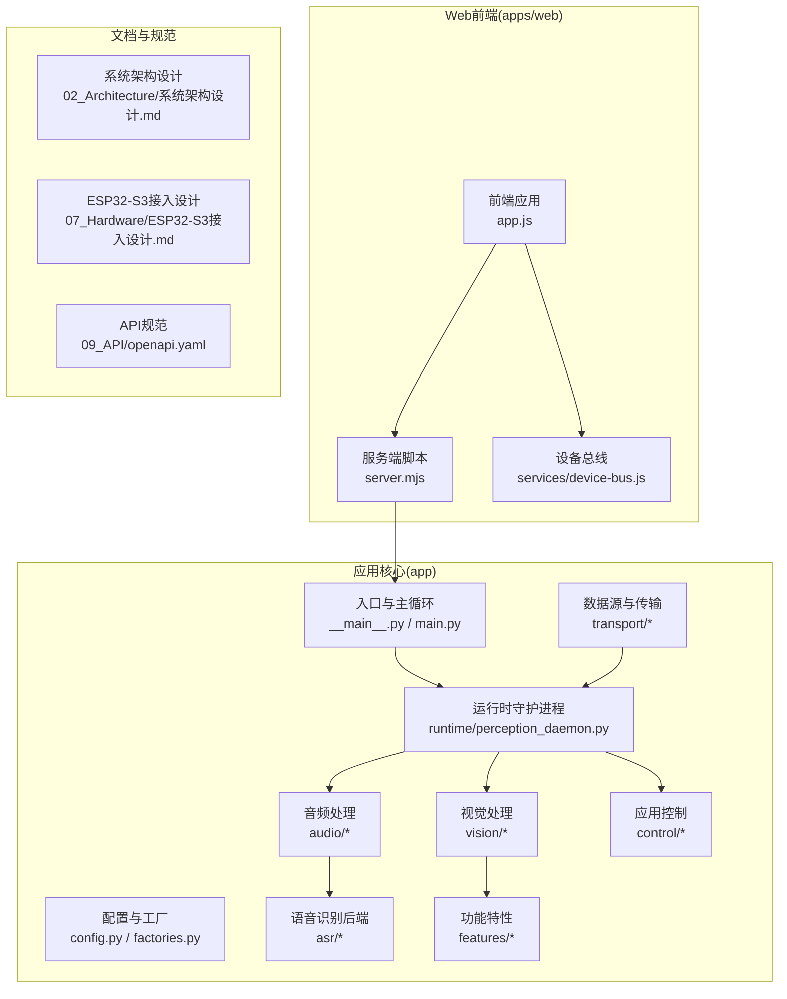
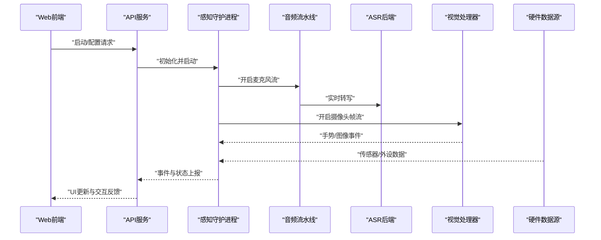
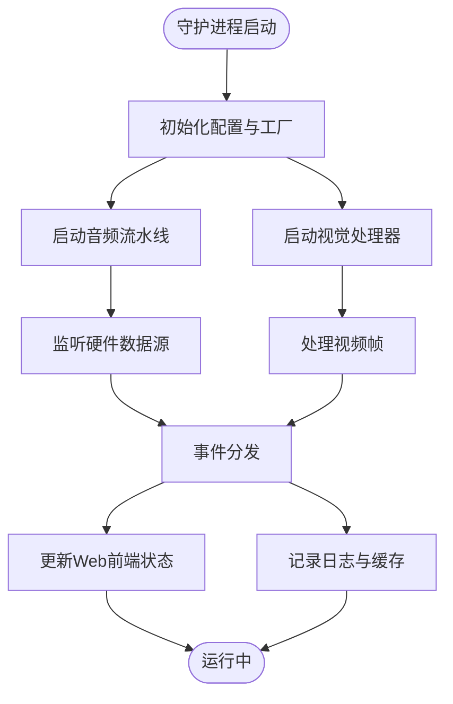
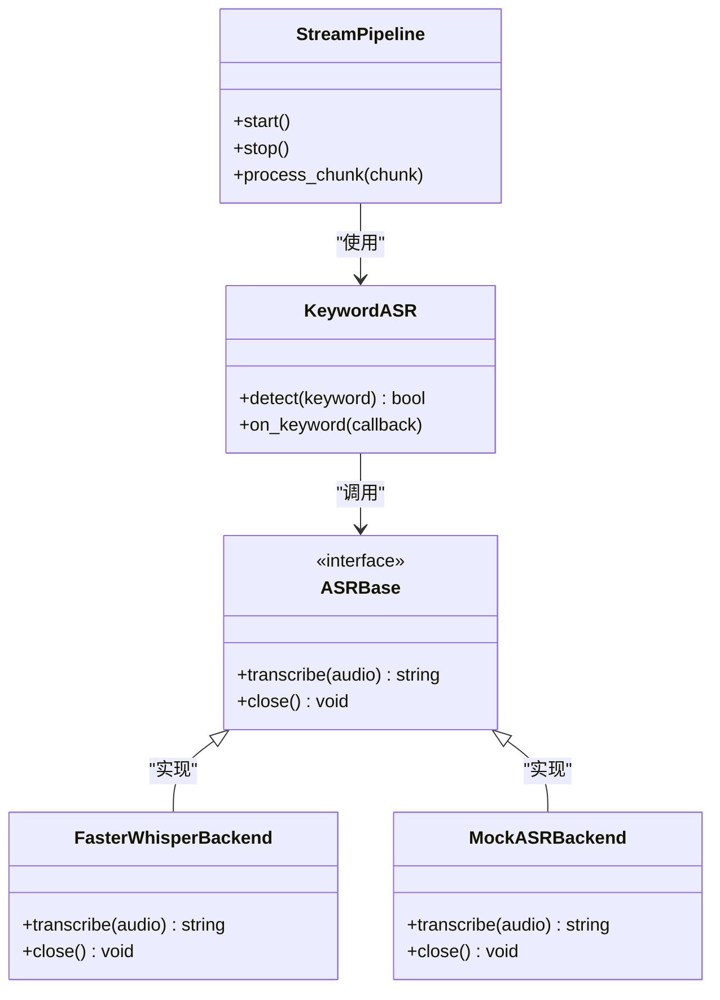
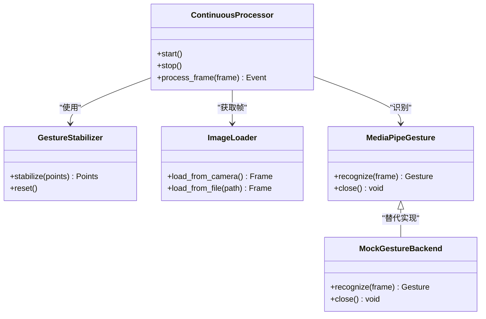
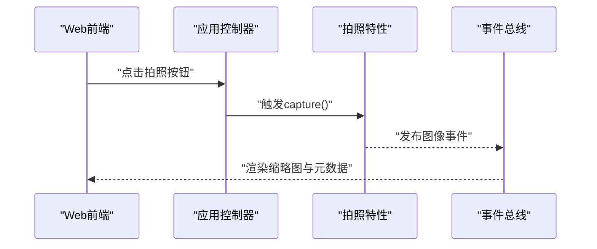
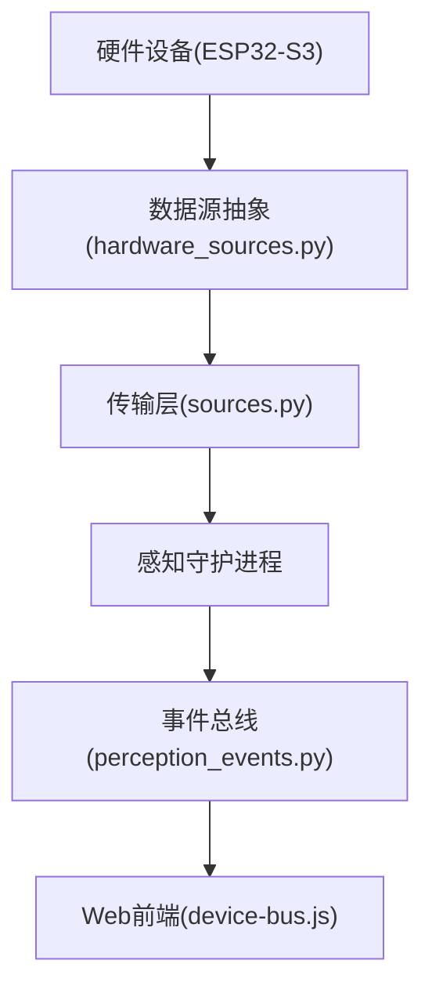
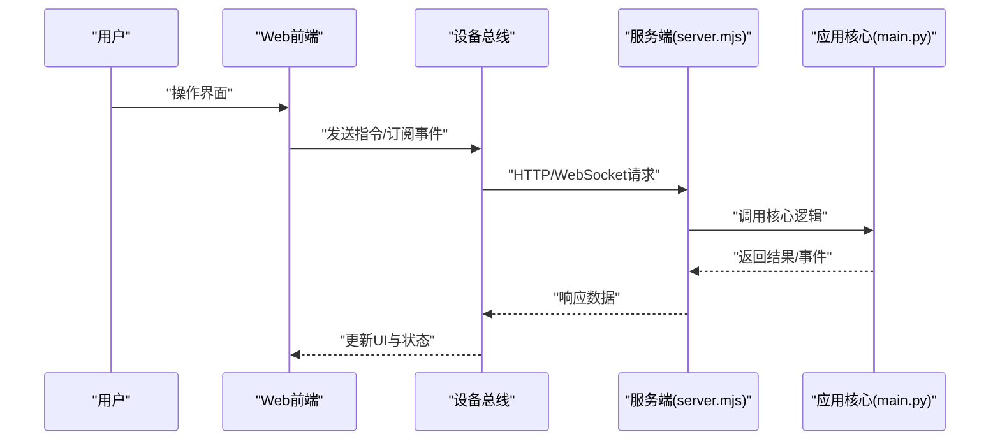
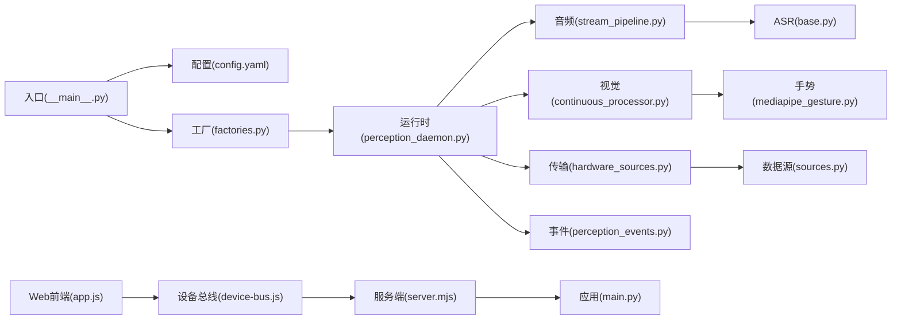

# 项目介绍

<cite>
**本文引用的文件**   
- [README.md](file://README.md)
- [config.yaml](file://config.yaml)
- [app/__main__.py](file://app/__main__.py)
- [app/main.py](file://app/main.py)
- [app/config.py](file://app/config.py)
- [app/factories.py](file://app/factories.py)
- [app/models.py](file://app/models.py)
- [app/perception_events.py](file://app/perception_events.py)
- [app/runtime/perception_daemon.py](file://app/runtime/perception_daemon.py)
- [app/audio/stream_pipeline.py](file://app/audio/stream_pipeline.py)
- [app/audio/keyword_asr.py](file://app/audio/keyword_asr.py)
- [app/asr/base.py](file://app/asr/base.py)
- [app/asr/faster_whisper_backend.py](file://app/asr/faster_whisper_backend.py)
- [app/asr/mock_backend.py](file://app/asr/mock_backend.py)
- [app/vision/continuous_processor.py](file://app/vision/continuous_processor.py)
- [app/vision/gesture_stabilizer.py](file://app/vision/gesture_stabilizer.py)
- [app/vision/image_loader.py](file://app/vision/image_loader.py)
- [app/vision/mediapipe_gesture.py](file://app/vision/mediapipe_gesture.py)
- [app/vision/mock_backend.py](file://app/vision/mock_backend.py)
- [app/features/photo_capture.py](file://app/features/photo_capture.py)
- [app/control/application_controller.py](file://app/control/application_controller.py)
- [app/transport/hardware_sources.py](file://app/transport/hardware_sources.py)
- [app/transport/sources.py](file://app/transport/sources.py)
- [apps/web/app.js](file://apps/web/app.js)
- [apps/web/server.mjs](file://apps/web/server.mjs)
- [apps/web/services/device-bus.js](file://apps/web/services/device-bus.js)
- [AI_Hardware_Community_Project/02_Architecture/系统架构设计.md](file://AI_Hardware_Community_Project/02_Architecture/系统架构设计.md)
- [AI_Hardware_Community_Project/07_Hardware/ESP32-S3接入设计.md](file://AI_Hardware_Community_Project/07_Hardware/ESP32-S3接入设计.md)
- [AI_Hardware_Community_Project/09_API/openapi.yaml](file://AI_Hardware_Community_Project/09_API/openapi.yaml)
- [AI_Hardware_Community_Project/10_Development_Log/2026-07-23_立项与架构基线.md](file://AI_Hardware_Community_Project/10_Development_Log/2026-07-23_立项与架构基线.md)
</cite>

## 目录
1. [简介](#简介)
2. [项目结构](#项目结构)
3. [核心组件](#核心组件)
4. [架构总览](#架构总览)
5. [详细组件分析](#详细组件分析)
6. [依赖关系分析](#依赖关系分析)
7. [性能考量](#性能考量)
8. [故障排查指南](#故障排查指南)
9. [结论](#结论)
10. [附录](#附录)

## 简介
本项目面向“AI智能桌面设备”，提供端侧感知（语音、视觉）、事件总线与硬件集成能力，并通过Web前端进行交互与控制。其核心价值在于将多模态感知、本地推理与桌面应用无缝衔接，为开发者快速构建具备语音识别、手势检测、图像采集等能力的桌面AI设备提供基础平台。

- 目标用户：桌面AI设备开发者、系统集成商、教育科研团队与个人极客
- 应用场景：桌面助手、会议记录、人机交互原型、智能家居中控、机器人桌面终端
- 差异化优势：模块化感知管线、可插拔后端（ASR/VAD/视觉）、软硬解耦通信、前后端一体化开发体验

[本节不直接分析具体文件]

## 项目结构
仓库采用“应用层 + Web前端 + 文档与规范”的分层组织方式：
- app：Python应用核心，包含感知、控制、传输、运行时等模块
- apps/web：Web前端与服务端脚本，提供设备交互界面与模拟环境
- AI_Hardware_Community_Project：产品与架构文档、API规范、硬件接入方案
- scripts/tools/tests：辅助脚本、工具与测试

**图示来源** 
- [app/__main__.py:1-200](file://app/__main__.py#L1-L200)
- [app/main.py:1-200](file://app/main.py#L1-L200)
- [app/runtime/perception_daemon.py:1-200](file://app/runtime/perception_daemon.py#L1-L200)
- [apps/web/app.js:1-200](file://apps/web/app.js#L1-L200)
- [apps/web/server.mjs:1-200](file://apps/web/server.mjs#L1-L200)

**章节来源**
- [AI_Hardware_Community_Project/02_Architecture/系统架构设计.md](file://AI_Hardware_Community_Project/02_Architecture/系统架构设计.md)
- [AI_Hardware_Community_Project/07_Hardware/ESP32-S3接入设计.md](file://AI_Hardware_Community_Project/07_Hardware/ESP32-S3接入设计.md)
- [AI_Hardware_Community_Project/09_API/openapi.yaml](file://AI_Hardware_Community_Project/09_API/openapi.yaml)

## 核心组件
- 运行时守护进程：统一调度感知任务、管理生命周期与资源
- 音频子系统：VAD与关键词唤醒、ASR转写，支持可插拔后端
- 视觉子系统：连续帧处理、手势稳定化、图像加载与识别后端
- 功能特性：拍照采集、事件缓存与分发
- 控制与传输：应用控制器、硬件数据源抽象与通信桥接
- Web前端：设备交互、状态可视化与模拟运行环境

**章节来源**
- [app/runtime/perception_daemon.py:1-200](file://app/runtime/perception_daemon.py#L1-L200)
- [app/audio/stream_pipeline.py:1-200](file://app/audio/stream_pipeline.py#L1-L200)
- [app/asr/base.py:1-200](file://app/asr/base.py#L1-L200)
- [app/vision/continuous_processor.py:1-200](file://app/vision/continuous_processor.py#L1-L200)
- [app/features/photo_capture.py:1-200](file://app/features/photo_capture.py#L1-L200)
- [app/control/application_controller.py:1-200](file://app/control/application_controller.py#L1-L200)
- [app/transport/hardware_sources.py:1-200](file://app/transport/hardware_sources.py#L1-L200)
- [apps/web/app.js:1-200](file://apps/web/app.js#L1-L200)

## 架构总览
系统以“感知守护进程”为核心，协调音频与视觉流水线，通过事件总线与Web前端交互；硬件层通过抽象数据源接入，API层遵循OpenAPI规范对外暴露能力。

**图示来源** 
- [app/runtime/perception_daemon.py:1-200](file://app/runtime/perception_daemon.py#L1-L200)
- [app/audio/stream_pipeline.py:1-200](file://app/audio/stream_pipeline.py#L1-L200)
- [app/asr/base.py:1-200](file://app/asr/base.py#L1-L200)
- [app/vision/continuous_processor.py:1-200](file://app/vision/continuous_processor.py#L1-L200)
- [app/transport/hardware_sources.py:1-200](file://app/transport/hardware_sources.py#L1-L200)
- [apps/web/server.mjs:1-200](file://apps/web/server.mjs#L1-L200)

## 详细组件分析

### 运行时守护进程（Perception Daemon）
- 职责：统一调度音频与视觉流水线，管理生命周期、错误恢复与资源释放
- 关键行为：启动/停止、事件订阅与发布、异常捕获与重试

**图示来源** 
- [app/runtime/perception_daemon.py:1-200](file://app/runtime/perception_daemon.py#L1-L200)
- [app/transport/sources.py:1-200](file://app/transport/sources.py#L1-L200)

**章节来源**
- [app/runtime/perception_daemon.py:1-200](file://app/runtime/perception_daemon.py#L1-L200)

### 音频子系统（VAD + 关键词 + ASR）
- VAD：静音检测，减少无效处理
- 关键词唤醒：本地热词检测，降低误触发
- ASR：支持多种后端（如Faster-Whisper），实现实时转写

**图示来源** 
- [app/audio/stream_pipeline.py:1-200](file://app/audio/stream_pipeline.py#L1-L200)
- [app/audio/keyword_asr.py:1-200](file://app/audio/keyword_asr.py#L1-L200)
- [app/asr/base.py:1-200](file://app/asr/base.py#L1-L200)
- [app/asr/faster_whisper_backend.py:1-200](file://app/asr/faster_whisper_backend.py#L1-L200)
- [app/asr/mock_backend.py:1-200](file://app/asr/mock_backend.py#L1-L200)

**章节来源**
- [app/audio/stream_pipeline.py:1-200](file://app/audio/stream_pipeline.py#L1-L200)
- [app/audio/keyword_asr.py:1-200](file://app/audio/keyword_asr.py#L1-L200)
- [app/asr/base.py:1-200](file://app/asr/base.py#L1-L200)
- [app/asr/faster_whisper_backend.py:1-200](file://app/asr/faster_whisper_backend.py#L1-L200)
- [app/asr/mock_backend.py:1-200](file://app/asr/mock_backend.py#L1-L200)

### 视觉子系统（连续处理 + 手势稳定化 + 图像加载）
- 连续处理器：高效读取与处理视频帧
- 手势稳定化：平滑抖动，提升识别稳定性
- 图像加载：从摄像头或文件加载图像
- 手势识别后端：基于MediaPipe的识别实现与Mock后端

**图示来源** 
- [app/vision/continuous_processor.py:1-200](file://app/vision/continuous_processor.py#L1-L200)
- [app/vision/gesture_stabilizer.py:1-200](file://app/vision/gesture_stabilizer.py#L1-L200)
- [app/vision/image_loader.py:1-200](file://app/vision/image_loader.py#L1-L200)
- [app/vision/mediapipe_gesture.py:1-200](file://app/vision/mediapipe_gesture.py#L1-L200)
- [app/vision/mock_backend.py:1-200](file://app/vision/mock_backend.py#L1-L200)

**章节来源**
- [app/vision/continuous_processor.py:1-200](file://app/vision/continuous_processor.py#L1-L200)
- [app/vision/gesture_stabilizer.py:1-200](file://app/vision/gesture_stabilizer.py#L1-L200)
- [app/vision/image_loader.py:1-200](file://app/vision/image_loader.py#L1-L200)
- [app/vision/mediapipe_gesture.py:1-200](file://app/vision/mediapipe_gesture.py#L1-L200)
- [app/vision/mock_backend.py:1-200](file://app/vision/mock_backend.py#L1-L200)

### 功能特性（拍照采集）
- 拍照采集：触发相机快照，生成图像事件并推送至事件总线
- 适用场景：会议记录、远程协作、内容创作

**图示来源** 
- [app/features/photo_capture.py:1-200](file://app/features/photo_capture.py#L1-L200)
- [app/control/application_controller.py:1-200](file://app/control/application_controller.py#L1-L200)
- [apps/web/app.js:1-200](file://apps/web/app.js#L1-L200)

**章节来源**
- [app/features/photo_capture.py:1-200](file://app/features/photo_capture.py#L1-L200)
- [app/control/application_controller.py:1-200](file://app/control/application_controller.py#L1-L200)

### 硬件集成（ESP32-S3与数据源抽象）
- 硬件数据源：抽象摄像头、麦克风与传感器接口，便于替换与扩展
- ESP32-S3接入：定义通信协议与连接策略，支持边缘采集与转发

**图示来源** 
- [app/transport/hardware_sources.py:1-200](file://app/transport/hardware_sources.py#L1-L200)
- [app/transport/sources.py:1-200](file://app/transport/sources.py#L1-L200)
- [app/perception_events.py:1-200](file://app/perception_events.py#L1-L200)
- [apps/web/services/device-bus.js:1-200](file://apps/web/services/device-bus.js#L1-L200)
- [AI_Hardware_Community_Project/07_Hardware/ESP32-S3接入设计.md](file://AI_Hardware_Community_Project/07_Hardware/ESP32-S3接入设计.md)

**章节来源**
- [app/transport/hardware_sources.py:1-200](file://app/transport/hardware_sources.py#L1-L200)
- [app/transport/sources.py:1-200](file://app/transport/sources.py#L1-L200)
- [app/perception_events.py:1-200](file://app/perception_events.py#L1-L200)
- [apps/web/services/device-bus.js:1-200](file://apps/web/services/device-bus.js#L1-L200)
- [AI_Hardware_Community_Project/07_Hardware/ESP32-S3接入设计.md](file://AI_Hardware_Community_Project/07_Hardware/ESP32-S3接入设计.md)

### Web前端（设备交互与模拟）
- 设备总线：封装与后端的通信细节，提供统一的事件模型
- 模拟器：在无硬件环境下模拟输入与输出，便于开发与测试

**图示来源** 
- [apps/web/app.js:1-200](file://apps/web/app.js#L1-L200)
- [apps/web/server.mjs:1-200](file://apps/web/server.mjs#L1-L200)
- [apps/web/services/device-bus.js:1-200](file://apps/web/services/device-bus.js#L1-L200)
- [app/main.py:1-200](file://app/main.py#L1-L200)

**章节来源**
- [apps/web/app.js:1-200](file://apps/web/app.js#L1-L200)
- [apps/web/server.mjs:1-200](file://apps/web/server.mjs#L1-L200)
- [apps/web/services/device-bus.js:1-200](file://apps/web/services/device-bus.js#L1-L200)
- [app/main.py:1-200](file://app/main.py#L1-L200)

## 依赖关系分析
- 应用入口与配置：入口文件负责初始化配置与工厂，创建运行时实例
- 感知模块：音频与视觉模块通过守护进程统一调度
- 传输层：抽象硬件数据源，屏蔽底层差异
- Web前端：通过设备总线与后端交互，提供一致的事件模型

**图示来源** 
- [app/__main__.py:1-200](file://app/__main__.py#L1-L200)
- [config.yaml:1-200](file://config.yaml#L1-L200)
- [app/factories.py:1-200](file://app/factories.py#L1-L200)
- [app/runtime/perception_daemon.py:1-200](file://app/runtime/perception_daemon.py#L1-L200)
- [app/audio/stream_pipeline.py:1-200](file://app/audio/stream_pipeline.py#L1-L200)
- [app/vision/continuous_processor.py:1-200](file://app/vision/continuous_processor.py#L1-L200)
- [app/asr/base.py:1-200](file://app/asr/base.py#L1-L200)
- [app/vision/mediapipe_gesture.py:1-200](file://app/vision/mediapipe_gesture.py#L1-L200)
- [app/transport/hardware_sources.py:1-200](file://app/transport/hardware_sources.py#L1-L200)
- [app/transport/sources.py:1-200](file://app/transport/sources.py#L1-L200)
- [app/perception_events.py:1-200](file://app/perception_events.py#L1-L200)
- [apps/web/app.js:1-200](file://apps/web/app.js#L1-L200)
- [apps/web/server.mjs:1-200](file://apps/web/server.mjs#L1-L200)
- [app/main.py:1-200](file://app/main.py#L1-L200)

**章节来源**
- [app/__main__.py:1-200](file://app/__main__.py#L1-L200)
- [config.yaml:1-200](file://config.yaml#L1-L200)
- [app/factories.py:1-200](file://app/factories.py#L1-L200)
- [app/runtime/perception_daemon.py:1-200](file://app/runtime/perception_daemon.py#L1-L200)
- [apps/web/app.js:1-200](file://apps/web/app.js#L1-L200)
- [apps/web/server.mjs:1-200](file://apps/web/server.mjs#L1-L200)

## 性能考量
- 异步与并发：守护进程与流水线应充分利用异步IO，避免阻塞
- 资源管理：合理分配CPU/GPU与内存，及时释放未使用的资源
- 后端选择：根据设备能力选择合适的ASR与视觉后端（本地/云端）
- 网络优化：减少不必要的请求与数据量，使用增量更新与缓存

[本节提供通用指导，不直接分析具体文件]

## 故障排查指南
- 常见问题
  - 音频无输入：检查权限、设备占用与采样率配置
  - 视觉卡顿：降低分辨率或帧率，关闭多余特效
  - 握手失败：确认端口、防火墙与跨域设置
- 定位方法
  - 查看守护进程日志与事件缓存
  - 使用Web模拟器验证流程
  - 逐步禁用模块定位问题

**章节来源**
- [app/runtime/perception_daemon.py:1-200](file://app/runtime/perception_daemon.py#L1-L200)
- [apps/web/simulator.html:1-200](file://apps/web/simulator.html#L1-L200)

## 结论
本项目以模块化与可扩展性为核心设计理念，提供完整的桌面AI设备解决方案。通过统一的感知守护进程、可插拔的后端与清晰的API规范，开发者可以快速搭建具备语音、视觉与硬件集成的智能桌面应用。建议结合文档与示例，优先完成最小可用版本，再逐步增强功能与性能。

[本节总结性内容，不直接分析具体文件]

## 附录
- 版本信息：参考项目根目录的版本说明与变更记录
- 许可证信息：遵循仓库中的许可证文件约定
- 社区支持：参与讨论与贡献请参考文档与规范

[本节为补充信息，不直接分析具体文件]