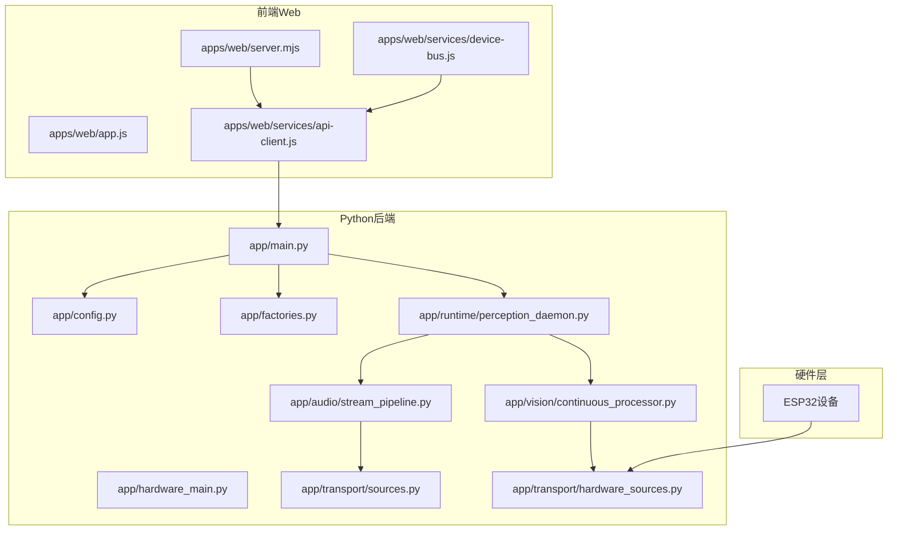
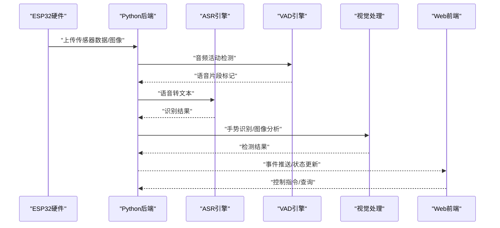
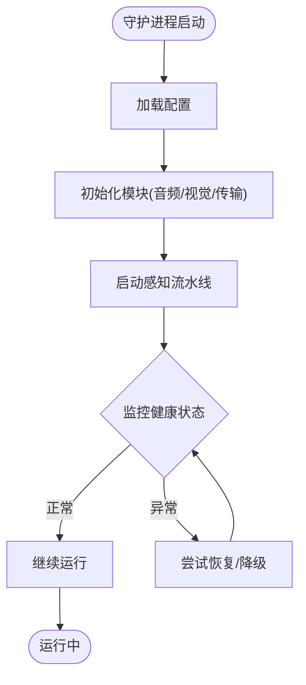
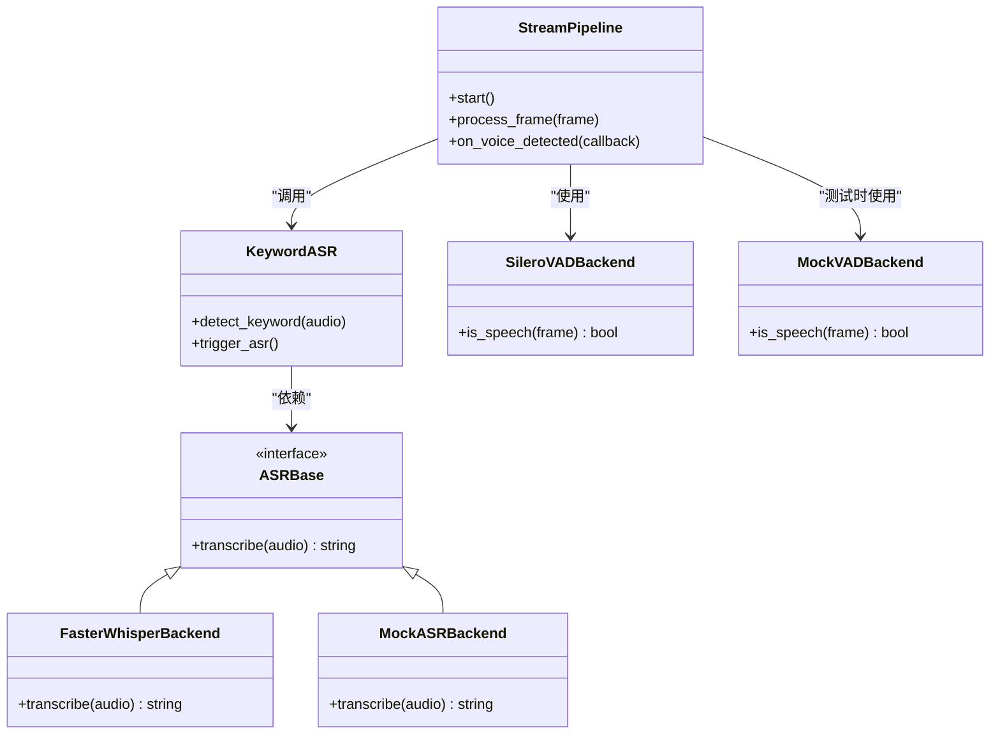
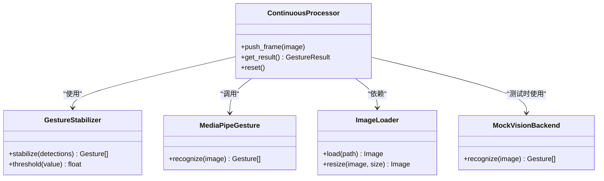
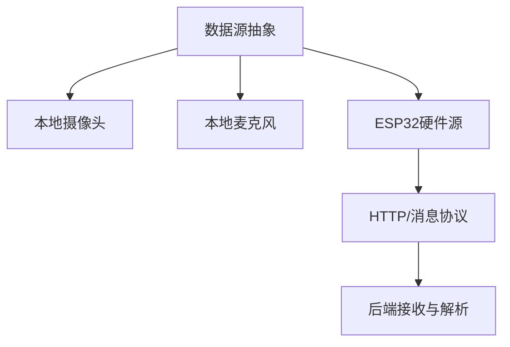
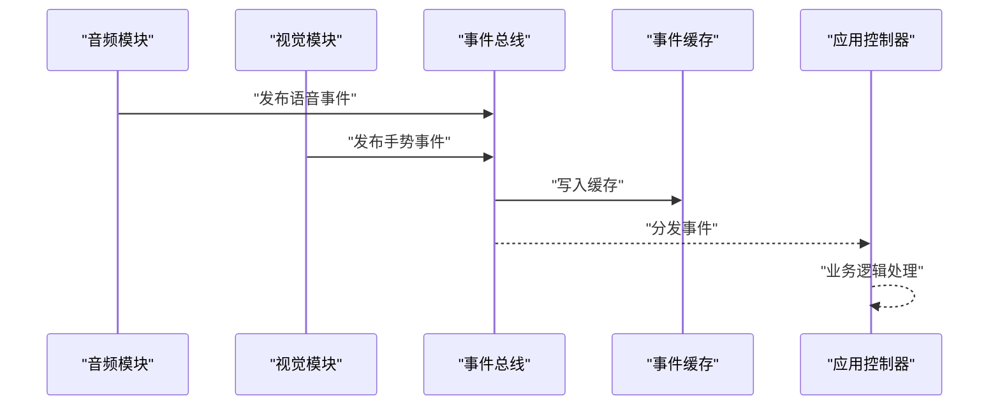
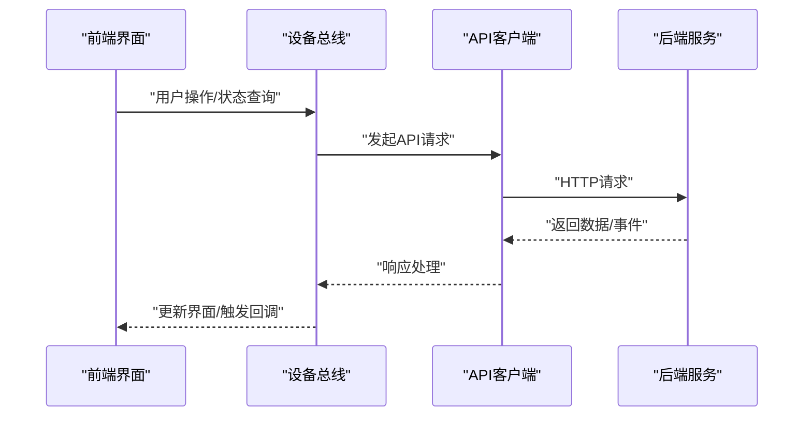
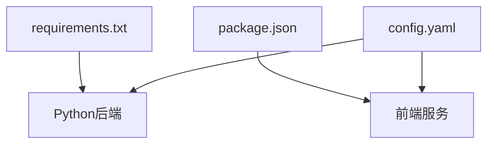

# 项目概览

<cite>
**本文引用的文件**   
- [README.md](file://README.md)
- [config.yaml](file://config.yaml)
- [requirements.txt](file://requirements.txt)
- [package.json](file://package.json)
- [app/main.py](file://app/main.py)
- [app/hardware_main.py](file://app/hardware_main.py)
- [app/config.py](file://app/config.py)
- [app/factories.py](file://app/factories.py)
- [app/models.py](file://app/models.py)
- [app/perception_events.py](file://app/perception_events.py)
- [app/event_cache.py](file://app/event_cache.py)
- [app/control/application_controller.py](file://app/control/application_controller.py)
- [app/runtime/perception_daemon.py](file://app/runtime/perception_daemon.py)
- [app/audio/stream_pipeline.py](file://app/audio/stream_pipeline.py)
- [app/audio/keyword_asr.py](file://app/audio/keyword_asr.py)
- [app/asr/base.py](file://app/asr/base.py)
- [app/asr/faster_whisper_backend.py](file://app/asr/faster_whisper_backend.py)
- [app/asr/mock_backend.py](file://app/asr/mock_backend.py)
- [app/audio/vad/silero_backend.py](file://app/audio/vad/silero_backend.py)
- [app/audio/vad/mock_backend.py](file://app/audio/vad/mock_backend.py)
- [app/detection/keywords.py](file://app/detection/keywords.py)
- [app/features/photo_capture.py](file://app/features/photo_capture.py)
- [app/transport/sources.py](file://app/transport/sources.py)
- [app/transport/hardware_sources.py](file://app/transport/hardware_sources.py)
- [app/vision/continuous_processor.py](file://app/vision/continuous_processor.py)
- [app/vision/gesture_stabilizer.py](file://app/vision/gesture_stabilizer.py)
- [app/vision/image_loader.py](file://app/vision/image_loader.py)
- [app/vision/mediapipe_gesture.py](file://app/vision/mediapipe_gesture.py)
- [app/vision/mock_backend.py](file://app/vision/mock_backend.py)
- [apps/web/server.mjs](file://apps/web/server.mjs)
- [apps/web/app.js](file://apps/web/app.js)
- [apps/web/services/device-bus.js](file://apps/web/services/device-bus.js)
- [apps/web/services/api-client.js](file://apps/web/services/api-client.js)
- [apps/web/services/ai-orchestrator.mjs](file://apps/web/services/ai-orchestrator.mjs)
- [integrations/desktop_bot/log_event_bridge.py](file://integrations/desktop_bot/log_event_bridge.py)
- [integrations/desktop_bot/web_event_forwarder.py](file://integrations/desktop_bot/web_event_forwarder.py)
- [AI_Hardware_Community_Project/02_Architecture/系统架构设计.md](file://AI_Hardware_Community_Project/02_Architecture/系统架构设计.md)
- [AI_Hardware_Community_Project/07_Hardware/ESP32-S3接入设计.md](file://AI_Hardware_Community_Project/07_Hardware/ESP32-S3接入设计.md)
- [AI_Hardware_Community_Project/09_API/openapi.yaml](file://AI_Hardware_Community_Project/09_API/openapi.yaml)
</cite>

## 目录
1. [简介](#简介)
2. [项目结构](#项目结构)
3. [核心组件](#核心组件)
4. [架构总览](#架构总览)
5. [详细组件分析](#详细组件分析)
6. [依赖关系分析](#依赖关系分析)
7. [性能考虑](#性能考虑)
8. [故障排查指南](#故障排查指南)
9. [结论](#结论)
10. [附录](#附录)

## 简介
本项目面向“AI智能桌面设备”，目标是构建一个集语音识别、手势检测、图像采集与硬件集成于一体的桌面端感知与交互系统。系统采用Python后端服务、JavaScript前端界面，以及通过通信协议与ESP32硬件设备进行数据交换。整体架构强调模块化、可扩展性与可测试性，支持在本地开发环境与生产部署环境中运行。

主要功能特性包括：
- 语音识别（ASR）与关键词唤醒
- 音频活动检测（VAD）与流式处理
- 视觉感知（手势识别、连续图像处理）
- 图像采集与特征处理
- 与ESP32设备的通信与数据桥接
- 事件总线与缓存机制，支撑前后端与硬件之间的解耦通信
- Web前端可视化与控制面板

技术栈选择背景：
- Python后端：便于集成机器学习推理库（如Whisper、MediaPipe等），提供稳定的异步服务与进程管理。
- JavaScript前端：快速构建交互式Web界面，并通过API与后端进行实时通信。
- ESP32硬件集成：低成本、低功耗的边缘采集与执行单元，通过HTTP或消息通道与后端交互。

系统边界：
- 后端负责感知流水线编排、模型推理、事件分发与对外API暴露。
- 前端负责用户交互、状态展示与指令下发。
- 硬件层负责传感器数据采集与基础控制，通过协议与后端对接。

**章节来源**
- [README.md](file://README.md)
- [AI_Hardware_Community_Project/02_Architecture/系统架构设计.md](file://AI_Hardware_Community_Project/02_Architecture/系统架构设计.md)

## 项目结构
项目采用分层与按功能模块组织的方式：
- app：核心Python应用，包含配置、运行时、感知流水线、传输层、视觉与音频模块、控制与事件系统等。
- apps/web：前端Web应用，包含服务端脚本、页面资源与服务模块。
- integrations：与桌面机器人或其他外部系统的集成桥接。
- AI_Hardware_Community_Project：产品与架构文档、API规范、数据库设计与硬件接入方案。
- scripts、tests、tools：辅助脚本、测试与工具。
- config.yaml、requirements.txt、package.json：配置与依赖声明。

**图表来源**
- [app/main.py](file://app/main.py)
- [app/hardware_main.py](file://app/hardware_main.py)
- [app/config.py](file://app/config.py)
- [app/factories.py](file://app/factories.py)
- [app/runtime/perception_daemon.py](file://app/runtime/perception_daemon.py)
- [app/audio/stream_pipeline.py](file://app/audio/stream_pipeline.py)
- [app/vision/continuous_processor.py](file://app/vision/continuous_processor.py)
- [app/transport/sources.py](file://app/transport/sources.py)
- [app/transport/hardware_sources.py](file://app/transport/hardware_sources.py)
- [apps/web/server.mjs](file://apps/web/server.mjs)
- [apps/web/app.js](file://apps/web/app.js)
- [apps/web/services/device-bus.js](file://apps/web/services/device-bus.js)
- [apps/web/services/api-client.js](file://apps/web/services/api-client.js)

**章节来源**
- [config.yaml](file://config.yaml)
- [requirements.txt](file://requirements.txt)
- [package.json](file://package.json)

## 核心组件
- 配置与工厂：集中管理配置加载与对象创建，确保不同环境下的行为一致。
- 运行时守护进程：统一调度感知流水线，协调音频与视觉处理任务。
- 音频子系统：实现流式音频输入、VAD与ASR后端抽象，支持关键词唤醒。
- 视觉子系统：实现连续图像处理、手势识别与稳定化策略，支持Mock与真实后端。
- 传输层：抽象数据来源（本地摄像头/麦克风与硬件设备），提供统一接口。
- 事件系统：事件总线与缓存，用于跨模块通信与状态同步。
- 控制与应用控制器：高层业务逻辑编排与生命周期管理。
- 前端服务：Web服务器、API客户端、设备总线与AI编排服务。

**章节来源**
- [app/config.py](file://app/config.py)
- [app/factories.py](file://app/factories.py)
- [app/runtime/perception_daemon.py](file://app/runtime/perception_daemon.py)
- [app/audio/stream_pipeline.py](file://app/audio/stream_pipeline.py)
- [app/asr/base.py](file://app/asr/base.py)
- [app/asr/faster_whisper_backend.py](file://app/asr/faster_whisper_backend.py)
- [app/asr/mock_backend.py](file://app/asr/mock_backend.py)
- [app/audio/vad/silero_backend.py](file://app/audio/vad/silero_backend.py)
- [app/audio/vad/mock_backend.py](file://app/audio/vad/mock_backend.py)
- [app/vision/continuous_processor.py](file://app/vision/continuous_processor.py)
- [app/vision/mediapipe_gesture.py](file://app/vision/mediapipe_gesture.py)
- [app/vision/mock_backend.py](file://app/vision/mock_backend.py)
- [app/transport/sources.py](file://app/transport/sources.py)
- [app/transport/hardware_sources.py](file://app/transport/hardware_sources.py)
- [app/control/application_controller.py](file://app/control/application_controller.py)
- [apps/web/server.mjs](file://apps/web/server.mjs)
- [apps/web/services/api-client.js](file://apps/web/services/api-client.js)
- [apps/web/services/device-bus.js](file://apps/web/services/device-bus.js)

## 架构总览
系统由三层构成：
- 硬件层：ESP32设备负责传感器数据采集与基础控制，通过HTTP或消息通道将数据上报至后端。
- 后端层：Python服务编排感知流水线，调用ASR/VAD与视觉模型，输出事件与结果，并暴露API供前端使用。
- 前端层：Web界面提供可视化与控制入口，通过API与设备总线与后端交互。

**图表来源**
- [app/transport/hardware_sources.py](file://app/transport/hardware_sources.py)
- [app/audio/stream_pipeline.py](file://app/audio/stream_pipeline.py)
- [app/asr/base.py](file://app/asr/base.py)
- [app/asr/faster_whisper_backend.py](file://app/asr/faster_whisper_backend.py)
- [app/audio/vad/silero_backend.py](file://app/audio/vad/silero_backend.py)
- [app/vision/continuous_processor.py](file://app/vision/continuous_processor.py)
- [apps/web/services/api-client.js](file://apps/web/services/api-client.js)

**章节来源**
- [AI_Hardware_Community_Project/07_Hardware/ESP32-S3接入设计.md](file://AI_Hardware_Community_Project/07_Hardware/ESP32-S3接入设计.md)
- [AI_Hardware_Community_Project/09_API/openapi.yaml](file://AI_Hardware_Community_Project/09_API/openapi.yaml)

## 详细组件分析

### 运行时与感知守护进程
- perception_daemon：作为后台守护进程，统一启动与管理感知流水线，协调音频与视觉任务的生命周期与资源占用。
- application_controller：高层控制逻辑，负责应用启动、配置加载、模块初始化与异常恢复。

**图表来源**
- [app/runtime/perception_daemon.py](file://app/runtime/perception_daemon.py)
- [app/control/application_controller.py](file://app/control/application_controller.py)

**章节来源**
- [app/runtime/perception_daemon.py](file://app/runtime/perception_daemon.py)
- [app/control/application_controller.py](file://app/control/application_controller.py)

### 音频子系统（VAD与ASR）
- stream_pipeline：音频流管道，负责采集、分帧、VAD检测与ASR调用。
- keyword_asr：关键词唤醒逻辑，结合VAD结果触发ASR流程。
- asr.base：定义ASR后端抽象接口，faster_whisper_backend为具体实现，mock_backend用于测试。
- vad.silero_backend：基于Silero的VAD实现，mock_backend用于模拟。

**图表来源**
- [app/audio/stream_pipeline.py](file://app/audio/stream_pipeline.py)
- [app/audio/keyword_asr.py](file://app/audio/keyword_asr.py)
- [app/asr/base.py](file://app/asr/base.py)
- [app/asr/faster_whisper_backend.py](file://app/asr/faster_whisper_backend.py)
- [app/asr/mock_backend.py](file://app/asr/mock_backend.py)
- [app/audio/vad/silero_backend.py](file://app/audio/vad/silero_backend.py)
- [app/audio/vad/mock_backend.py](file://app/audio/vad/mock_backend.py)

**章节来源**
- [app/audio/stream_pipeline.py](file://app/audio/stream_pipeline.py)
- [app/audio/keyword_asr.py](file://app/audio/keyword_asr.py)
- [app/asr/base.py](file://app/asr/base.py)
- [app/asr/faster_whisper_backend.py](file://app/asr/faster_whisper_backend.py)
- [app/asr/mock_backend.py](file://app/asr/mock_backend.py)
- [app/audio/vad/silero_backend.py](file://app/audio/vad/silero_backend.py)
- [app/audio/vad/mock_backend.py](file://app/audio/vad/mock_backend.py)

### 视觉子系统（手势与连续处理）
- continuous_processor：连续图像处理器，负责帧缓冲、去抖与结果聚合。
- gesture_stabilizer：手势稳定器，减少抖动与误判。
- mediapipe_gesture：基于MediaPipe的手势识别后端。
- image_loader：图像加载与预处理。
- mock_backend：用于测试的视觉后端。

**图表来源**
- [app/vision/continuous_processor.py](file://app/vision/continuous_processor.py)
- [app/vision/gesture_stabilizer.py](file://app/vision/gesture_stabilizer.py)
- [app/vision/mediapipe_gesture.py](file://app/vision/mediapipe_gesture.py)
- [app/vision/image_loader.py](file://app/vision/image_loader.py)
- [app/vision/mock_backend.py](file://app/vision/mock_backend.py)

**章节来源**
- [app/vision/continuous_processor.py](file://app/vision/continuous_processor.py)
- [app/vision/gesture_stabilizer.py](file://app/vision/gesture_stabilizer.py)
- [app/vision/mediapipe_gesture.py](file://app/vision/mediapipe_gesture.py)
- [app/vision/image_loader.py](file://app/vision/image_loader.py)
- [app/vision/mock_backend.py](file://app/vision/mock_backend.py)

### 传输层与硬件集成
- sources：抽象数据来源接口，统一摄像头、麦克风与文件源。
- hardware_sources：与ESP32设备通信的数据源实现，封装协议细节。

**图表来源**
- [app/transport/sources.py](file://app/transport/sources.py)
- [app/transport/hardware_sources.py](file://app/transport/hardware_sources.py)

**章节来源**
- [app/transport/sources.py](file://app/transport/sources.py)
- [app/transport/hardware_sources.py](file://app/transport/hardware_sources.py)
- [AI_Hardware_Community_Project/07_Hardware/ESP32-S3接入设计.md](file://AI_Hardware_Community_Project/07_Hardware/ESP32-S3接入设计.md)

### 事件系统与缓存
- event_bus：事件总线，负责模块间事件发布与订阅。
- event_cache：事件缓存，用于持久化或回溯历史事件。
- perception_events：感知事件定义与类型。

**图表来源**
- [app/events/event_bus.py](file://app/events/event_bus.py)
- [app/event_cache.py](file://app/event_cache.py)
- [app/perception_events.py](file://app/perception_events.py)

**章节来源**
- [app/events/event_bus.py](file://app/events/event_bus.py)
- [app/event_cache.py](file://app/event_cache.py)
- [app/perception_events.py](file://app/perception_events.py)

### 前端服务与设备总线
- server.mjs：Node.js Web服务器，提供静态资源与API代理。
- app.js：前端主应用，初始化UI与事件绑定。
- device-bus.js：设备总线，封装与后端的通信与事件转发。
- api-client.js：API客户端，统一请求与响应处理。
- ai-orchestrator.mjs：AI编排服务，协调前端与后端AI能力。

**图表来源**
- [apps/web/server.mjs](file://apps/web/server.mjs)
- [apps/web/app.js](file://apps/web/app.js)
- [apps/web/services/device-bus.js](file://apps/web/services/device-bus.js)
- [apps/web/services/api-client.js](file://apps/web/services/api-client.js)
- [apps/web/services/ai-orchestrator.mjs](file://apps/web/services/ai-orchestrator.mjs)

**章节来源**
- [apps/web/server.mjs](file://apps/web/server.mjs)
- [apps/web/app.js](file://apps/web/app.js)
- [apps/web/services/device-bus.js](file://apps/web/services/device-bus.js)
- [apps/web/services/api-client.js](file://apps/web/services/api-client.js)
- [apps/web/services/ai-orchestrator.mjs](file://apps/web/services/ai-orchestrator.mjs)

### 集成桥接（桌面机器人）
- log_event_bridge.py：日志事件桥接，将后端事件转发到桌面机器人系统。
- web_event_forwarder.py：Web事件转发器，将前端事件路由到后端或外部系统。

**章节来源**
- [integrations/desktop_bot/log_event_bridge.py](file://integrations/desktop_bot/log_event_bridge.py)
- [integrations/desktop_bot/web_event_forwarder.py](file://integrations/desktop_bot/web_event_forwarder.py)

## 依赖关系分析
- Python依赖：requirements.txt声明了后端所需的库，包括音频处理、视觉推理与Web框架等。
- Node.js依赖：package.json声明了前端服务与工具链依赖。
- 配置：config.yaml统一管理环境变量与模块参数。

**图表来源**
- [requirements.txt](file://requirements.txt)
- [package.json](file://package.json)
- [config.yaml](file://config.yaml)

**章节来源**
- [requirements.txt](file://requirements.txt)
- [package.json](file://package.json)
- [config.yaml](file://config.yaml)

## 性能考虑
- 流式处理：音频与视频采用流式处理，降低内存占用与延迟。
- 模型后端抽象：通过抽象接口切换不同实现（如Faster Whisper、MediaPipe），便于优化与替换。
- 事件缓存：避免重复计算与网络开销，提升响应速度。
- 守护进程：独立进程管理感知任务，隔离资源竞争与异常影响。

[本节为通用指导，不直接分析具体文件]

## 故障排查指南
- 配置错误：检查config.yaml中的路径、端口与模型参数是否正确。
- 硬件连接：确认ESP32设备通信协议与网络可达性。
- 模型加载失败：验证依赖库版本与模型文件完整性。
- 前端通信：检查API客户端与服务端路由是否匹配。
- 事件丢失：查看事件总线与缓存是否正常工作。

**章节来源**
- [app/config.py](file://app/config.py)
- [app/transport/hardware_sources.py](file://app/transport/hardware_sources.py)
- [app/asr/base.py](file://app/asr/base.py)
- [apps/web/services/api-client.js](file://apps/web/services/api-client.js)
- [app/event_cache.py](file://app/event_cache.py)

## 结论
本项目以模块化与可扩展为核心设计理念，通过Python后端、JavaScript前端与ESP32硬件的协同工作，实现了语音识别、手势检测、图像采集与硬件集成的完整解决方案。清晰的架构设计与完善的抽象接口使得系统易于维护与升级，适合在桌面场景下快速部署与迭代。

[本节为总结性内容，不直接分析具体文件]

## 附录
- 产品与架构文档：参考AI_Hardware_Community_Project目录下的各设计文档。
- API规范：openapi.yaml定义了前后端交互接口。
- 数据库设计：schema.sql与数据库设计文档描述了数据存储结构。

**章节来源**
- [AI_Hardware_Community_Project/02_Architecture/系统架构设计.md](file://AI_Hardware_Community_Project/02_Architecture/系统架构设计.md)
- [AI_Hardware_Community_Project/09_API/openapi.yaml](file://AI_Hardware_Community_Project/09_API/openapi.yaml)
- [AI_Hardware_Community_Project/05_Database/schema.sql](file://AI_Hardware_Community_Project/05_Database/schema.sql)
- [AI_Hardware_Community_Project/05_Database/数据库设计.md](file://AI_Hardware_Community_Project/05_Database/数据库设计.md)