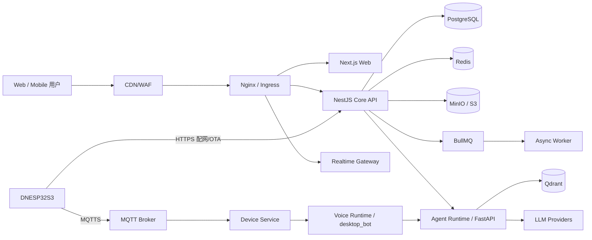

# 系统架构设计

## 1. 架构目标

- MVP 可由小团队在单台到三台服务器稳定运营；
- 业务模块边界清楚，未来可按负载独立伸缩；
- 社区请求、Agent 长任务、设备长连接互不拖累；
- 所有公开动作都可鉴权、限流、审计和追踪；
- 文件、Agent 工具、设备命令默认不可信；
- 契约优先，Web、Python Runtime 与固件可独立演进。

## 2. 总体上下文



## 3. 架构策略：模块化单体优先

MVP 核心业务采用 NestJS 模块化单体，不从十几个微服务起步。理由：

- 用户、内容、评论、权限存在大量强事务；
- 小团队更需要交付速度、一致部署和简单调试；
- 模块边界与事件契约保留后续拆分能力。

从第一天独立的服务只有：

1. `web`：Next.js SSR/BFF 展示层；
2. `core-api`：社区与控制面；
3. `worker`：异步任务；
4. `agent-runtime`：模型/工具执行，隔离 Python 生态与高风险工作负载；
5. `voice-runtime`：复用 `desktop_bot`，第三阶段服务化；
6. `mqtt-broker`：设备连接基础设施。

触发拆分的证据：模块需独立伸缩、部署频率冲突、故障域要求、数据所有权稳定，或单体已产生真实团队阻塞。不能只因为“企业级”而拆。

## 4. Core API 模块边界

| 模块 | 所有数据 | 职责 |
|---|---|---|
| Identity | account、credential、session、verification | 注册、登录、令牌、MFA 预留 |
| Users | profile、follow、creator_application | 主页、关系、认证 |
| Content | content、revision、category、tag | 草稿、发布、版本、分类 |
| Social | comment、reaction、bookmark | 互动与计数 |
| Files | file_object、asset_link、quota | 预签名、扫描状态、引用 |
| Search | search_document | 索引、查询、排序 |
| Notification | notification、preference | 站内通知、邮件 |
| Moderation | report、case、action | 举报、审核、处罚 |
| Agent Control | agent、version、run metadata | Agent 控制面，执行交给 Runtime |
| Device Control | device、binding、command metadata | 设备控制面，连接交给 MQTT/Device Service |
| Admin | audit、feature flag、system config | 后台与审计 |

模块间禁止直接随意访问 Repository；通过公开应用服务或领域事件协作。MVP 可共享一个 PostgreSQL，但 schema/表前缀明确所有权。

## 5. 数据与基础设施

### PostgreSQL

唯一事实源。使用 UUIDv7/ULID 风格可排序 ID（实现可先用 UUIDv7 扩展或应用层生成）。业务删除采用 `deleted_at`，认证令牌、临时上传等安全数据按生命周期硬删除。

### Redis

- 会话撤销/短期缓存；
- 限流计数；
- BullMQ 队列；
- 在线状态和 WebSocket presence；
- 不作为不可恢复的事实源。

生产环境应分离 cache 与 queue Redis，至少使用不同实例/持久化策略。

### 对象存储

桶建议：`public-assets`、`private-assets`、`quarantine`、`agent-artifacts`、`firmware-releases`。存储 key 使用随机 ID，不使用原始文件名；数据库保存展示名。

### 搜索

MVP：PostgreSQL `tsvector` + `pg_trgm`，支持标题、摘要、正文、标签和作者。内容超过百万或需要复杂聚合时再迁移 OpenSearch；通过 Search 模块隔离实现。

### Qdrant

第二阶段仅存向量和检索元数据，文档原文仍在对象存储/数据库。Collection 按 embedding 模型或租户策略规划，不让用户直接访问 Qdrant。

## 6. 关键链路

### 6.1 内容发布

```text
Client -> Content API: Publish(id, expectedVersion, idempotencyKey)
Content API -> PostgreSQL: 状态转换 + revision + outbox（同一事务）
Outbox Worker -> Search: 建索引
Outbox Worker -> Notification: 通知关注者
Outbox Worker -> Analytics: 记录发布事件
```

Outbox 避免“数据库已发布但消息未发送”。消费者必须以 event ID 幂等。

### 6.2 文件直传

```text
Client -> API: create upload intent
API -> Client: presigned URL + object key + limits
Client -> S3: upload
Client -> API: complete(hash, size)
API -> Queue: scan
Worker: sniff MIME -> antivirus -> metadata -> thumbnails
Worker -> DB: ready/rejected
```

下载私有资源必须由 API 鉴权后返回短时预签名 URL。公开资源可经 CDN，但下架时要支持 purge。

### 6.3 Agent 运行

```text
Client -> API: 创建 Run
API: 权限/配额/预算/版本检查
API -> Queue/Runtime: 调度
Runtime: 构建上下文 -> 模型 -> 工具策略 -> 沙箱调用 -> 结果
Runtime -> Event Stream: token/status/tool approval
Runtime -> API/DB: 状态、用量、摘要、审计
```

运行正文/大型产物放对象存储，数据库保存索引、状态、成本和安全摘要。同步问答可流式，长任务一律异步。

### 6.4 设备语音

```text
设备采集/本地 VAD -> MQTTS/HTTPS 上传音频帧或对象引用
Device Gateway 验证设备身份和用户绑定
Voice Runtime ASR -> 路由 -> Agent Runtime
TTS 生成/缓存 -> 设备收到文本或音频 URL
设备播放 -> 回报 completed/failed
```

第三阶段需先决定 ASR 在设备、局域网电脑端还是云端运行。现有 `desktop_bot` 是电脑端 WAV 批处理核心，不应被描述为已经支持设备流式语音。

## 7. API 与事件边界

- 外部 REST：`/api/v1`；破坏性变更升主版本。
- 内部调用：HTTP/gRPC 均可，MVP 优先 HTTP + 签名服务凭证。
- 浏览器实时：WebSocket/SSE，通知可 WebSocket，Agent token 流优先 SSE。
- 设备：MQTT topic + JSON/CBOR envelope，payload schema 版本化。
- 异步事件：`domain.entity.event.v1` 命名，例如 `community.content.published.v1`。

事件标准字段：`event_id`、`event_type`、`occurred_at`、`producer`、`trace_id`、`subject_id`、`schema_version`、`data`。

## 8. 安全架构

### 身份

- Web 使用短期 Access Token（10–15 分钟）+ 旋转 Refresh Token；
- Refresh Token 只存 HttpOnly、Secure、SameSite Cookie，数据库存哈希与 token family；
- 密码使用 Argon2id；邮箱验证和重置令牌单次使用、短期有效、只存哈希；
- 管理员建议强制 WebAuthn/TOTP；后台独立路由和更严格 session。

### 授权

RBAC 解决平台角色，ABAC 解决资源所有者、可见性、组织和 Agent 工具 scope。所有授权在服务端执行；前端隐藏按钮不是权限。

### 输入与文件

- DTO 白名单、长度和枚举校验；
- Markdown/HTML 服务端消毒，CSP 禁止任意脚本；
- 文件同时校验扩展名、声明 MIME、magic bytes、大小、哈希；
- 压缩包限制递归层级、展开大小和文件数，防 zip bomb；
- 固件和可执行内容不能由 CDN 自动执行，强制下载。

### Agent

- 工具 allowlist、参数 schema、资源 scope；
- 写操作区分 auto/ask/deny，危险动作要求一次性审批；
- Secret 只由工具执行器按引用注入，不进入 Prompt/日志；
- URL fetch 防 SSRF，阻断内网/metadata 地址，DNS 重新绑定防护；
- 每 Run 限时、限 token、限费用、限工具次数。

### IoT

- 每设备唯一身份，禁止全量共享长期密钥；
- MQTTS、topic ACL、nonce/timestamp、防重放；
- Secure Boot、Flash Encryption、签名 OTA、A/B 分区与回滚；
- 设备命令有 `command_id`、过期时间、幂等语义和 ACK。

## 9. 可用性与性能 SLO

| 指标 | MVP 目标 | 成熟目标 |
|---|---:|---:|
| Web/API 月可用性 | 99.5% | 99.9% |
| 普通读 API P95 | < 400 ms | < 250 ms |
| 普通写 API P95 | < 700 ms | < 400 ms |
| 搜索 P95 | < 800 ms | < 400 ms |
| 错误率（5xx） | < 1% | < 0.3% |
| Agent 成功率 | Phase 2 ≥ 98% | ≥ 99% |
| RPO / RTO | 24h / 4h | 5min / 1h |

静态资源 CDN 缓存；公开详情页支持 ISR；登录态 API 禁止共享缓存。数据库连接池有上限，所有外部调用有 timeout、重试预算和 circuit breaker。

## 10. 可观测性

- OpenTelemetry 统一 trace，上游 `traceparent` 贯穿 API、Worker、Agent；
- JSON 日志字段：timestamp、level、service、env、trace_id、request_id、user_id_hash、route、latency、error_code；
- RED 指标：Rate、Errors、Duration；队列监控 backlog/age/fail；
- 业务指标：注册、发布、上传、Agent 成功、设备在线；
- 告警按用户影响设计，避免只监 CPU。

严禁记录密码、Cookie、Authorization、API Key、完整 Prompt Secret、原始语音。调试采样必须经过用户同意并设置保留期。

## 11. 灾备与数据生命周期

- PostgreSQL 每日全量 + WAL/PITR；每季度恢复演练；
- 对象存储开启版本控制/生命周期；固件发布物不可原位覆盖；
- IaC、迁移和配置进入 Git，Secret 不进入 Git；
- 删除账户进入冷静期，随后匿名化公共互动并删除私有数据；法律保留例外需记录原因；
- Agent 日志默认 30 天，安全审计 180–365 天，语音默认不持久化或最短保留。

## 12. 架构决策记录（ADR 摘要）

| ADR | 决策 | 状态 |
|---|---|---|
| 001 | NestJS 模块化单体作为核心业务后端 | Accepted |
| 002 | PostgreSQL 为主库，MVP 不引入 MySQL | Accepted |
| 003 | 文件使用 S3 直传和异步扫描 | Accepted |
| 004 | Python Agent/Voice Runtime 与 Core API 隔离 | Accepted |
| 005 | MQTT 为设备长连接主协议 | Proposed，Phase 3 验证 |
| 006 | MVP 搜索用 PostgreSQL，达到阈值再迁移 | Accepted |
| 007 | 私信不进入 MVP | Accepted |

## 13. 需要尽早验证的开放问题

1. DNESP32S3 实际固件代码、Flash/PSRAM、编解码器、麦克风/扬声器和分区表；
2. 语音链路是设备直连云、电脑伴侣进程，还是两者兼容；
3. 首发地区及隐私/内容/生成式 AI 合规要求；
4. 是否需要组织/团队空间；MVP 数据模型可预留 `owner_type`，UI 暂不开放；
5. 项目资源是否允许收费下载，以及许可证/侵权处理机制。

