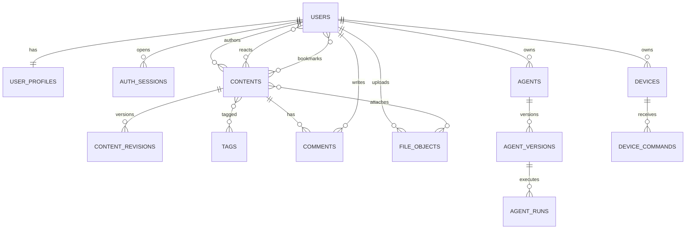

# 数据库设计

## 1. 设计原则

- PostgreSQL 是业务事实源，使用 UTC `timestamptz`；
- 主键使用 UUID，应用层可生成 UUIDv7 以改善局部性；
- 邮箱/username 使用规范化列和唯一索引；
- 外键默认 `RESTRICT`，明确生命周期后才 `CASCADE`；
- 公开业务数据软删除，安全凭证和临时数据到期硬删除；
- 大正文、日志和二进制产物不塞进单行 JSONB；
- JSONB 只用于演进快、查询少的扩展配置，核心关系正常化；
- 所有多租户查询即使 MVP 只有个人，也从 owner/visibility 维度设计。

## 2. 领域关系

## 3. 账号与用户

### users

| 字段 | 类型 | 说明 |
|---|---|---|
| id | uuid PK | 用户 ID |
| email / email_normalized | varchar | 展示值/唯一比较值 |
| password_hash | text | Argon2id |
| status | enum | pending/active/suspended/deleted |
| email_verified_at | timestamptz | 邮箱验证 |
| role | enum | member/moderator/admin；认证创作者另建状态 |
| created_at/updated_at/deleted_at | timestamptz | 生命周期 |

### user_profiles

`user_id`、`username`、`username_normalized`、`display_name`、`bio`、`avatar_file_id`、`location`、`website_url`、`social_links jsonb`、`creator_status`、统计缓存。

### auth_sessions

`refresh_token_hash`、`token_family_id`、`device_name`、`ip_hash`、`user_agent`、`expires_at`、`last_seen_at`、`revoked_at`。只存哈希，不存原始 Token。

### follows

复合主键 `(follower_id, followee_id)`，check 两者不同。若以后需要屏蔽，单独 `user_blocks`，授权查询必须优先处理 block。

## 4. 内容

### contents

统一公共实体：

- `type`: post/article/project/agent_listing；
- `status`: draft/pending_review/published/rejected/removed/archived；
- `visibility`: public/unlisted/followers/private；
- `title`、`slug`、`summary`、`body_markdown`、`cover_file_id`；
- `author_id`、`category_id`；
- `metadata jsonb`：只放类型扩展的非关键字段；
- `version`：乐观锁；
- `published_at`、`created_at`、`updated_at`、`deleted_at`；
- 缓存统计：view/comment/like/bookmark/download counts。

项目关键扩展建议放 `project_details`：`content_id`、`repository_url`、`license_spdx`、`hardware_platforms text[]`、`difficulty`、`bom`、`compatibility`。

### content_revisions

保存发布版本或显式快照：`content_id`、`revision_no`、`title`、`body_markdown`、`metadata`、`created_by`。自动保存不必每次形成永久 revision。

### categories / tags / content_tags

分类是运营控制的单选层级；标签是多选词汇。tag 有 `normalized_name` 唯一约束和别名表预留。禁止用户创建大量近义标签而不治理。

## 5. 互动

### comments

`content_id`、`author_id`、`parent_id`、`root_id`、`depth`、`body`、`status`、`like_count`。限制 depth，删除时保留 tombstone。

### content_reactions

复合唯一 `(user_id, content_id, reaction_type)`。MVP 只开放 like。

### bookmarks

复合唯一 `(user_id, content_id)`；后续收藏夹用 `collection_id` 扩展。

### notifications

`recipient_id`、`actor_id`、`type`、`entity_type/id`、`payload`、`read_at`。为未读查询建 `(recipient_id, read_at, created_at desc)` 部分/复合索引。

私信在 Phase 1.5 使用 `conversations`、`conversation_members`、`messages`，不要复用 notifications。

## 6. 文件

### file_objects

- owner、bucket、object_key、original_name；
- declared/detected MIME、size、sha256；
- status、scan_result、width/height/duration；
- visibility、created_at、ready_at、deleted_at。

唯一 `(bucket, object_key)`，sha256 可用于用户范围内去重但不能因此跨用户泄露文件存在。

### content_assets

`content_id`、`file_id`、`purpose`（cover/inline/attachment/release）、`position`、`display_name`。删除内容时只删引用，后台清理无引用对象需宽限期。

### project_releases（MVP+）

版本不可变：`project_content_id`、`version`、`changelog`、`status`、`published_at`。附件使用 release_assets。固件必须另含 target、checksum、signature、min_bootloader。

## 7. Agent

### agents

`owner_id`、`name`、`slug`、`description`、`visibility`、`status`、`latest_version_id`、统计和时间。

### agent_versions

不可变配置：`version`、`system_prompt`（加密/访问控制）、`model_policy`、`tool_policy`、`input_schema`、`output_schema`、`knowledge_config`、`limits`、`checksum`、`published_at`。

### agent_runs

`agent_version_id`、`user_id`、`status`、`input_ref`、`output_ref`、`started/finished_at`、`token_input/output`、`cost_micros`、`error_code`、`trace_id`。大输入输出放对象存储并设置权限。

### agent_tool_calls

`run_id`、`tool_name/version`、`status`、`arguments_redacted`、`approval_id`、`started/finished_at`、`error_code`。不保存 Secret。

### knowledge_bases/documents

KB 所有者、索引模型、状态；document 保存源文件引用、解析状态和权限；chunk 文本是否入 PostgreSQL按规模决定，向量在 Qdrant。

## 8. 设备

### device_models

型号、硬件版本、能力、支持的固件通道、生命周期。

### devices

`owner_id`、`model_id`、`serial_hash`、`display_name`、`status`、`firmware_version`、`credential_version`、`last_seen_at`、`reported_state jsonb`、`desired_state jsonb`。

原始序列号/制造密钥应加密或放设备身份系统，业务库只存不可逆/脱敏标识。

### device_binding_tokens

单次短期 token 哈希、challenge、过期、消费时间。绑定必须验证物理拥有，例如设备屏幕/按键显示一次性码。

### device_commands

`device_id`、`issuer_id`、`command_type`、`payload`、`status`、`idempotency_key`、`expires_at`、`sent/acked/completed_at`、`error_code`。唯一 `(device_id, idempotency_key)`。

### telemetry

高频遥测不要永久写主业务表。早期按小时聚合存 PostgreSQL 分区表；规模上升后使用 TimescaleDB/ClickHouse。原始语音不属于普通 telemetry。

## 9. 审核、审计、异步

- `reports`：举报者、目标、原因、描述、状态；
- `moderation_actions`：案件、动作、规则、操作者、前后状态；
- `audit_logs`：actor、action、target、result、reason、IP hash、request/trace ID，append-only；
- `outbox_events`：事件、aggregate、payload、published/retry；
- `idempotency_keys`：scope、key、request_hash、response/status、过期时间。

## 10. 索引策略

- 所有外键显式建索引；
- Feed：`contents(status, published_at desc, id desc) where deleted_at is null`；
- 作者主页：`contents(author_id, status, published_at desc)`；
- slug：已发布内容 `(type, slug)` 唯一部分索引；
- 评论：`comments(content_id, created_at, id)`；
- 通知：`notifications(recipient_id, created_at desc)`；
- Agent runs：`(user_id, created_at desc)`、`(agent_version_id, created_at desc)`；
- 设备：`(owner_id, status)`、`last_seen_at`；
- 全文：生成 `search_vector` GIN；模糊字段 GIN/GiST trigram。

索引以查询证据为准；JSONB 不做无差别 GIN，避免写放大。

## 11. 分区与归档

先分区的候选：audit_logs、agent_runs/tool_calls、device_telemetry、outbox_events。按月 range 分区，保留策略可独立执行。MVP 数据量低时可以不分区，但字段/查询避免依赖单表永久存在。

## 12. 迁移规则

- 只向前迁移，生产禁止 ORM 自动同步；
- expand → backfill → switch → contract；
- 大表加非空列先 nullable/默认，回填后加约束；
- 索引用 `CREATE INDEX CONCURRENTLY`（需迁移工具支持非事务步骤）；
- 每次迁移说明锁影响、回滚/前滚方案和数据校验 SQL；
- staging 用生产规模抽样数据演练。

