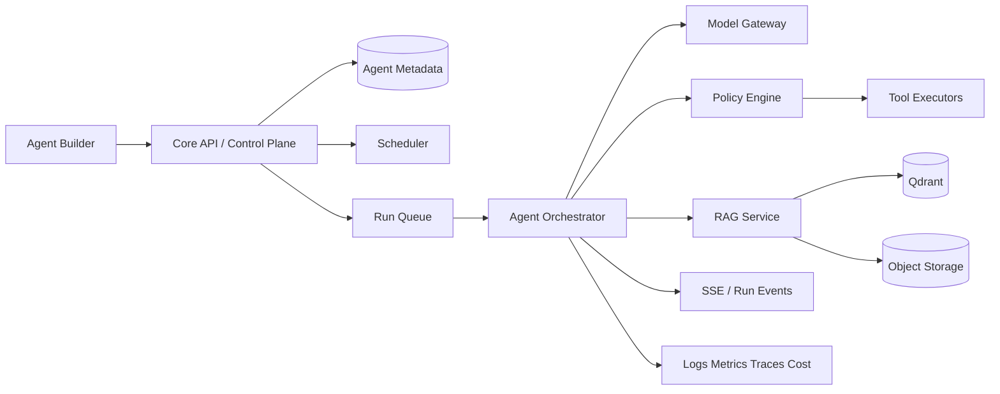

# AI Agent 架构设计

## 1. 目标与边界

平台 Agent 不是一段 Prompt，而是可版本化、可授权、可运行、可评估、可审计、可计费的软件资产。

第二阶段目标：

- 用户通过表单/低代码方式创建 Agent；
- 配置模型策略、知识库、工具、输入输出和运行限制；
- 支持即时流式对话和异步任务；
- 支持定时资讯/日报等调度；
- 完整记录运行状态、工具调用、token 和成本；
- 发布到社区前进行安全与质量检查。

非目标：第一版不允许用户上传任意 Python 在主集群执行；不承诺通用自治；不让 Agent 直接持有用户 Secret。

## 2. 控制面与数据面



控制面由 Core API 负责定义、版本、权限、配额、发布和账本；数据面由 Runtime 负责模型调用、上下文、工具、RAG、流式事件和执行隔离。

## 3. Agent 定义

```yaml
apiVersion: agent.platform/v1
kind: Agent
metadata:
  name: esp32-hardware-assistant
spec:
  modelPolicy:
    class: balanced
    allowedProviders: [provider_a, provider_b]
    temperature: 0.2
  instructions:
    system: "..."
  inputSchema: {}
  outputSchema: {}
  tools:
    - ref: knowledge.search@1
      permission: auto
    - ref: web.fetch@1
      permission: ask
  knowledgeBases: []
  limits:
    timeoutSeconds: 120
    maxSteps: 12
    maxToolCalls: 20
    maxInputTokens: 32000
    maxOutputTokens: 4000
    maxCostMicros: 500000
  memory:
    conversationTurns: 12
    longTerm: disabled
```

发布生成不可变 `agent_version` 和 checksum。草稿可修改，已发布版本不可原位覆盖。

## 4. 运行状态机

```text
created -> queued -> running -> waiting_approval -> running
                         |             |
                         v             v
                      succeeded / failed / cancelled / timed_out
```

要求：

- 所有状态转换带序号，防乱序回调；
- `cancel` 是协作式取消，并有硬超时兜底；
- 重试创建新 attempt，不覆盖原记录；
- 相同 `Idempotency-Key` 不重复执行；
- Runtime lease 到期由 reconciler 判定丢失并重试/失败。

## 5. Orchestrator

运行循环：

1. 加载固定 Agent Version 和授权快照；
2. 构建最小上下文；
3. 通过 Model Gateway 请求结构化响应；
4. 若请求工具，Policy Engine 校验工具、参数、资源 scope、预算和审批；
5. 执行工具并将脱敏结果加入上下文；
6. 达到输出、停止条件或限制时结束；
7. 写入用量、产物、摘要和审计事件。

不得让模型自行决定“拥有权限”；模型输出只是一项不可信请求。

## 6. Model Gateway

统一接口屏蔽供应商差异：

- chat/response、stream、embedding；
- 结构化输出和 tool calling；
- 超时、有限重试、熔断、并发限制；
- Provider/Model allowlist；
- 模型路由按能力/区域/成本，不让用户注入任意 base URL；
- 输入输出 token、缓存命中、延迟、错误码和成本归一化；
- 安全回退：模型不可用时降级或明确失败，不静默切换到能力不符模型。

模型密钥只存在 Vault/Secret Manager。若支持用户自带 Key，必须加密、隔离、不可回显，并明确使用范围。

## 7. 工具系统

### 工具 Manifest

```yaml
name: web.fetch
version: 1
description: 获取允许的公开网页
inputSchema: {}
outputSchema: {}
risk: network_read
defaultApproval: ask
timeoutSeconds: 20
networkPolicy: public_http_only
```

风险级别：

- `pure`：计算/格式转换；
- `data_read`：读取用户数据；
- `network_read`：访问外网；
- `data_write`：修改平台/第三方数据；
- `physical_action`：控制设备；
- `destructive`：删除、发布、付款等。

`data_write` 以上默认 ask；设备动作需要设备 scope、命令 allowlist 和过期时间。审批票据绑定 run、tool、arguments hash、user、expiry，只能使用一次。

### 沙箱

工具执行器独立容器/进程：

- 非 root、只读根文件系统、临时目录配额；
- CPU/内存/PID/执行时间限制；
- 默认无网络，按工具域名 allowlist；
- 禁止访问云 metadata、内网和控制面；
- 出站代理记录目的域，响应大小限制；
- 用户代码功能以后使用专门沙箱平台，不与 Runtime 同进程。

## 8. Secret 管理

Agent 配置只保存 `secret_ref`。执行前 Core API 发短期 capability，工具执行器向 Vault 获取对应 Secret；模型上下文永远看不到 Secret 原文。日志对常见 token、邮箱、凭证模式进行脱敏，并提供用户可配置敏感字段。

## 9. RAG

### 摄取

文件上传 → 安全扫描 → 文本提取/OCR → 结构识别 → 分块 → 元数据与 ACL → embedding → Qdrant upsert → 索引版本 ready。

每个 chunk 带：

- `tenant_id/owner_id`、KB/document ID；
- source、page/section、content hash；
- ACL、语言、embedding model/version；
- created/updated/deleted marker。

### 检索

查询改写（可选）→ 权限过滤 → 向量 + 关键词混合 → rerank → 去重 → context budget → 引用。返回结果必须能定位来源。先做检索评测再调 chunk size，不能仅凭直觉。

### 防护

- 检索到的文档是数据，不是系统指令；
- 对网页/文档提示注入做边界标记和风险检测；
- 工具权限不因文档内容改变；
- 私有文档 ACL 在查询和返回两处校验；
- 删除文档触发数据库、对象存储、向量索引的可追踪清理。

## 10. 记忆

- Working memory：单 Run 上下文；
- Conversation memory：最近 N 轮，按会话隔离；
- Summary memory：压缩长会话，保留来源；
- Long-term memory：默认关闭，用户显式开启并可查看/编辑/删除。

不要把完整聊天无限塞入 Prompt；不要把模型推断的敏感属性写入长期记忆。

## 11. 调度

支持 one-off、cron、event-trigger。Scheduler 只创建 Run，不直接执行。要求：

- cron 使用用户时区并保存标准化表达式；
- 错过执行有 skip/catch-up 策略；
- 同任务 `forbid/allow/replace` 并发策略；
- 单用户/Agent 并发与每日预算；
- 失败退避、最大重试、Dead Letter；
- 资讯 Agent 抓取遵守站点条款、robots 和频率限制。

## 12. 日志与可观测

用户可见：步骤状态、工具名称、审批、耗时、token/成本、最终结果、可理解错误。

运营可见：trace、provider error、queue delay、sandbox status、策略命中。Chain-of-thought 不持久化/展示；可记录简短的结构化决策摘要。

关键指标：

- run success/cancel/timeout；
- queue wait、time-to-first-token、总时长；
- 每成功任务成本；
- 工具错误率/审批率；
- RAG recall/引用覆盖；
- 安全策略拦截和误报。

## 13. 评测与发布

每个 Agent 可维护 Dataset：输入、期望属性、禁止行为、评分规则。发布门：

- schema 合法；
- 工具和 Secret 引用有效；
- 标准安全用例通过；
- 关键任务成功率达到阈值；
- 成本和延迟不超限；
- 版本说明和权限清单完整。

自动评测包括规则/代码评分、LLM-as-judge（仅辅助）和人工抽查。对模型/Prompt/工具更新运行回归集和 canary。

## 14. 典型 Agent

### 信息收集 Agent

定时触发 → 搜索/抓取 allowlist 来源 → 去重 → 摘要 → 带引用日报 → 站内/邮件推送。发布到公共社区属于写操作，需审批。

### 项目助手

通过用户授权读取代码快照 → 建索引 → 问题分析 → 引用文件/行号 → 建议。MVP 不自动推送代码。

### 硬件助手

检索 ESP-IDF、板卡手册、项目资料 → 分析日志/电路图片 → 给出分级排错。真实烧录、重启、OTA 属于 `physical_action`。

### 社区运营 Agent

聚合公开内容指标 → 发现主题/低质风险 → 给运营建议。不得自行封禁用户；审核只能辅助排序。

## 15. 与 desktop_bot 集成

现有项目已经提供 `ASRBackend`、`LLMBackend`、`OutputAdapter`、`DuplexTransportAdapter`、模式管理和统一 `AssistantResponse`。集成策略：

1. 保留 `VoicePipeline` 作为语音域编排；
2. 新增长驻 FastAPI/WebSocket 适配器，避免 CLI 进程丢失 session；
3. 将现有 LLMBackend 逐步替换为 Agent Gateway Client；
4. 把 `action` 映射为经过 Policy Engine 的工具/设备命令；
5. 增加 TTS Adapter 和流式/分片音频协议；
6. 在云接入前补齐 trace、租户/用户/设备 identity 和并发 session store。

旧的本地固定命令保留为低延迟降级路径；云端不可用时不得把未执行动作说成已执行。

