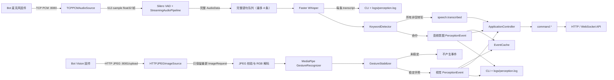
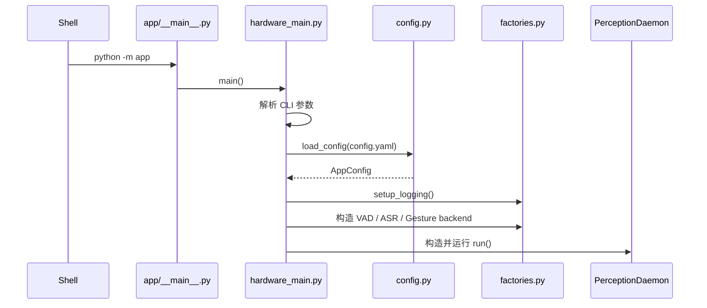
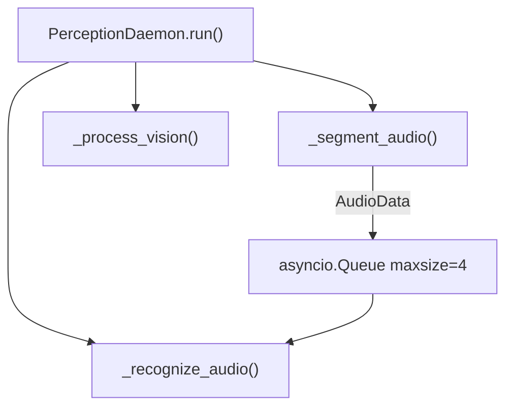
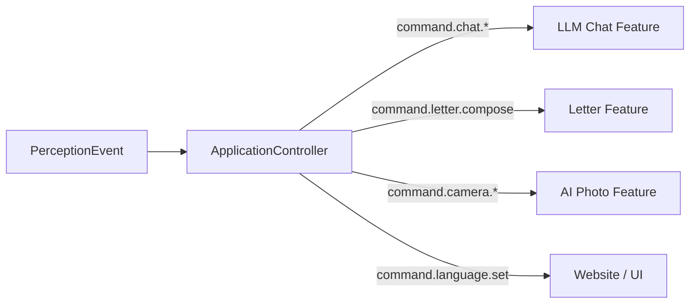

# `python -m app` 完整工作 Pipeline

本文以当前代码为准，说明执行 `python -m app` 后：

- 程序如何启动；
- 音频和图像信号从哪里进入；
- 信号如何在各模块之间传输；
- 队列、模型和状态如何协作；
- 哪些内容会成为最终输出；
- `app/` 下每个文件负责什么。

当前项目是一个“持续感知服务”，不是完整对话机器人。它负责把原始音频和图像
转换为结构化 `PerceptionEvent`。LLM 回答、TTS、写信执行和硬件动作回传尚未
接入。

## 1. 总体结构



两条感知链路共享：

- 同一份 `AppConfig`；
- 同一个 `session_id` 默认值；
- 同一个内存 `EventCache`；
- 同一套控制台和文件日志；
- 同一个 `PerceptionDaemon` 生命周期。

它们不共享输入队列，也不会互相等待。音频 VAD、音频 ASR 和视觉处理是三个长期
异步任务。

## 2. 启动命令与参数

标准启动：

```bash
python -m app
```

等价兼容入口：

```bash
python -m app.main
python -m app.hardware_main
```

Vision 实时测试模式：

```bash
python -m app test
```

`test` 模式不启动正常的 Audio/Vision `PerceptionDaemon`，而是启动同一个
`HTTPJPEGImageSource`、`ContinuousVisionProcessor` 和 MediaPipe backend，
同时打开 OpenCV 窗口显示最新画面、检测结果与稳定事件。它仍监听默认
`POST /upload` 地址，因此不能与正常 app 进程同时占用同一 Vision 端口。

可用参数：

```text
[run | test]
--config PATH
--session SESSION_ID
--audio-only
--vision-only
--audio-host HOST
--audio-port PORT
--vision-host HOST
--vision-port PORT
--scale FLOAT
```

`--audio-only` 和 `--vision-only` 互斥。命令行地址、端口和 session 会覆盖
`config.yaml` 中相应值。`--scale` 只影响 `test` 模式的显示窗口。

## 3. 启动阶段

### 3.1 Python 模块入口

执行 `python -m app` 时，Python 读取 `app/__main__.py`，再调用
`app.hardware_main.main()`。



### 3.2 配置加载和验证

`load_config()` 读取 YAML，并只接受以下九个顶层 section：

| Section | 用途 |
| --- | --- |
| `audio` | 目标采样率 |
| `asr` | ASR 后端、模型、设备、量化和语言 |
| `hardware` | 音频/视觉开关、监听地址、端口和 session |
| `vad` | Silero VAD 阈值和断句策略 |
| `keywords` | 唤醒、聊天切换和写信关键词 |
| `perception` | 事件缓存、语句队列和视觉 FPS |
| `vision` | 图像约束、手势模型和稳定策略 |
| `application` | 默认语言、延迟拍照、照片目录和下游地址 |
| `api` | HTTP/WebSocket 接口地址和开关 |

未知 section、未知字段和非法阈值会在服务器启动前抛出
`ConfigurationError`。当前 Silero 流式输入被明确限制为：

- `audio.target_sample_rate = 16000`；
- `hardware.audio_frame_samples = 512`。

### 3.3 日志初始化

`setup_logging()` 创建两个 INFO 级别 handler：

- `logging.StreamHandler()`：输出到当前 CLI；
- `logging.FileHandler()`：追加写入 `logs/perception.log`。

日志格式：

```text
时间 级别 logger名称 消息
```

### 3.4 模型和组件构造

`build_daemon()` 根据开关组装组件。

音频启用时：

```text
TCPPCMAudioSource
StreamingAudioPipeline
SileroVADBackend
FasterWhisperBackend 或 MockASRBackend
KeywordDetector
KeywordASRProcessor
```

视觉启用时：

```text
HTTPJPEGImageSource
MediaPipeGestureBackend
ContinuousVisionProcessor
GestureStabilizer
```

模型加载时机不同：

- Silero ONNX session 在启动组装阶段创建；
- MediaPipe 手势模型在启动组装阶段加载；
- Faster Whisper 在第一条有效语句到达时延迟加载，之后复用同一实例。

Silero 或 MediaPipe 在组装阶段加载失败时，启动会终止并显示参数错误。Whisper
是延迟加载的，其加载失败会在第一条有效语句到达时记为 ASR 错误，Runtime 随后
继续等待下一条语句。

## 4. Runtime 并发结构

`PerceptionDaemon.run()` 使用 `asyncio.TaskGroup` 创建最多三个长期任务：



| 任务 | 职责 |
| --- | --- |
| `_segment_audio()` | 消费 PCM 帧，运行 VAD，产生完整语句 |
| `_recognize_audio()` | 串行消费完整语句，运行 ASR 和关键词检测 |
| `_process_vision()` | 消费最新 JPEG，运行图像识别和手势稳定 |

音频被拆成两个任务，是为了防止较慢的 Whisper 推理暂停 VAD。视觉自身采用
“最新帧优先”，因此只需要一个处理任务。

当主任务被取消或收到 `Ctrl+C`：

1. 异步任务取消；
2. 网络 server 关闭；
3. MediaPipe backend 关闭；
4. Runtime 把最终 health/metrics 写入日志。

## 5. 音频信号来源

### 5.1 输入协议

音频来自 Bot 麦克风固件建立的 TCP 连接：

```text
监听：0.0.0.0:8080
格式：raw PCM
采样率：16000 Hz
通道：单声道
位宽：signed 16-bit
字节序：little-endian
```

服务器当前只允许一个活跃音频客户端。第二个客户端连接时会被拒绝。第一个客户端
断开后，新的客户端可以重新连接，Runtime 本身不会退出。

### 5.2 TCP 字节到音频帧

TCP 不保证一次 `read()` 对应一帧。`TCPPCMAudioSource` 使用 `bytearray`
累计任意大小的数据块，凑够：

```text
512 samples × 2 bytes = 1024 bytes
```

后才产生一帧。

转换过程：

```text
1024 raw bytes
→ np.frombuffer(dtype="<i2")
→ 512 个 int16 sample
→ 除以 32768
→ float32，范围约为 [-1.0, 1.0]
```

每帧时长：

```text
512 / 16000 = 0.032 秒 = 32 ms
```

帧进入 `TCPPCMAudioSource` 内部队列。默认队列容量为 256 帧，约等于：

```text
256 × 32 ms = 8.192 秒
```

队列满时 TCP 读取协程会等待，而不是丢弃帧。

## 6. VAD 与语句切分

### 6.1 Silero VAD

`SileroVADBackend` 使用 faster-whisper 随包提供的
`silero_vad_v6.onnx`，也可以通过配置指定独立 ONNX 文件。

每个 512-sample 帧输出一个 `[0, 1]` 范围内的语音概率。推理通过
`asyncio.to_thread()` 放到工作线程，避免直接阻塞事件循环。

Silero 是有状态模型，内部保存：

- hidden state `h`；
- cell state `c`；
- 最近 64 samples 的 context。

一句话完成后会调用 `reset()` 清空这些状态。

### 6.2 StreamingAudioPipeline 状态

初始状态为“未在说话”：

1. 每帧更新最多 200 ms 的 pre-roll；
2. 当概率 `>= speech_threshold`，进入说话状态；
3. 把触发前的 pre-roll 和当前帧一起放入语句。

说话状态中：

1. 所有帧继续追加到语句；
2. 概率 `<= release_threshold` 时累计静音 samples；
3. 再次出现高于释放阈值的帧时，静音计数清零；
4. 连续静音达到限制，或整句达到最长时间，结束语句。

当前配置：

| 参数 | 值 | 含义 |
| --- | ---: | --- |
| `speech_threshold` | 0.60 | 开始说话阈值 |
| `release_threshold` | 0.35 | 静音累计阈值 |
| `min_speech_duration_ms` | 250 | 最短有效人声 |
| `min_silence_duration_ms` | 800 | 结束一句话所需连续静音 |
| `pre_roll_ms` | 200 | 保留触发前音频 |
| `max_utterance_seconds` | 45 | 单条语句硬上限 |

有效语句输出为：

```python
AudioData(
    samples=np.ndarray(dtype=float32),
    sample_rate=16000,
    duration_seconds=...,
    source_path=Path("<stream>"),
)
```

低于最短有效人声的片段被直接丢弃，不进入 ASR，也没有 transcript 日志。

### 6.3 完整语句队列

VAD 产生的 `AudioData` 放入独立 `asyncio.Queue`，默认最多 4 条。

- 队列未满：ASR 任务依次处理；
- 队列已满：丢弃新产生的整条语句；
- 不会丢一半音频后再与下一句话拼接；
- 丢弃计入 `audio_utterances_dropped`。

当前只有一个 ASR consumer，因此 Whisper 推理是串行的。

## 7. ASR 与关键词门控

### 7.1 Faster Whisper

当前配置：

```yaml
asr:
  backend: faster_whisper
  model: models/faster-whisper-small
  device: cpu
  compute_type: int8
  language: zh
```

处理方式：

1. 第一条有效语句到达时创建 `WhisperModel`；
2. 把 `AudioData.samples` 直接传给模型，不写 WAV；
3. 固定执行 `task="transcribe"`；
4. 固定中文 `language="zh"`；
5. `vad_filter=False`，因为前面已经用 Silero 完成断句；
6. 拼接 Whisper 返回的所有 segment text；
7. 去掉文本首尾空白。

Whisper 同步推理通过 `asyncio.to_thread()` 运行，所以不会阻塞视觉任务或音频 VAD
任务。

### 7.2 每条 ASR 结果的调试输出

只要一段音频真正进入 ASR 并返回文本，无论是否命中关键词，都会产生一条日志：

```text
INFO desktop_assistant.asr asr result {
  "session_id": "bot",
  "duration_seconds": 1.28,
  "transcript": "今天天气不错",
  "matched_event": null,
  "matched_keyword": null
}
```

该日志同时出现在 CLI 和 `logs/perception.log`。

如果 ASR 抛出 `ASRError`：

- `asr_errors` 加一；
- 输出异常日志；
- 当前语句丢弃；
- Runtime 继续处理下一条语句。

### 7.3 KeywordDetector

关键词检测前会：

- 删除空白；
- 删除常见中英文标点；
- 使用 `casefold()` 统一大小写。

匹配优先级固定为：

| 优先级 | 事件类型 | 配置来源 |
| ---: | --- | --- |
| 1 | `mode.enter_chat` | `keywords.enter_chat` |
| 2 | `mode.exit_chat` | `keywords.exit_chat` |
| 3 | `feature.write_letter` | `keywords.write_letter` |
| 4 | `wake` | `keywords.wake` |

优先匹配具体功能，最后才匹配普通唤醒词。因此：

```text
小A，帮我写信，内容是明天见
```

产生 `feature.write_letter`，而不是普通 `wake`。

结果中的 `payload_text` 会删除已命中的功能关键词和唤醒词：

```json
{
  "keyword": "帮我写信",
  "transcript": "小A，帮我写信，内容是明天见",
  "payload_text": "内容是明天见"
}
```

未命中任何关键词时：

- ASR transcript 已经写入调试日志；
- 产生 `speech.transcribed` 并写入 `EventCache`；
- 未进入聊天时不产生功能命令；
- 已进入聊天时产生 `command.chat.ask`。

## 8. 图像信号来源

### 8.1 输入协议

图像来自 Bot Vision 固件发送的 HTTP 请求：

```text
POST http://<host>:8081/upload
Content-Type: image/jpeg
Content-Length: <JPEG字节数>

<raw JPEG bytes>
```

可选 header：

| Header | 用途 |
| --- | --- |
| `X-Session-Id` | 覆盖默认 session |
| `X-Request-Id` | 携带发送端请求标识 |

接收端会检查：

- 请求方法必须是 `POST`；
- path 必须匹配 `/upload`；
- header 总大小不超过 32 KiB；
- 必须提供合法 `Content-Length`；
- 缺少 Content-Type 时按 `image/jpeg` 处理；显式提供时必须是 JPEG；
- body 非空且不超过 `vision.max_image_bytes`；
- body 必须完整接收。

### 8.2 HTTP 立即响应

合法图片进入队列后，固件立即收到：

```json
{
  "status": "accepted",
  "bytes": 12345,
  "dropped_stale_frame": false
}
```

HTTP 状态码为 `202 Accepted`。

如果处理速度低于上传速度，容量为 1 的图像队列会用新图覆盖旧图，此时：

```json
{
  "dropped_stale_frame": true
}
```

这表示请求已成功接收，但一张更旧、尚未推理的图片被丢弃。

非法请求可能返回：

| 状态码 | 原因 |
| ---: | --- |
| 400 | 无效请求、空图片或 body 不完整 |
| 404 | method/path 不匹配 |
| 411 | 缺少 Content-Length |
| 413 | 图片过大 |
| 415 | 不是 JPEG Content-Type |
| 431 | header 过大 |
| 500 | 未知内部错误 |

## 9. 图像处理与视觉事件

### 9.1 最新帧和 FPS 限制

`HTTPJPEGImageSource` 只保留最新一张待处理图片。`ContinuousVisionProcessor`
还根据 `perception.vision_max_fps` 限制推理频率。

默认 `5 FPS`，即两次推理开始时间至少间隔约 200 ms。等待期间到达的新图片会
覆盖队列中的旧图片。

### 9.2 JPEG 解码和验证

`decode_jpeg()` 进行第二层内容验证：

1. Content-Type 仍必须是 JPEG；
2. 数据必须非空且不超过大小限制；
3. Pillow 必须能识别真实 JPEG；
4. 应用 EXIF orientation；
5. 尺寸必须严格为 640×480；
6. 转换为 `(480, 640, 3)` 的 `uint8 RGB ndarray`。

应用默认不把 JPEG 或 RGB 图片写入磁盘。

### 9.3 MediaPipe 手势识别

`MediaPipeGestureBackend` 使用：

- MediaPipe Tasks `GestureRecognizer`；
- CPU delegate；
- `RunningMode.IMAGE`；
- 最多 2 只手；
- canned gesture classifier；
- 默认最低分数 0.70。

对每只手只取置信度最高的类别，产生：

```python
GestureDetection(
    label="Victory",
    score=0.93,
    handedness="Right",
)
```

`None` 类别和低于阈值的检测不会进入稳定器。推理通过
`asyncio.to_thread()` 执行。

### 9.4 GestureStabilizer

单帧检测不会立即成为事件。当前为四个 label 建立稳定策略：

| Label | 窗口 | 所需命中 | 释放帧 | 最终事件 |
| --- | ---: | ---: | ---: | --- |
| `Victory` | 5 帧 | 至少 3 帧 | 2 帧 | `gesture.victory` |
| `Thumb_Up` | 3 帧 | 至少 2 帧 | 2 帧 | `gesture.thumb_up` |
| `Thumb_Down` | 3 帧 | 至少 2 帧 | 2 帧 | `gesture.thumb_down` |
| `Open_Palm` | 3 帧 | 至少 2 帧 | 2 帧 | `gesture.open_palm` |

一个手势触发后会进入 disarmed 状态。继续保持手势不会重复产生事件；必须连续缺失
达到 `release_frames`，才会重新允许触发。

视觉事件示例：

```json
{
  "event_type": "gesture.victory",
  "source": "vision",
  "timestamp_ms": 1784800000000,
  "session_id": "bot",
  "payload": {
    "label": "Victory",
    "confidence": 0.9321
  }
}
```

未稳定的普通 detection 当前不会写日志、不会写缓存，也不会返回给图像发送端。

## 10. 统一事件与缓存

音频和视觉最终都转换为：

```python
PerceptionEvent(
    event_type="...",
    source="audio | vision",
    timestamp_ms=...,
    session_id="bot",
    payload={...},
)
```

### 10.1 当前事件类型

音频：

- `speech.transcribed`
- `wake`
- `mode.enter_chat`
- `mode.exit_chat`
- `feature.write_letter`
- `feature.photo_print`
- `llm.letter.start`
- `llm.qa.start`

视觉：

- `gesture.victory`
- `gesture.thumb_up`
- `gesture.thumb_down`
- `gesture.open_palm`

控制器会进一步产生 `command.chat.*`、`command.language.set`、
`command.camera.capture_after` 和其他 `command.*` 事件。`Victory` 或
`feature.photo_print` 会启动同一个照片打印任务；`Open_Palm` 切换中英文。

照片打印任务等待 1 秒后保存届时最新 JPEG，再在内存中按打印机配置执行 EXIF
方向修正、灰度、亮度/对比度、像素化、灰度量化和 1-bit 抖动。位图宽度默认
384 像素，过长图像以最多 1200 像素高度分块，依次发送到：

```text
POST {printer.base_url}/printer/image?width=...&height=...
Content-Type: application/octet-stream
```

成功产生 `photo.captured`、`photo.printed` 和 `photo.completed`。打印功能关闭、
超时、连接失败或非 2xx 响应产生 `photo.print_failed`。整个任务以及结束后的
2 秒冷却共用一个任务锁，期间新的语音或 Victory 触发会被忽略，不进入队列。

启用 `llm` 后，LLM 开始短语在普通关键词之前检测。写信模式可以从
`我要给{recipient}写信` 模板提取收件人，或者进入 `awaiting_recipient` 后等待
“收件人是…”；问答模式使用配置的 `user_nickname`。进入模式后，多段
`speech.transcribed` 按顺序暂存在内存，其他音频意图被抑制，视觉手势仍正常工作。

控制语只有在标准化后完整匹配当前模式配置时才生效；`正文：` 前缀优先于控制语并
在保存前移除。结束后通过 OpenAI-compatible `/chat/completions` 生成结果，并产生：

- `llm.session_started`
- `llm.recipient_set`
- `llm.transcript_buffered`
- `llm.session_cancelled`
- `llm.session_failed`
- `llm.letter_completed`
- `llm.answer_completed`

API Key 只从 `llm.api_key_env` 指定的环境变量读取。原始片段、输出、耗时和错误写入
独立轮转日志 `logs/llm.log`，不记录 API Key。阶段一不调用打印机。

### 10.2 EventCache

事件缓存使用内存 `deque`：

```text
容量：100 条
TTL：1800 秒（30 分钟）
持久化：无
```

行为：

- 容量满后自动淘汰最旧事件；
- 追加、读取、取长度时惰性删除过期事件；
- 进程退出后全部丢失；
- ASR 普通文本以 `speech.transcribed` 进入缓存；
- 视觉单帧 detection 不进入缓存；
- 原始 PCM、WAV、JPEG、RGB 都不进入缓存。

### 10.3 事件日志

每个有效事件还会输出：

```text
INFO desktop_assistant.perception perception event <JSON>
```

该日志同时进入 CLI 和 `logs/perception.log`。

## 11. 最终输出汇总

当前应用的主要可观察输出：

| 输出 | 接收方 | 内容 |
| --- | --- | --- |
| ASR result 日志 | CLI、`logs/perception.log` | 每条实际 ASR transcript，包括未命中关键词的文本 |
| Perception event 日志 | CLI、`logs/perception.log` | 感知、命令和功能结果事件 |
| EventCache | 当前 Python 进程、HTTP API | 最近结构化事件 |
| HTTP response | Vision 固件 | 图片是否接收、字节数、是否覆盖旧帧或错误原因 |
| WebSocket `/api/events` | 网站、功能程序 | 实时事件和 `command.*` |
| HTTP `/api/events` | 网站、功能程序 | 按 sequence 补取历史事件 |
| POST `/api/results` | 聊天和其他功能程序 | 回传回答、任务状态和功能结果 |
| HTTP `/api/photos/{id}.jpg` | 网站、功能程序 | 语音或 Victory 触发保存的 JPEG |
| HTTP `{printer.base_url}/printer/image` | 打印机固件 | 灰度像素化后的 1-bit 分块位图 |
| `logs/llm.log` | 本地调试 | LLM 会话片段、输出、耗时、取消和错误 |

TCP 音频发送端当前不会收到识别文本或业务响应。

尚未内置以下业务实现：

- LLM 回答（已提供 `command.chat.*` 接口）；
- TTS 音频；
- 状态持久化；
- 信件草稿；
- 设备控制指令；
- 数据库或 JSON 事件文件；
- 原始音频自动落盘（语音或 Victory 触发的照片会落盘）。

## 12. Metrics 和 health

`PerceptionDaemon` 维护：

| 指标 | 含义 |
| --- | --- |
| `audio_frames_received` | 进入 VAD 的 512-sample 帧数 |
| `audio_utterances` | VAD 产生的完整有效语句数 |
| `audio_utterances_dropped` | ASR 语句队列满时丢弃数 |
| `asr_calls` | ASR 调用次数 |
| `asr_errors` | ASR 错误次数 |
| `keyword_hits` | 关键词命中并产生事件的次数 |
| `speech_transcripts` | 非空 ASR 转写事件数 |
| `vision_frames_received` | Vision task 从最新帧队列取得的图片数 |
| `vision_frames_processed` | 已完成处理的图片数 |
| `vision_errors` | 图片校验或推理错误数 |
| `vision_events` | 稳定手势事件数 |

`health()` 还包含：

- Runtime 是否正在运行；
- 当前缓存事件数量；
- 当前完整语句队列长度。

启用 `api.enabled` 后，`GET /api/health` 返回这些数据，
`GET /api/state` 返回当前聊天、语言和拍照状态。

## 13. 文件职责

### 13.1 入口、配置和共享模型

| 文件 | 职责 |
| --- | --- |
| `app/__init__.py` | 包说明，无运行逻辑 |
| `app/__main__.py` | `python -m app` 的入口，调用 `hardware_main.main()` |
| `app/main.py` | `python -m app.main` 兼容入口 |
| `app/hardware_main.py` | CLI、配置读取、组件组装、Runtime 启停和资源关闭 |
| `app/config.py` | 配置 dataclass、YAML 加载、未知字段和参数边界验证 |
| `app/factories.py` | 构造 ASR、VAD、MediaPipe backend，并初始化日志 |
| `app/models.py` | 定义 `AudioData`、`ImageRequest`、`GestureDetection` |
| `app/perception_events.py` | 定义统一 `PerceptionEvent` 和默认时间戳 |
| `app/event_cache.py` | 有界、带 TTL 的进程内事件缓存 |

### 13.2 ASR

| 文件 | 职责 |
| --- | --- |
| `app/asr/__init__.py` | 导出 ASR 公共接口 |
| `app/asr/base.py` | 定义 `ASRBackend.transcribe()` 和 `ASRError` |
| `app/asr/faster_whisper_backend.py` | 延迟加载 Faster Whisper，在线程中执行本地转写 |
| `app/asr/mock_backend.py` | 测试和离线开发用的文件名到 transcript 映射 |

### 13.3 Audio 和 VAD

| 文件 | 职责 |
| --- | --- |
| `app/audio/__init__.py` | Audio 子包说明并导出 `AudioData` |
| `app/audio/stream_pipeline.py` | pre-roll、语音起点、连续静音终点、最短/最长语句和 `AudioData` 组装 |
| `app/audio/keyword_asr.py` | 调用 ASR、记录并保留 transcript、构造关键词意图事件 |
| `app/audio/vad/__init__.py` | 导出 VAD 公共接口 |
| `app/audio/vad/base.py` | 定义帧级 `VADBackend` 和 `VADError` |
| `app/audio/vad/silero_backend.py` | Silero v6 ONNX 状态、帧校验、概率推理和 reset |
| `app/audio/vad/mock_backend.py` | 测试用的确定性 VAD 概率序列 |

### 13.4 Detection

| 文件 | 职责 |
| --- | --- |
| `app/detection/__init__.py` | 导出关键词检测接口 |
| `app/detection/keywords.py` | 文本标准化、优先级匹配、关键词和 payload 提取 |

### 13.5 LLM

| 文件 | 职责 |
| --- | --- |
| `app/llm/mode_detector.py` | 写信/问答开始短语和收件人模板识别 |
| `app/llm/session.py` | 收件人、转录缓冲、控制语、限制、Prompt 和超时状态机 |
| `app/llm/client.py` | OpenAI-compatible 请求、环境变量 API Key 和稳定错误 |

### 13.6 Runtime

| 文件 | 职责 |
| --- | --- |
| `app/runtime/__init__.py` | 导出 `PerceptionDaemon` |
| `app/runtime/perception_daemon.py` | 三任务并发、语句队列、metrics、事件缓存和事件日志 |

### 13.7 控制、功能与 API

| 文件 | 职责 |
| --- | --- |
| `app/control/application_controller.py` | 聊天状态、语言状态和感知事件到功能命令的路由 |
| `app/events/event_bus.py` | 对网站和其他消费者广播实时事件 |
| `app/features/photo_capture.py` | 最新帧存储、1 秒异步拍照、打印协调、冷却、本地保存和下游上传 |
| `app/features/thermal_printer.py` | 灰度像素化、1-bit 位图打包、分块和打印机 HTTP 客户端 |
| `app/api/server.py` | health、state、历史事件、照片和 WebSocket 接口 |

### 13.8 Transport

| 文件 | 职责 |
| --- | --- |
| `app/transport/__init__.py` | 导出当前网络输入源 |
| `app/transport/sources.py` | 定义可替换的 `AudioFrameSource` 和 `ImageFrameSource` 接口 |
| `app/transport/hardware_sources.py` | TCP PCM server、HTTP JPEG server、协议校验、帧转换、重连和最新图覆盖 |

### 13.9 Vision

| 文件 | 职责 |
| --- | --- |
| `app/vision/__init__.py` | Vision 子包说明 |
| `app/vision/base.py` | 定义 `GestureBackend` 和带错误码的 `VisionError` |
| `app/vision/image_loader.py` | JPEG 类型、大小、EXIF、尺寸和 RGB ndarray 校验 |
| `app/vision/mediapipe_gesture.py` | MediaPipe 模型加载、每只手的 top gesture 和资源关闭 |
| `app/vision/gesture_stabilizer.py` | 滑动窗口投票、单次触发和 release 后重新武装 |
| `app/vision/continuous_processor.py` | FPS 限制、解码、识别、过滤、稳定和视觉事件构造 |
| `app/vision/mock_backend.py` | 测试用的手势结果序列 |

### 13.10 仓库根目录和辅助文件

| 文件 | 职责 |
| --- | --- |
| `config.yaml` | 当前默认运行配置 |
| `requirements.txt` | NumPy、YAML、Whisper、ONNX Runtime、MediaPipe、OpenCV 和 Pillow 依赖 |
| `requirements-dev.txt` | pytest 和 pytest-asyncio 测试依赖 |
| `scripts/receive_microphone.py` | 固件诊断：直接收 PCM 并保存 `microphone.wav`，不走 VAD/ASR |
| `scripts/receive_images.py` | 固件诊断：直接收 JPEG 并保存到 `received_images/`，不走视觉模型 |
| `scripts/vision_live.py` | `python -m app test` 使用的实时 Vision 窗口，也可独立运行 |
| `scripts/record.py` | 使用本机麦克风录制训练/测试 WAV 和 metadata |
| `tests/test_config.py` | 配置默认值、仓库配置和非法配置测试 |
| `tests/test_vad_stream.py` | VAD 断句、静音、最长语句和真实 Silero smoke test |
| `tests/test_perception_runtime.py` | 关键词、缓存、音频主链路和视觉稳定事件测试 |
| `tests/test_thermal_printer.py` | 打印图像、位图位序、分块和 HTTP 协议测试 |
| `tests/test_llm_session.py` | LLM 模式检测、会话、控制语、限制和超时测试 |
| `tests/test_llm_client.py` | OpenAI-compatible HTTP、响应和专用日志测试 |

## 14. 当前边界和后续接入点

后续功能应消费 `command.*`，不要直接进入 Transport、VAD、ASR 或 Vision
内部。当前聊天实现方消费 `command.chat.start/ask/stop`，照片处理程序由
`application.photo_processor_url` 接收 multipart JPEG，网站消费 WebSocket。

推荐扩展方向：



当前值得注意的边界：

- 唤醒词由完整 ASR 后的文本匹配完成，每段有效人声都有 Whisper 开销；
- 没有 partial/streaming transcript；
- 没有使用 ASR confidence 过滤；
- `EventCache` 不是持久化存储；
- 图像 HTTP `202` 只表示接收成功，不代表完成推理；
- 音频 TCP 目前是单向输入，不回传识别结果；
- 单个音频连接如果在语句中途断开，VAD 当前没有独立的断线 reset 信号。
