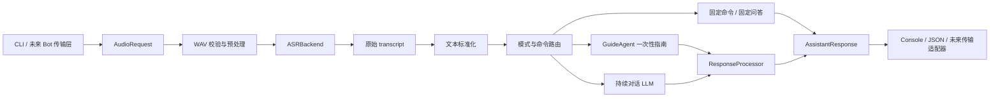
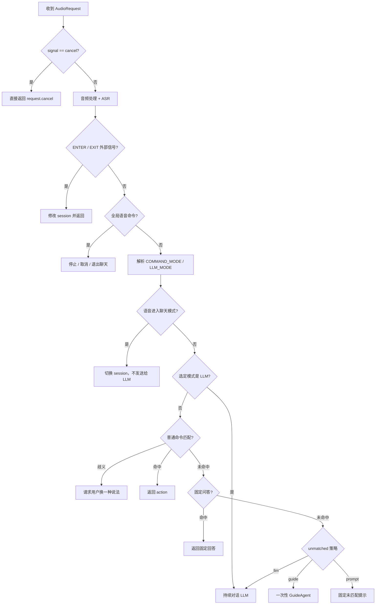

# 桌面 AI Bot 开发与调试指南

本文面向后续维护者，说明桌面 AI Bot 从接收 WAV 到输出 JSON 的完整工作流程、
`app/` 目录职责、核心调用关系，以及常见修改和调试入口。

相关文档：

- [README](../README.md)：安装、配置和日常使用
- [设计说明](design.md)：模块边界和路由原则
- [开发记录](worklog.md)：已完成工作和验证记录

## 1. 系统总览

当前程序是一个与传输协议无关的语音处理核心。CLI 只是现阶段的输入入口，
`VoicePipeline` 不依赖终端、WebSocket、串口或具体 Bot SDK。



核心设计约束：

- ASR、LLM 和输出层都通过抽象接口注入。
- Pipeline 不直接操作 UI、扬声器或打印机，只返回 `action`。
- 每个 `session_id` 有独立模式、历史和最后回答。
- 所有业务异常转换为 `AssistantResponse`，不让异常直接穿透处理链路。
- 原始 ASR 文本用于显示和日志；标准化文本只用于命令匹配。

## 2. 一次请求的完整调用链

CLI 命令：

```bash
python -m app.main \
  --wav records/el_0001.wav \
  --signal auto \
  --session bot-001 \
  --output console
```

### 2.1 CLI 和依赖组装

入口是 `app/main.py`：

1. `build_parser()` 解析 WAV、signal、session、output 和 config。
2. `load_config()` 读取并校验 `config.yaml`。
3. `build_asr()` 根据 `asr.backend` 创建 Mock 或 faster-whisper。
4. `build_llm()` 创建 Mock 或 OpenAI 兼容客户端。
5. `VoicePipeline(...)` 接收所有依赖。
6. `pipeline.process(AudioRequest(...))` 执行业务链路。
7. `OutputAdapter.send_response()` 输出统一 JSON。

新增后端时，应扩展工厂和抽象实现，不要把供应商判断写进 Pipeline。

### 2.2 音频读取与预处理

`app/audio/loader.py::load_wav()`：

1. 检查文件存在和 `.wav` 后缀。
2. 使用标准库 `wave` 读取 PCM 数据。
3. 校验空音频、最短和最长时间。
4. 解码 8/16/24/32 bit PCM。
5. 多声道平均为单声道。
6. 重采样为 16 kHz。
7. 转换为连续的 `float32` NumPy 数组。
8. 根据配置执行轻量峰值归一化。

输出是 `AudioData`，它与文件输入方式解耦。未来实时音频接入时，可以直接构造
等价的 `AudioData`，或增加新的 loader。

### 2.3 ASR

Pipeline 调用统一接口：

```python
transcript = await asr_backend.transcribe(audio)
```

当前默认使用 `FasterWhisperBackend`：

- 模型从 `models/faster-whisper-small/` 加载；
- `language="zh"`；
- `task="transcribe"`；
- 开启 `vad_filter`；
- 同步推理放入 `asyncio.to_thread()`；
- 一个 backend 实例只初始化一次模型。

ASR 返回空字符串时，Pipeline 直接返回 `empty_transcript`，不会继续路由。

### 2.4 文本标准化

`app/routing/aliases.py::normalize_text()`：

- 去除首尾空白；
- 转小写；
- 删除常见中英文标点和多余空格；
- 替换少量保守别名，例如“进入智能模式”→“进入聊天模式”。

不要在这里对开放问题做激进改写。此结果只用于命令匹配，发送给 LLM 的仍是原始
transcript。

### 2.5 路由

路由集中在 `VoicePipeline.process()`，优先级不能随意调整：



特别注意：

- `CANCEL` 信号在读取 WAV 前处理。
- 外部 `ENTER_LLM_MODE` / `EXIT_LLM_MODE` 在 ASR 后立即处理。
- 停止、取消、退出聊天是全局语音命令，在 LLM 模式也优先。
- “进入聊天模式”本身绝不能发送给 LLM。
- 模糊匹配歧义时不会执行命令，也不会交给指南智能体。
- `LLM_MODE` 只强制本次路由，不修改 `session.mode`。
- `ENTER_LLM_MODE` 或进入聊天命令才会持续修改 session。

### 2.6 COMMAND、指南和持续对话

| 路径 | 使用 LLM | 使用历史 | 写入历史 | 改变 session 模式 |
| --- | --- | --- | --- | --- |
| 固定命令 | 否 | 否 | 否 | 仅模式命令会改变 |
| 固定问答 | 否 | 否 | 否 | 否 |
| `guide` 兜底 | 是 | 否 | 否 | 否 |
| `llm_mode` | 是 | 是 | 是 | 否 |
| 持续 LLM 模式 | 是 | 是 | 是 | 已经是 LLM |

指南智能体使用 `GUIDE_SYSTEM_PROMPT`，只回答 1～2 句话，不假装执行设备动作。
它会更新 `last_assistant_response`，因此回答可以被“打印回答”使用，但不会污染
持续聊天历史。

持续对话使用 `SYSTEM_PROMPT`，由 `ResponseProcessor` 保存用户和助手消息，并
只保留最近 `max_history_turns` 轮。

### 2.7 回答后处理和输出

`ResponseProcessor` 会：

- 去除 Markdown；
- 限制显示和播报长度；
- 校验 emotion；
- 保存最后回答；
- 按调用类型决定是否更新历史。

最终所有路径都返回 `AssistantResponse`。`metadata` 常见字段：

```json
{
  "audio_duration_seconds": 3.635,
  "asr_latency_ms": 2806.34,
  "llm_latency_ms": 520.1,
  "total_latency_ms": 3330.5,
  "command_score": 100.0,
  "command_id": "home",
  "llm_role": "guide",
  "session_mode": "command"
}
```

字段只在相关阶段执行过时才出现。

## 3. `app/` 目录说明

```text
app/
├── main.py                    CLI、日志初始化和依赖工厂
├── config.py                  配置 dataclass、YAML 加载、类型与取值校验
├── schemas.py                 对外请求、响应、控制信号和 LLM 回复结构
│
├── audio/
│   ├── loader.py              PCM WAV 读取和 AudioData
│   ├── validator.py           路径校验、AudioProcessingError
│   └── preprocess.py          单声道、重采样、幅度归一化
│
├── asr/
│   ├── base.py                ASRBackend 抽象接口和 ASRError
│   ├── faster_whisper_backend.py
│   │                          中文 Whisper 本地推理实现
│   └── mock_backend.py        文件名到文本的离线测试实现
│
├── routing/
│   ├── aliases.py             命令匹配专用文本标准化
│   ├── command_router.py      完全、包含、模糊三级匹配和歧义保护
│   └── mode_manager.py        SessionState 和内存 session 管理
│
├── command/
│   ├── definitions.py         固定命令、触发短语、action 和回复
│   ├── handlers.py            模式切换、打印内容等状态型命令处理
│   └── fixed_qa.py            固定问答和当前模式动态回答
│
├── llm/
│   ├── base.py                LLMBackend 和带稳定错误码的 LLMError
│   ├── client.py              OpenAI 兼容客户端及 SDK 错误分类
│   ├── mock_backend.py        离线 LLM 测试后端
│   ├── prompts.py             持续对话与指南智能体系统提示词
│   ├── guide_agent.py         无历史的一次性指南调用
│   ├── history.py             对话轮次追加和裁剪
│   └── response_processor.py  文本清洗、截断、emotion 和历史更新
│
├── runtime/
│   └── pipeline.py            整条业务链路和路由优先级
│
├── output/
│   ├── base.py                OutputAdapter 抽象接口
│   ├── console_adapter.py     格式化终端 JSON
│   └── json_file_adapter.py   UTF-8 JSON 文件输出
│
└── transport/
    └── base.py                未来双向 WebSocket/HTTP/串口/Bot SDK 接口
```

各目录中的 `__init__.py` 只负责包声明和少量公共导出，不应放业务状态。

## 4. 核心文件和修改入口

### `app/runtime/pipeline.py`

最重要的编排文件。适合修改路由优先级、新处理阶段、metadata 和统一错误响应。
不适合放供应商 SDK 细节、大段 Prompt、具体设备操作或具体传输协议。修改后至少
运行 `tests/test_pipeline.py`。

### `app/config.py` 和 `config.yaml`

新增配置时需要同时：

1. 在对应 Config dataclass 增加默认值；
2. 在 `_validate()` 增加类型和范围检查；
3. 更新 `config.yaml`；
4. 更新 README 或本文档；
5. 增加错误配置测试。

### `app/schemas.py`

这是 Pipeline 与未来 Bot 传输层的稳定边界。修改字段时需要同步输出适配器、
JSON 示例、Bot/协议序列化代码和相关测试。

### `app/command/definitions.py`

增加固定命令的首选位置。每条命令包含稳定 `command_id`、触发 `phrases`、
`response`、交给设备层执行的 `action`、`emotion` 和 `is_global`。有真实状态
副作用或动态响应时，在 `handlers.py` 增加逻辑。

### `app/routing/command_router.py`

匹配依次执行：

1. 完全匹配，100 分；
2. 包含匹配，95 分，优先最长 phrase；
3. rapidfuzz 模糊匹配。

高影响 action 使用更高阈值。前两名差距小于 `ambiguity_margin` 时标记为歧义。
调阈值时要同时检查误触发和漏匹配，不要只针对单个录音调参。

### `app/asr/faster_whisper_backend.py`

适合修改模型目录、device、compute type、beam、VAD、initial prompt、segment 拼接
或置信度 metadata。不要在模块 import 时加载或下载模型。新增其他 ASR 引擎时
实现新的 `ASRBackend`，并在 `main.py::build_asr()` 注册。

### `app/llm/prompts.py`

- `SYSTEM_PROMPT`：持续聊天，允许最近对话历史。
- `GUIDE_SYSTEM_PROMPT`：COMMAND/AUTO 未匹配兜底，无历史、短回答。

调试 Prompt 时要同时检查 JSON 合规性、回答长度、是否假装执行动作，以及指南
是否意外展开为长对话。

### `app/llm/client.py`

负责 OpenAI 兼容调用、惰性客户端初始化、JSON 解析和错误分类。不要在这里实现
业务路由。当前安全错误码包括：

- `llm_api_key_missing`
- `llm_authentication_error`
- `llm_model_not_found`
- `llm_rate_limited`
- `llm_timeout`
- `llm_connection_error`
- `llm_bad_request`
- `llm_request_error`

## 5. Session 生命周期

```text
session_id
├── mode: command | llm
├── conversation_history
└── last_assistant_response
```

注意：

- 不同 `session_id` 完全隔离。
- 退出聊天模式会切回 COMMAND 并清空历史。
- `last_assistant_response` 不会因退出聊天模式自动清空。
- 指南回答更新 last response，但不更新 history。
- 当前存储只在内存中。
- 每次执行 `python -m app.main` 都是新进程，因此 CLI 调用之间不会保留 session。
- 未来长驻 Bot 服务必须复用同一个 `VoicePipeline` 和 `ModeManager`。

## 6. 常见开发任务

### 增加一个固定命令

1. 在 `command/definitions.py` 添加 `CommandDefinition`。
2. 如果只是返回 action，不需要真正操作设备。
3. 如果依赖 session 或最后回答，修改 `command/handlers.py`。
4. 增加完全、包含、模糊和误触发测试。

### 增加固定问答

在 `command/fixed_qa.py` 增加标准化问题和回答。动态回答可以读取
`SessionState`，但不要调用外部服务。

### 增加 ASR 后端

1. 继承 `ASRBackend`。
2. 实现异步 `transcribe(AudioData) -> str`。
3. 同步推理使用 `asyncio.to_thread()`。
4. 将供应商异常转换为 `ASRError`。
5. 在配置和 `build_asr()` 注册。
6. 使用依赖注入完成 Pipeline 测试。

### 增加 LLM 后端

1. 继承 `LLMBackend`。
2. 支持 `system_prompt` 和 `include_history`，保证指南与持续对话都能复用。
3. 返回 `LLMReply`。
4. 使用稳定 `LLMError.code`，不要将密钥或完整远端响应写入日志。
5. 在 `build_llm()` 注册。

### 接入 WebSocket、HTTP、串口或 Bot SDK

1. 实现 `DuplexTransportAdapter.receive_request()`。
2. 把协议消息和音频转换为 `AudioRequest` 或本地临时 WAV。
3. 长驻复用 Pipeline。
4. 调用 `process()`。
5. 通过 `send_response()` 序列化 `AssistantResponse`。
6. 在传输层消费 `action`，Pipeline 不直接控制设备。

## 7. 调试顺序

建议严格按链路从前往后排查。

### WAV 无法处理

检查：

```bash
file records/el_0001.wav
```

观察 `audio_file_not_found`、`unsupported_audio_format`、`corrupted_audio`、
`empty_audio`、`audio_too_short` 或 `audio_too_long`。

### ASR 没有文本或效果差

观察日志中的音频时长、VAD 删除量和最终 transcript：

- `empty_transcript`：ASR 成功但无有效文本。
- `asr_error`：模型、依赖或推理失败。
- VAD 删除过多时，先对比关闭 VAD 的实验，不要直接加入重型降噪。
- 中文识别错误时，可依次尝试 initial prompt、beam 参数和更大模型。

### 命令没有命中

依次检查原始 transcript、`normalize_text()` 输出、命令 phrase、
`command_score`、`command_ambiguous`、fuzzy threshold 和 ambiguity margin。
不要为了一个识别错误添加过短 phrase，这会增加全局误触发风险。

### AUTO 意外进入指南

指南只在普通命令和固定问答都未命中后调用。查看：

```json
{
  "llm_role": "guide",
  "session_mode": "command"
}
```

如果本应是命令，优先修正 ASR 或命令 phrase，而不是在 Guide Prompt 中补设备动作。

### LLM 调用失败

先确认环境变量存在但不要打印值：

```bash
test -n "$DEEPSEEK_API_KEY" && echo "key configured"
```

再根据结构化错误码排查密钥、模型、限流、超时或网络。`llm_latency_ms` 接近
0 通常意味着本地配置错误；数秒后失败通常意味着已经发起网络请求。

### Session 看起来没有保存

确认是否在多次执行独立 CLI。CLI 每次都会创建新的 ModeManager。需要验证持续
模式时，应在同一个测试或长驻进程中连续调用同一个 Pipeline 实例。

## 8. 测试与回归

```bash
python -m pytest -q
python -m scripts.smoke_test
```

| 文件 | 覆盖内容 |
| --- | --- |
| `tests/test_audio.py` | WAV 校验、声道、采样率和时长 |
| `tests/test_routing.py` | 标准化、三级匹配、歧义和 session |
| `tests/test_pipeline.py` | 路由优先级、指南、模式切换和异常 |
| `tests/test_llm.py` | Mock、后处理、历史和密钥错误 |
| `tests/test_output.py` | JSON 文件格式 |
| `tests/test_config.py` | 默认值、类型和未知配置 |

修改路由、Prompt、配置或后端接口后，必须运行全量测试。涉及真实模型或供应商时，
还应运行一个真实 WAV smoke test，但外部服务测试不能成为离线测试的硬依赖。

## 9. 当前边界

当前尚未实现 Bot 实时音频流、WebSocket/HTTP/串口服务、TTS、真实设备控制、
session 持久化、ASR 置信度路由和多模型自动评测。这些能力应通过已有接口逐步
加入，避免把传输、设备控制或供应商 SDK 逻辑塞进 `VoicePipeline.process()`。

