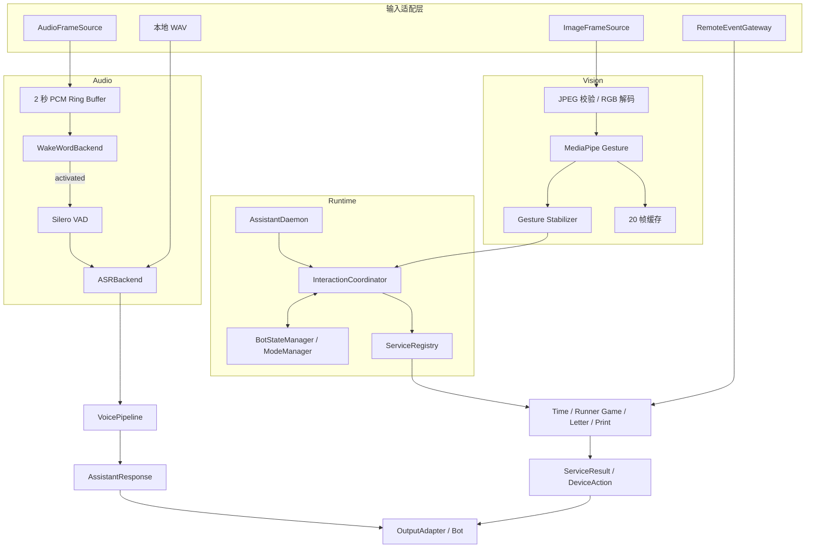

# 桌面 AI Bot 项目总览

## 1. 项目定位

这是一个面向桌面机器人和边缘设备的 Python 多模态交互核心。项目把语音、视觉、
交互状态、业务服务和设备动作拆成独立模块，使同一个长驻进程可以：

- 持续接收麦克风 PCM，经过唤醒门控、VAD 和 ASR；
- 接收 640×480 JPEG，使用 MediaPipe 识别手势；
- 用 `Victory` 手势切换固定功能与 LLM 模式；
- 在跑酷游戏中把 `Thumb_Up` 转换为跳跃动作；
- 处理时间查询、固定命令、固定问答和 LLM 请求；
- 为线上信件和打印队列保留服务边界；
- 将结果转换为结构化 action，由 Bot 设备层执行。

核心程序不直接控制摄像头、麦克风、屏幕、游戏或打印机。硬件和网络能力通过
Adapter 接入，业务核心只接收标准数据并返回标准结果。

## 2. 当前状态

| 能力 | 状态 | 说明 |
| --- | --- | --- |
| 本地 WAV → ASR | 已实现 | 支持 PCM WAV、预处理和 faster-whisper |
| 固定命令与固定问答 | 已实现 | 三级匹配、歧义保护和稳定 action |
| LLM / GuideAgent | 已实现 | OpenAI 兼容接口；项目配置默认无多轮历史 |
| Silero VAD | 已实现 | 复用 faster-whisper 自带 Silero v6 ONNX |
| 唤醒门控状态机 | 已实现 | 2 秒预缓存、5 秒等待、45 秒语句上限 |
| “小A”真实声学检测 | 未接入 | 已定义 `WakeWordBackend`，当前只有 Mock |
| ASR 判断“小A” | 未实现 | 可作为后续 `asr_gate` 后端，当前不是运行路径 |
| MediaPipe 手势识别 | 已实现 | IMAGE 模式，模型在本地 `models/` |
| 最近 20 张视觉缓存 | 已实现 | 缓存已完成推理的 RGB 帧和识别结果 |
| Victory 模式切换 | 已实现 | 3/5 帧投票，放下后才允许再次触发 |
| Thumb_Up 游戏跳跃 | 已实现 | 游戏上下文中使用 2/3 帧投票 |
| 时间服务 | 已实现 | 本地时间，不调用 LLM |
| 跑酷游戏服务 | 接口已实现 | 产生 start/jump/pause/stop action，不含游戏 UI |
| 长驻 Runtime | 已实现骨架 | Audio/Vision 有界队列和健康状态 |
| 真实麦克风/摄像头 Source | 未实现 | 需要 Bot SDK、WebSocket 或硬件 Adapter |
| 统一多模态 CLI | 未实现 | 当前 CLI 只处理单个 WAV |
| 线上信件 | 预留 | 幂等接收、策略和打印任务模型已定义 |
| 真实打印 | 未实现 | 当前只有 Mock PrinterAdapter |
| TTS / 回声保护 | 未实现 | 按当前需求暂不加入 |

当前自动化结果为 61 个测试通过、1 个外部条件测试跳过；离线 smoke test 为
10/10 通过。

## 3. 总体架构



## 4. 两种语音模式

`ModeManager` 为每个 `session_id` 保存独立模式：

- `command`：固定命令、固定问答和 GuideAgent 兜底；
- `llm`：将语音文本交给对话 LLM。

`Victory` 是全局手势：

```text
command --Victory--> llm
llm     --Victory--> command
```

项目 `config.yaml` 设置 `llm.history_enabled: false`，因此 LLM 请求默认是单轮的；
`last_assistant_response` 仍会保存，以支持“打印刚才的回答”。

旧的单次 `llm_mode` 和持续 `enter_llm_mode` / `exit_llm_mode` 控制信号仍然兼容。

## 5. Audio 处理链路

### 5.1 本地 WAV

```text
AudioRequest
→ 文件和 PCM 校验
→ 单声道 / 16 kHz / float32
→ Faster Whisper
→ 唤醒词文本前缀清理
→ 模式与命令路由
→ AssistantResponse
```

CLI：

```bash
python -m app.main \
  --wav input/home.wav \
  --signal auto \
  --session bot-001
```

### 5.2 长驻 PCM

`AssistantDaemon` 通过 `AudioFrameSource` 接收 16 kHz、单声道、float32 PCM。
Silero 流式后端要求每帧 512 samples，即约 32 ms。

```text
SLEEPING
→ WakeWordBackend
→ ACTIVATED
→ Silero VAD
→ CAPTURING
→ PROCESSING
→ VoicePipeline
→ SLEEPING
```

关键配置：

- 休眠预缓存：2 秒；
- 唤醒后等待语音：5 秒；
- VAD 端点静音：800 ms；
- 最短有效语音：250 ms；
- 最长有效语音：45 秒；
- 唤醒冷却：1.5 秒。

休眠缓存和有效语句都只存在内存，不持久化。处理完成、取消、超时或队列溢出后
会清空。

### 5.3 “小A”边界

当前代码定义了 `WakeWordBackend`，但仓库没有真实“小A”声学模型。测试通过
`MockWakeWordBackend` 验证：

- 无唤醒时 VAD/ASR 不被调用；
- 唤醒后只提交一段有效语句；
- “小A，现在几点了”会在 ASR 后移除开头别名；
- 只说“小A”时进入 5 秒后续等待。

如果选择由 ASR 判断关键词，未来应新增 `wake_word.backend: asr_gate`：

```text
持续 PCM → VAD → ASR → 检查文本是否以“小A”开头 → 路由或丢弃
```

这种方式无需训练唤醒模型，但每段环境人声都会调用 ASR。当前实现没有启用这条
链路，不能把它当成已完成功能。

## 6. Vision 处理链路

`VisionPipeline` 接收 `ImageRequest`：

```text
JPEG bytes
→ Content-Type / 大小 / 格式校验
→ EXIF 方向处理
→ 严格校验 640×480
→ RGB uint8
→ MediaPipe GestureRecognizer
→ score 过滤
→ 20 帧缓存
→ 手势时序投票
→ InteractionCoordinator
→ DeviceAction
```

默认手势：

| MediaPipe 标签 | 上下文 | 行为 |
| --- | --- | --- |
| `Victory` | 全局 | 切换 command / llm |
| `Thumb_Up` | 跑酷游戏运行中 | `game.runner.jump` |
| 其他 | 任意 | 记录检测结果，不触发业务 |

缓存使用 `deque(maxlen=20)`，第 21 帧会淘汰最早帧。当前缓存的是 RGB NumPy
数组、时间戳、检测结果和推理耗时；以后可改为 JPEG 缓存降低内存占用。

## 7. Runtime 与队列

`AssistantRuntime` 负责组合：

- `ModeManager`；
- `BotStateManager`；
- `ServiceRegistry`；
- `InteractionCoordinator`；
- 共享同一 session 状态的 `VoicePipeline`。

`AssistantDaemon` 负责长期运行：

- Audio producer / consumer；
- Vision producer / consumer；
- 有界队列；
- Audio 溢出时重置当前语句；
- Vision 队列满时丢弃旧帧，只处理最新图像；
- 统计基本运行指标；
- Source 结束后退出，真实 Source 可以无限迭代。

当前还没有 `python -m app.bot_main` 统一入口，也没有真实设备 Source。要启动实际
Bot，需要实现：

```python
class BotMicrophoneSource(AudioFrameSource):
    ...

class BotCameraSource(ImageFrameSource):
    ...
```

然后将它们注入 `AssistantDaemon`。

## 8. 服务板块

### 8.1 时间服务

`TimeService` 处理“几点”“日期”“星期”等文本，返回 `ui.show_time`，不调用
LLM。Clock 可注入，因此测试不依赖真实当前时间。

### 8.2 跑酷游戏

`RunnerGameService` 管理：

- `game.runner.start`；
- `game.runner.jump`；
- `game.runner.pause`；
- `game.runner.resume`；
- `game.runner.stop`。

服务不包含游戏画面、物理或碰撞逻辑，这些由 Bot UI 或网页执行。

### 8.3 线上信件和打印

预留流程：

```text
线上平台
→ RemoteEventGateway
→ LetterService
→ PrintJob
→ PrintService
→ PrinterAdapter
```

当前具备：

- `event_id` 去重；
- 信件长度校验；
- `notify_only` / `require_confirmation` / `auto_print` 策略；
- 有界打印队列；
- Mock 打印机。

当前不具备：

- HTTP/WebSocket 服务；
- 请求签名和重放保护；
- 数据库；
- HTML/PDF 内容净化；
- 真实打印机。

因此 `letter`、`remote` 和真实 `printing` 在项目配置中默认关闭。

## 9. 数据与动作边界

主要 Schema 位于 `app/schemas.py`：

- `AudioRequest` / `AssistantResponse`；
- `ImageRequest` / `VisionResponse`；
- `GestureDetection`；
- `DeviceAction`；
- `LetterReceived`；
- `PrintJob`。

设备动作示例：

```json
{
  "action": "game.runner.jump",
  "parameters": {}
}
```

```json
{
  "action": "ui.show_mode",
  "parameters": {
    "mode": "llm",
    "session_id": "bot-001"
  }
}
```

动作只是描述，不代表硬件操作已经执行。

## 10. 安装与模型

```bash
python3.11 -m venv .venv
source .venv/bin/activate
pip install -r requirements.txt
pip install -r requirements-dev.txt
pip install -r requirements-vision.txt
pip install -r requirements-vad.txt
```

本地模型：

```text
models/faster-whisper-small/
models/gesture_recognizer.task
```

模型目录被 Git 忽略。Silero VAD 默认复用 faster-whisper 包内的
`silero_vad_v6.onnx`。

## 11. 配置分区

| 分区 | 作用 |
| --- | --- |
| `audio` | WAV 和目标采样率 |
| `asr` | Whisper 后端、模型、设备和语言 |
| `interaction` | 默认模式、未匹配策略 |
| `command` | 模糊匹配和安全阈值 |
| `llm` | 模型、地址、密钥环境变量、历史开关 |
| `vad` | Silero 阈值、端点和最长语句 |
| `wake_word` | 小A、别名、预缓存、超时和冷却 |
| `vision` | MediaPipe、分辨率、缓存和手势投票 |
| `services` | 时间、游戏、信件服务开关 |
| `printing` | 打印策略与队列限制 |
| `remote` | 远程入口预留 |
| `output` | Console 或 JSON |

所有字段都有类型和范围校验，未知配置会导致启动失败。

## 12. 测试

```bash
.venv/bin/python -m pytest -q
.venv/bin/python -m scripts.smoke_test
```

当前覆盖：

- WAV 格式、采样率、声道和错误；
- 命令、模式、历史和 LLM 错误；
- Silero ONNX 静音推理；
- VAD 端点和最长语句；
- 小A门控、2 秒缓存、超时和无唤醒不调用 ASR；
- JPEG 校验、20 帧缓存和手势防抖；
- Victory 切换、游戏跳跃；
- 时间服务、信件幂等和打印队列；
- 长驻 Audio Source。

真实外部 LLM、真实摄像头、真实麦克风和打印机不属于离线测试依赖。

## 13. 已知集成缺口

当前组件已经可以分别测试，但要成为完整设备应用还需完成：

1. 统一 `app.bot_main` 启动入口；
2. 麦克风和摄像头 Source；
3. 真实“小A”模型，或实现 `asr_gate`；
4. 将转写后的服务事件与 VoicePipeline 路由收敛为单一入口；
5. Bot action 发送与执行回执；
6. 游戏 UI；
7. 远程平台鉴权与持久化；
8. 真实打印 Adapter；
9. 生产健康检查、日志轮转和进程守护。

在这些部分完成前，`AssistantDaemon` 是可测试的长驻核心，而不是开箱即用的完整
硬件程序。
